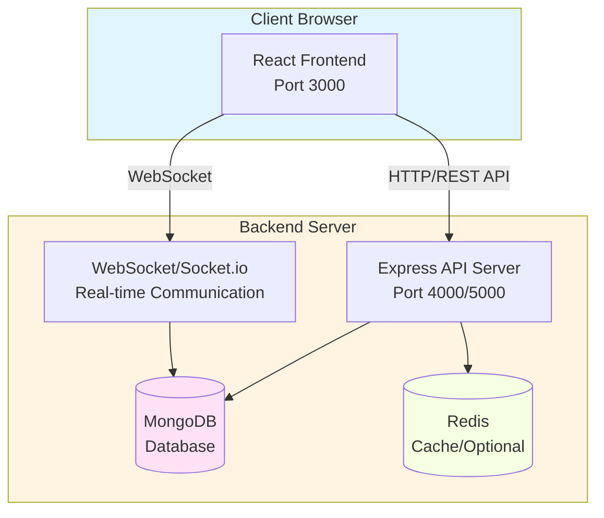
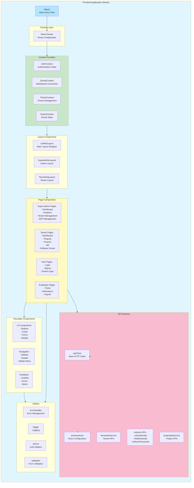
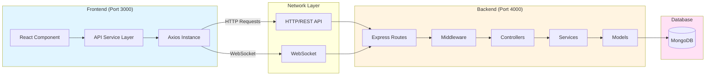
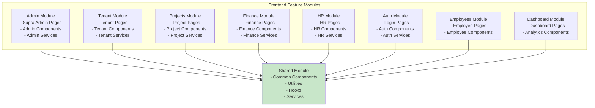
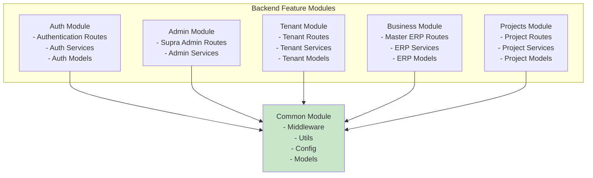
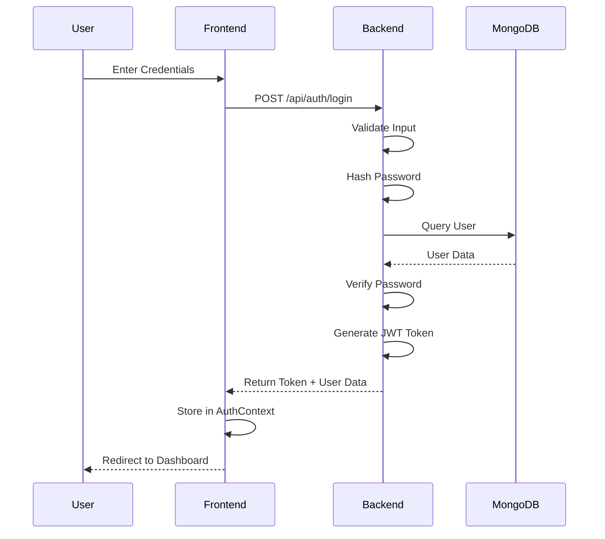
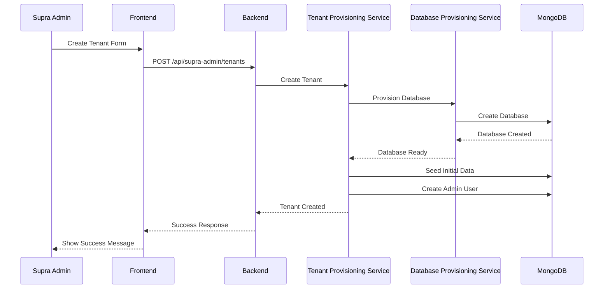
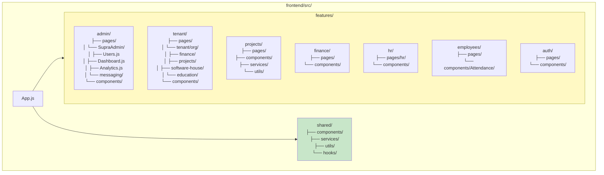
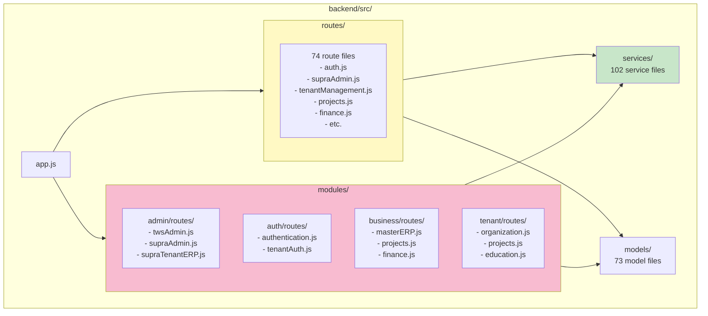

# TWS Project Architecture Flow Diagram

This document provides a comprehensive visual representation of the TWS (The Wolf Stack) project structure, showing how frontend and backend files are organized and how they relate to each other.

## High-Level Architecture Overview

## Detailed Frontend Structure

## Detailed Backend Structure

```mermaid
graph TB
    subgraph Backend["Backend Server (Express.js)"]
        direction TB
        
        Entry[app.js / server.js<br/>Main Entry Point]
        
        subgraph Middleware["Middleware Layer"]
            AuthMW[auth.js<br/>Authentication]
            RBAC[rbac.js<br/>Role-Based Access]
            ModuleAccess[moduleAccessControl.js<br/>Module Permissions]
            RateLimit[rateLimiter.js<br/>Rate Limiting]
            ErrorMW[errorHandler.js<br/>Error Handling]
            Validation[inputValidation.js<br/>Input Validation]
        end
        
        subgraph Routes["Route Handlers"]
            direction LR
            AuthRoutes[Authentication Routes<br/>/api/auth/*]
            SupraAdminRoutes[Supra Admin Routes<br/>/api/supra-admin/*]
            TenantRoutes[Tenant Routes<br/>/api/tenant/*]
            ProjectRoutes[Project Routes<br/>/api/projects/*]
            FinanceRoutes[Finance Routes<br/>/api/finance/*]
            HRRoutes[HR Routes<br/>/api/hr/*]
            AttendanceRoutes[Attendance Routes<br/>/api/attendance/*]
            MessagingRoutes[Messaging Routes<br/>/api/messaging/*]
        end
        
        subgraph Controllers["Controllers"]
            direction LR
            TenantController[Tenant Controller<br/>Business Logic]
        end
        
        subgraph Services["Business Logic Services"]
            direction LR
            TenantService[tenantService<br/>Tenant Management]
            TenantProvisioning[tenantProvisioningService<br/>Tenant Setup]
            DatabaseProvisioning[databaseProvisioningService<br/>DB Management]
            MasterERPService[masterERPService<br/>ERP Templates]
            EmailService[emailService<br/>Email Sending]
            AuthService[Authentication Services]
            FinanceService[Finance Services]
            HRService[HR Services]
        end
        
        subgraph Models["Data Models (Mongoose)"]
            direction LR
            UserModel[User Model]
            TenantModel[Tenant Model]
            ProjectModel[Project Model]
            FinanceModels[Finance Models<br/>- Transaction<br/>- Account<br/>- Invoice]
            HRModels[HR Models<br/>- Employee<br/>- Payroll<br/>- Attendance]
            ERPTemplate[ERPTemplate Model]
            SubscriptionPlan[SubscriptionPlan Model]
        end
        
        subgraph Config["Configuration"]
            direction LR
            EnvConfig[environment.js<br/>Environment Config]
            FirebaseConfig[firebase-admin.js<br/>Firebase Setup]
            RedisConfig[redis.js<br/>Redis Setup]
            LoggingConfig[logging.js<br/>Logging Setup]
        end
        
        subgraph Workers["Background Workers"]
            direction LR
            NotificationWorker[notificationWorker<br/>Notifications]
            FileProcessor[fileProcessor<br/>File Processing]
            RetentionWorker[retentionWorker<br/>Data Retention]
        end
        
        Entry --> Middleware
        Middleware --> Routes
        Routes --> Controllers
        Controllers --> Services
        Services --> Models
        Services --> Config
        Services --> Workers
        Models --> DB[(MongoDB)]
        Workers --> DB
    end
    
    style Backend fill:#fff4e1
    style Entry fill:#ffe0b2
    style Routes fill:#fff9c4
    style Services fill:#f8bbd0
    style Models fill:#c8e6c9
    style DB fill:#ffe1f5
```

## Frontend-Backend Integration Flow

## Module Organization

### Frontend Modules

### Backend Modules

## Data Flow Examples

### Authentication Flow

### Tenant Creation Flow

## File Relationship Summary

### Key Frontend Files and Their Dependencies

1. **App.js** (Entry Point)
   - Imports: AuthContext, SocketContext, ThemeContext
   - Imports: All route components
   - Imports: UnifiedLayout

2. **AuthContext.js**
   - Uses: axiosInstance
   - Uses: apiClient
   - Uses: errorHandler

3. **API Services**
   - All services use: axiosInstance
   - All services use: errorHandler
   - Industry APIs use: apiClientFactory

4. **Pages**
   - Use: Layout components
   - Use: API services
   - Use: Shared components
   - Use: Utils

### Key Backend Files and Their Dependencies

1. **app.js** (Entry Point)
   - Imports: All middleware
   - Imports: All routes
   - Imports: Config files
   - Sets up: Express app, Socket.io, MongoDB

2. **Routes**
   - Use: Middleware (auth, rbac, validation)
   - Use: Controllers
   - Use: Services

3. **Services**
   - Use: Models
   - Use: Other services
   - Use: Utils

4. **Models**
   - Use: Mongoose
   - Define: Database schemas

## Statistics

- **Total Files**: 927
  - Frontend: 499 files
  - Backend: 428 files
- **Files with Dependencies**: 619
- **Total Dependencies**: 2,374
- **Frontend Categories**:
  - Pages: 296 files
  - Components: 139 files
  - Services: 20 files
  - Utils: 14 files
  - Layouts: 5 files
  - Providers: 6 files
  - Hooks: 8 files
  - Config: 2 files
- **Backend Categories**:
  - Routes: 74 files
  - Services: 102 files
  - Models: 73 files
  - Middleware: 21 files
  - Utils: 5 files
  - Config: 7 files
  - Modules: 85 files

## How to Use These Diagrams

1. **High-Level Architecture**: Understand the overall system structure
2. **Frontend Structure**: Navigate frontend code organization
3. **Backend Structure**: Navigate backend code organization
4. **Integration Flow**: Understand how frontend and backend communicate
5. **Module Organization**: Find related files within modules
6. **Data Flow Examples**: Understand specific workflows

## Viewing the Diagrams

These Mermaid diagrams can be viewed in:
- **GitHub/GitLab**: Automatically rendered in markdown files
- **VS Code**: Install "Markdown Preview Mermaid Support" extension
- **Online**: Copy code to [Mermaid Live Editor](https://mermaid.live)
- **Documentation Tools**: Most modern documentation platforms support Mermaid

## Actual Folder Structure

### Frontend Folder Organization

### Backend Folder Organization

### Key Folder Paths

**Frontend:**
- Supra Admin Pages: `features/admin/pages/SupraAdmin/`
- Tenant Org Pages: `features/tenant/pages/tenant/org/`
- Shared Services: `shared/services/`
- API Client: `shared/utils/axiosInstance.js`

**Backend:**
- Main Routes: `routes/` (74 files)
- Module Routes: `modules/{module}/routes/`
- Services: `services/` (102 files)
- Models: `models/` (73 files)

## Related Files

- `PROJECT_FOLDER_STRUCTURE_DIAGRAM.md` - **⭐ Complete folder hierarchy with actual paths**
- `PROJECT_STRUCTURE_INDEX.md` - Detailed file listing
- `PROJECT_STRUCTURE_INDEX.json` - Machine-readable index
- `PROJECT_STRUCTURE_DIAGRAM.md` - Detailed dependency graph
