# TWS Project Folder Structure Diagram

This document shows the **actual folder structure** of the TWS project, organized by the real directory hierarchy.

## Frontend Folder Structure

```mermaid
graph TB
    subgraph FrontendRoot["frontend/src/"]
        direction TB
        
        Entry[App.js<br/>index.js]
        
        subgraph AppFolder["app/"]
            AppConfig[config/<br/>- api.js<br/>- firebase.js]
            AppProviders[providers/<br/>- AuthContext.js<br/>- SocketContext.js<br/>- ThemeContext.js<br/>- TenantContext.js]
        end
        
        subgraph FeaturesFolder["features/"]
            direction TB
            
            subgraph AdminFeature["admin/"]
                AdminPages[pages/<br/>├── SupraAdmin/<br/>│   ├── Analytics.js<br/>│   ├── Dashboard.js<br/>│   ├── TenantManagement.js<br/>│   ├── ERPManagement.js<br/>│   ├── Users.js<br/>│   └── messaging/<br/>├── admin/<br/>│   └── projects/<br/>└── system-admin/]
                AdminComponents[components/<br/>├── admin/<br/>└── ai/]
            end
            
            subgraph TenantFeature["tenant/"]
                TenantPages[pages/<br/>├── TenantDashboard/<br/>├── TenantERP/<br/>├── tenant/org/<br/>│   ├── dashboard/<br/>│   ├── finance/<br/>│   ├── projects/<br/>│   ├── software-house/<br/>│   │   └── hr/<br/>│   └── education/<br/>│       ├── students/<br/>│       ├── teachers/<br/>│       └── classes/<br/>└── clients/]
                TenantComponents[components/]
            end
            
            subgraph ProjectsFeature["projects/"]
                ProjectsPages[pages/<br/>├── Projects.js<br/>├── ProjectBoard.js<br/>└── projects/<br/>    ├── ProjectOverview.js<br/>    ├── MyProjects.js<br/>    └── ProjectTasks.js]
                ProjectsComponents[components/<br/>├── Portal/<br/>└── ProjectPortal/]
                ProjectsServices[services/<br/>- projectApiService.js<br/>- portalApiService.js]
                ProjectsUtils[utils/]
            end
            
            subgraph FinanceFeature["finance/"]
                FinancePages[pages/<br/>├── Finance.js<br/>├── Payroll.js<br/>└── Finance/<br/>    ├── ChartOfAccounts.js<br/>    ├── AccountsReceivable.js<br/>    └── BillingEngine.js]
                FinanceComponents[components/]
            end
            
            subgraph HRFeature["hr/"]
                HRPages[pages/hr/<br/>├── HRDashboard.js<br/>├── HREmployees.js<br/>├── HRPayroll.js<br/>└── HRRecruitment.js]
                HRComponents[components/hr/]
            end
            
            subgraph EmployeesFeature["employees/"]
                EmployeesPages[pages/<br/>├── Employees.js<br/>├── EmployeePortal.js<br/>└── employee/<br/>    ├── ProfileManagement.js<br/>    └── EmployeeAttendance.js]
                EmployeesComponents[components/Attendance/<br/>- AttendanceDashboard.js<br/>- AttendanceCheckInOut.js<br/>- 20+ files]
            end
            
            subgraph AuthFeature["auth/"]
                AuthPages[pages/<br/>- Login.js<br/>- SupraAdminLogin.js<br/>- TenantLogin.js<br/>- EmployeeLogin.js]
                AuthComponents[components/<br/>- RoleGuard.js<br/>- LoginNavbar.js]
            end
            
            subgraph DashboardFeature["dashboard/"]
                DashboardPages[pages/]
                DashboardComponents[components/]
            end
        end
        
        subgraph SharedFolder["shared/"]
            SharedComponents[components/<br/>├── navigation/<br/>│   - Sidebar.js<br/>│   - Header.js<br/>│   - GTSAdminSidebar.js<br/>├── ui/<br/>├── feedback/<br/>├── forms/<br/>└── monitoring/]
            SharedServices[services/<br/>├── tenantApiService.js<br/>├── analyticsService.js<br/>├── billingService.js<br/>└── industry/<br/>    ├── educationApi.js<br/>    ├── healthcareApi.js<br/>    └── softwareHouseApi.js]
            SharedUtils[utils/<br/>- axiosInstance.js<br/>- apiClient.js<br/>- errorHandler.js<br/>- auth.js]
            SharedHooks[hooks/<br/>- useSocket.js<br/>- useRoleBasedUI.js<br/>- useResponsive.js]
            SharedPages[pages/<br/>- LandingPage.js<br/>- Settings.js]
        end
        
        subgraph LayoutsFolder["layouts/"]
            Layouts[Layout Files<br/>- UnifiedLayout.js<br/>- SupraAdminLayout.js<br/>- UnifiedResponsiveLayout.js]
        end
        
        subgraph ModulesFolder["modules/"]
            Modules[Module Files<br/>- dashboard/]
        end
        
        Entry --> AppFolder
        Entry --> FeaturesFolder
        Entry --> SharedFolder
        Entry --> LayoutsFolder
        Entry --> ModulesFolder
    end
    
    style FrontendRoot fill:#e1f5ff
    style FeaturesFolder fill:#fff9c4
    style SharedFolder fill:#c8e6c9
```



## Backend Folder Structure

```mermaid
graph TB
    subgraph BackendRoot["backend/src/"]
        direction TB
        
        subgraph EntryFiles["Entry Points"]
            AppJS[app.js<br/>server.js]
        end
        
        subgraph ConfigFolder["config/"]
            ConfigFiles[Config Files<br/>- environment.js<br/>- firebase-admin.js<br/>- logging.js<br/>- redis.js<br/>- s3.js<br/>- security.js<br/>- swagger.js]
        end
        
        subgraph MiddlewareFolder["middleware/"]
            MiddlewareFiles[Middleware Files<br/>- auth.js<br/>- rbac.js<br/>- moduleAccessControl.js<br/>- rateLimiter.js<br/>- errorHandler.js<br/>- inputValidation.js<br/>- 15+ files]
        end
        
        subgraph RoutesFolder["routes/"]
            RoutesFiles[Route Files<br/>├── auth.js<br/>├── supraAdmin.js<br/>├── tenantManagement.js<br/>├── tenantOrg.js<br/>├── projects.js<br/>├── finance.js<br/>├── employees.js<br/>├── attendance.js<br/>├── messaging.js<br/>├── portal/<br/>│   ├── boards.js<br/>│   ├── cards.js<br/>│   └── workspaces.js<br/>└── 50+ route files]
        end
        
        subgraph ModulesFolder["modules/"]
            direction TB
            
            subgraph AdminModule["admin/"]
                AdminRoutes[routes/<br/>├── twsAdmin.js<br/>├── supraAdmin.js<br/>├── supraTenantERP.js<br/>├── messaging.js<br/>└── moderation.js]
            end
            
            subgraph AuthModule["auth/"]
                AuthRoutes[routes/<br/>├── authentication.js<br/>├── tenantAuth.js<br/>├── users.js<br/>└── sessions.js]
            end
            
            subgraph BusinessModule["business/"]
                BusinessRoutes[routes/<br/>├── masterERP.js<br/>├── erpManagement.js<br/>├── projects.js<br/>├── finance.js<br/>├── employees.js<br/>├── attendance.js<br/>├── messaging.js<br/>└── 30+ route files]
            end
            
            subgraph TenantModule["tenant/"]
                TenantRoutes[routes/<br/>├── organization.js<br/>├── projects.js<br/>├── education.js<br/>├── healthcare.js<br/>├── softwareHouse.js<br/>└── switching.js]
            end
            
            subgraph CoreModule["core/"]
                CoreRoutes[routes/<br/>├── files.js<br/>├── health.js<br/>├── notifications.js<br/>├── security.js<br/>└── webhooks.js]
            end
            
            subgraph IntegrationModule["integration/"]
                IntegrationRoutes[routes/<br/>├── calendar.js<br/>├── integrations.js<br/>├── platform.js<br/>└── webrtc.js]
            end
            
            subgraph MonitoringModule["monitoring/"]
                MonitoringRoutes[routes/<br/>├── system.js<br/>└── standalone.js]
            end
        end
        
        subgraph ServicesFolder["services/"]
            ServicesFiles[Service Files<br/>├── tenantService.js<br/>├── tenantProvisioningService/<br/>│   ├── tenantCreation.js<br/>│   ├── userAndOrgCreation.js<br/>│   └── seeders/<br/>├── masterERPService.js<br/>├── databaseProvisioningService.js<br/>├── emailService.js<br/>├── financeService.js<br/>├── attendanceService.js<br/>└── 90+ service files]
        end
        
        subgraph ModelsFolder["models/"]
            ModelsFiles[Model Files<br/>├── User.js<br/>├── Tenant.js<br/>├── Project.js<br/>├── Employee.js<br/>├── Finance.js<br/>├── Attendance.js<br/>├── ERPTemplate.js<br/>├── SubscriptionPlan.js<br/>├── industry/<br/>└── 70+ model files]
        end
        
        subgraph ControllersFolder["controllers/"]
            ControllersFiles[Controllers<br/>└── tenant/<br/>    └── projectsController.js]
        end
        
        subgraph UtilsFolder["utils/"]
            UtilsFiles[Utils<br/>- errorHandler.js<br/>- logger.js<br/>- pagination.js<br/>- modelSchemaHelper.js]
        end
        
        subgraph WorkersFolder["workers/"]
            WorkersFiles[Workers<br/>- notificationWorker.js<br/>- fileProcessor.js<br/>- retentionWorker.js]
        end
        
        subgraph ScriptsFolder["scripts/"]
            ScriptsFiles[Scripts<br/>- seedSupraAdmin.js<br/>- seedMasterERPs.js<br/>- seedTenantProjects.js<br/>- testLogin.js<br/>- 20+ scripts]
        end
        
        AppJS --> ConfigFolder
        AppJS --> MiddlewareFolder
        AppJS --> RoutesFolder
        AppJS --> ModulesFolder
        RoutesFolder --> ServicesFolder
        RoutesFolder --> ModelsFolder
        RoutesFolder --> ControllersFolder
        ServicesFolder --> ModelsFolder
        ServicesFolder --> UtilsFolder
        ServicesFolder --> WorkersFolder
    end
    
    style BackendRoot fill:#fff4e1
    style ModulesFolder fill:#fff9c4
    style ServicesFolder fill:#f8bbd0
    style ModelsFolder fill:#c8e6c9
```



## Complete Folder Hierarchy

### Frontend Structure

```
frontend/src/
├── App.js                          # Main entry point
├── index.js                        # React entry
├── index.css
│
├── app/
│   ├── config/
│   │   ├── api.js
│   │   └── firebase.js
│   └── providers/
│       ├── AuthContext.js
│       ├── SocketContext.js
│       ├── ThemeContext.js
│       └── TenantContext.js
│
├── features/
│   ├── admin/
│   │   ├── pages/
│   │   │   ├── SupraAdmin/         # ⭐ Main Supra Admin Pages
│   │   │   │   ├── Analytics.js
│   │   │   │   ├── Dashboard.js
│   │   │   │   ├── TenantManagement.js
│   │   │   │   ├── ERPManagement.js
│   │   │   │   ├── Users.js
│   │   │   │   ├── BillingManagement.js
│   │   │   │   ├── CreateOrganization.js
│   │   │   │   ├── CreateTenantWizard.js
│   │   │   │   ├── messaging/
│   │   │   │   │   ├── Analytics.js
│   │   │   │   │   ├── Announcements.js
│   │   │   │   │   └── Compose.js
│   │   │   │   └── [30+ files]
│   │   │   ├── admin/
│   │   │   │   ├── AdminMessagingDashboard.js
│   │   │   │   ├── ProjectManagement.js
│   │   │   │   └── projects/
│   │   │   └── system-admin/
│   │   └── components/
│   │       ├── admin/
│   │       └── ai/
│   │
│   ├── tenant/
│   │   ├── pages/
│   │   │   ├── TenantDashboard/
│   │   │   ├── TenantERP/
│   │   │   └── tenant/org/          # ⭐ Tenant Organization Pages
│   │   │       ├── dashboard/
│   │   │       ├── finance/
│   │   │       │   ├── FinanceOverview.js
│   │   │       │   ├── ChartOfAccounts.js
│   │   │       │   ├── AccountsReceivable.js
│   │   │       │   └── [10 files]
│   │   │       ├── projects/
│   │   │       │   ├── ProjectsOverview.js
│   │   │       │   └── [28 files]
│   │   │       ├── software-house/
│   │   │       │   ├── hr/
│   │   │       │   │   ├── HROverview.js
│   │   │       │   │   ├── EmployeeList.js
│   │   │       │   │   ├── AttendanceManagement.js
│   │   │       │   │   └── [15 files]
│   │   │       │   ├── TechStack.js
│   │   │       │   └── TimeTracking.js
│   │   │       ├── education/
│   │   │       │   ├── students/
│   │   │       │   ├── teachers/
│   │   │       │   ├── classes/
│   │   │       │   └── [20+ subfolders]
│   │   │       └── healthcare/
│   │   └── components/
│   │
│   ├── projects/
│   │   ├── pages/
│   │   │   ├── Projects.js
│   │   │   ├── ProjectBoard.js
│   │   │   └── projects/
│   │   ├── components/
│   │   │   ├── Portal/
│   │   │   └── ProjectPortal/
│   │   ├── services/
│   │   └── utils/
│   │
│   ├── finance/
│   │   ├── pages/
│   │   │   ├── Finance.js
│   │   │   ├── Payroll.js
│   │   │   └── Finance/
│   │   └── components/
│   │
│   ├── hr/
│   │   ├── pages/hr/
│   │   └── components/hr/
│   │
│   ├── employees/
│   │   ├── pages/
│   │   │   ├── Employees.js
│   │   │   ├── EmployeePortal.js
│   │   │   └── employee/
│   │   └── components/Attendance/
│   │
│   ├── auth/
│   │   ├── pages/
│   │   └── components/
│   │
│   └── dashboard/
│
├── shared/
│   ├── components/
│   │   ├── navigation/
│   │   ├── ui/
│   │   ├── feedback/
│   │   ├── forms/
│   │   └── monitoring/
│   ├── services/
│   │   ├── tenantApiService.js
│   │   ├── analyticsService.js
│   │   └── industry/
│   ├── utils/
│   ├── hooks/
│   └── pages/
│
├── layouts/
│   ├── UnifiedLayout.js
│   ├── SupraAdminLayout.js
│   └── UnifiedResponsiveLayout.js
│
└── modules/
    └── dashboard/
```

### Backend Structure

```
backend/src/
├── app.js                          # Main entry point
├── server.js
│
├── config/
│   ├── environment.js
│   ├── firebase-admin.js
│   ├── logging.js
│   ├── redis.js
│   ├── s3.js
│   ├── security.js
│   └── swagger.js
│
├── middleware/
│   ├── auth.js
│   ├── rbac.js
│   ├── moduleAccessControl.js
│   ├── rateLimiter.js
│   ├── errorHandler.js
│   └── [15+ files]
│
├── routes/                         # ⭐ Main Route Files
│   ├── auth.js
│   ├── supraAdmin.js
│   ├── tenantManagement.js
│   ├── tenantOrg.js
│   ├── projects.js
│   ├── finance.js
│   ├── employees.js
│   ├── attendance.js
│   ├── messaging.js
│   ├── portal/
│   │   ├── boards.js
│   │   ├── cards.js
│   │   └── workspaces.js
│   └── [50+ route files]
│
├── modules/                        # ⭐ Organized Feature Modules
│   ├── admin/
│   │   └── routes/
│   │       ├── twsAdmin.js
│   │       ├── supraAdmin.js
│   │       ├── supraTenantERP.js
│   │       └── [10+ files]
│   │
│   ├── auth/
│   │   └── routes/
│   │       ├── authentication.js
│   │       ├── tenantAuth.js
│   │       └── users.js
│   │
│   ├── business/
│   │   └── routes/
│   │       ├── masterERP.js
│   │       ├── erpManagement.js
│   │       ├── projects.js
│   │       ├── finance.js
│   │       └── [30+ files]
│   │
│   ├── tenant/
│   │   └── routes/
│   │       ├── organization.js
│   │       ├── projects.js
│   │       ├── education.js
│   │       ├── healthcare.js
│   │       └── softwareHouse.js
│   │
│   ├── core/
│   │   └── routes/
│   │       ├── files.js
│   │       ├── health.js
│   │       └── notifications.js
│   │
│   ├── integration/
│   │   └── routes/
│   │       ├── calendar.js
│   │       └── integrations.js
│   │
│   └── monitoring/
│       └── routes/
│           └── system.js
│
├── services/
│   ├── tenantService.js
│   ├── tenantProvisioningService/
│   │   ├── tenantCreation.js
│   │   ├── userAndOrgCreation.js
│   │   └── seeders/
│   ├── masterERPService.js
│   ├── databaseProvisioningService.js
│   ├── emailService.js
│   └── [90+ service files]
│
├── models/
│   ├── User.js
│   ├── Tenant.js
│   ├── Project.js
│   ├── Employee.js
│   ├── Finance.js
│   ├── Attendance.js
│   ├── ERPTemplate.js
│   ├── SubscriptionPlan.js
│   ├── industry/
│   └── [70+ model files]
│
├── controllers/
│   └── tenant/
│       └── projectsController.js
│
├── utils/
│   ├── errorHandler.js
│   ├── logger.js
│   └── pagination.js
│
├── workers/
│   ├── notificationWorker.js
│   ├── fileProcessor.js
│   └── retentionWorker.js
│
└── scripts/
    ├── seedSupraAdmin.js
    ├── seedMasterERPs.js
    ├── seedTenantProjects.js
    └── [20+ scripts]
```

## Key Folder Patterns

### Frontend Pattern
```
features/{feature-name}/
├── pages/           # Page components
├── components/      # Feature-specific components
├── services/        # API services (optional)
└── utils/          # Feature utilities (optional)
```

### Backend Pattern
```
modules/{module-name}/
└── routes/         # Route handlers for the module

OR

routes/             # Direct route files
services/           # Business logic
models/             # Data models
```

## File Relationship Flow

```mermaid
graph LR
    subgraph Frontend["Frontend Structure"]
        F1[features/admin/pages/SupraAdmin/Users.js]
        F2[shared/services/tenantApiService.js]
        F3[shared/utils/axiosInstance.js]
    end
    
    subgraph Backend["Backend Structure"]
        B1[routes/supraAdmin.js]
        B2[modules/admin/routes/supraAdmin.js]
        B3[services/tenantService.js]
        B4[models/User.js]
    end
    
    F1 --> F2
    F2 --> F3
    F3 -->|HTTP| B1
    B1 --> B2
    B2 --> B3
    B3 --> B4
    B4 -->|MongoDB| DB[(Database)]
    
    style Frontend fill:#e1f5ff
    style Backend fill:#fff4e1
```



## Important Notes

1. **Frontend**: Files are organized by **feature** in `features/` folder
   - Each feature has its own `pages/`, `components/`, etc.
   - Shared code goes in `shared/` folder

2. **Backend**: Files are organized by **type** (routes, services, models)
   - Routes can be in `routes/` or `modules/{module}/routes/`
   - Services contain business logic
   - Models define database schemas

3. **SupraAdmin Pages**: Located at `features/admin/pages/SupraAdmin/`
   - Contains all Supra Admin related pages
   - Has subfolder `messaging/` for messaging-related pages

4. **Tenant Pages**: Located at `features/tenant/pages/tenant/org/`
   - Organized by feature: `finance/`, `projects/`, `software-house/`, etc.
   - Each feature has its own subfolder structure

5. **Backend Modules**: Organized in `modules/` folder
   - Each module has its own `routes/` subfolder
   - Modules: admin, auth, business, tenant, core, integration, monitoring

