# Project Management Department - Comprehensive Documentation
## Tenant Software House Category

---

## Table of Contents

1. [Executive Summary](#executive-summary)
2. [Use Cases](#use-cases)
3. [Roadmap](#roadmap)
4. [System Architecture](#system-architecture)
5. [Flow Diagrams](#flow-diagrams)
6. [Activity Relationships](#activity-relationships)
7. [Actor Diagrams (PlantUML)](#actor-diagrams-plantuml)
8. [Entity Relationship Diagram](#entity-relationship-diagram)
9. [Workflow Processes](#workflow-processes)
10. [Data Flow Diagrams](#data-flow-diagrams)
11. [State Transition Diagrams](#state-transition-diagrams)
12. [API Endpoints](#api-endpoints)
13. [User Roles & Permissions](#user-roles--permissions)
14. [Metrics & KPIs](#metrics--kpis)

---

## Executive Summary

The Project Management Department in the Tenant Software House ERP system is a comprehensive solution for managing software development projects from inception to completion. It provides tools for project planning, task management, resource allocation, time tracking, client collaboration, and financial tracking.

### Key Capabilities
- **Multi-Project Management**: Manage multiple projects simultaneously with portfolio views
- **Agile/Scrum/Kanban Support**: Flexible methodology support
- **Client Portal**: Client collaboration and approval workflows
- **Resource Management**: Team allocation and utilization tracking
- **Time Tracking**: Billable hours and timesheet management
- **Financial Tracking**: Budget management and cost tracking
- **Real-time Collaboration**: Live updates and team communication

---

## Use Cases

### UC-1: Project Creation and Initialization
**Actor**: Project Manager  
**Description**: Create a new project from scratch or template  
**Preconditions**: User is authenticated, has PM role, client exists  
**Main Flow**:
1. Project Manager navigates to Projects page
2. Clicks "Create New Project"
3. Selects client from dropdown
4. Enters project details (name, description, type, methodology)
5. Sets budget and timeline
6. Assigns team members
7. Selects project template (optional)
8. System creates project with initial board structure
9. System sends notifications to assigned team members

**Alternative Flows**:
- **1a**: Create from template → Pre-fills fields from template
- **1b**: Create without client → Creates placeholder client record

**Postconditions**: Project created in "Planning" status, board initialized

---

### UC-2: Task Management via Kanban Board
**Actor**: Team Member, Project Manager  
**Description**: Create, update, and move tasks across workflow stages  
**Preconditions**: User has access to project, project is active  
**Main Flow**:
1. User opens project board
2. Views tasks organized by status columns (To Do, In Progress, Review, Done)
3. Creates new task card in appropriate column
4. Assigns task to team member
5. Sets priority, due date, story points
6. Drags task card to update status
7. System updates task status in real-time
8. System notifies assignee of status change

**Alternative Flows**:
- **2a**: Bulk task creation → Import from CSV/Excel
- **2b**: Task dependency → Link tasks and enforce order

**Postconditions**: Task updated, activity logged, notifications sent

---

### UC-3: Time Tracking and Timesheet Submission
**Actor**: Developer, Consultant  
**Description**: Log billable hours worked on projects and tasks  
**Preconditions**: User is assigned to project, project allows time tracking  
**Main Flow**:
1. Developer navigates to Timesheets page
2. Selects project and task
3. Enters date and hours worked
4. Marks as billable/non-billable
5. Adds description of work performed
6. Submits timesheet entry
7. System validates entry (no overlaps, reasonable hours)
8. System updates project actual hours and budget spent
9. System calculates billable amount based on hourly rate

**Alternative Flows**:
- **3a**: Quick timer → Start/stop timer for real-time tracking
- **3b**: Bulk time entry → Enter multiple days at once
- **3c**: Time entry approval → Requires manager approval before billing

**Postconditions**: Time entry saved, project metrics updated, billable hours calculated

---

### UC-4: Resource Allocation and Utilization
**Actor**: Project Manager, Department Lead  
**Description**: Allocate team members to projects and track utilization  
**Preconditions**: Resources exist, projects are active  
**Main Flow**:
1. PM navigates to Resources page
2. Views team members with current allocations
3. Selects resource to allocate
4. Chooses target project
5. Sets allocation percentage (0-100%)
6. Sets start and end dates
7. Sets hourly rate (optional)
8. System validates total allocation doesn't exceed 100%
9. System updates resource utilization metrics
10. System sends notification to resource

**Alternative Flows**:
- **4a**: Bulk allocation → Allocate multiple resources at once
- **4b**: Capacity warning → System warns if allocation exceeds capacity

**Postconditions**: Resource allocated, utilization updated, notifications sent

---

### UC-5: Milestone Management and Tracking
**Actor**: Project Manager  
**Description**: Create milestones and track progress toward delivery dates  
**Preconditions**: Project exists, timeline defined  
**Main Flow**:
1. PM navigates to Project Milestones
2. Creates milestone with title and due date
3. Associates tasks to milestone
4. Sets milestone owner
5. System calculates milestone progress based on task completion
6. PM views milestone timeline
7. System sends alerts for upcoming/overdue milestones

**Alternative Flows**:
- **5a**: Milestone dependency → Link milestones in sequence
- **5b**: Milestone approval → Require client approval before marking complete

**Postconditions**: Milestone created, progress tracked, alerts configured

---

### UC-6: Sprint Planning and Execution (Scrum)
**Actor**: Scrum Master, Project Manager  
**Description**: Plan sprints, assign tasks, track velocity  
**Preconditions**: Project uses Scrum methodology, backlog exists  
**Main Flow**:
1. Scrum Master creates new sprint
2. Sets sprint goal and duration (typically 2 weeks)
3. Moves tasks from backlog to sprint
4. Assigns story points to tasks
5. Allocates team members to sprint
6. System calculates sprint capacity
7. Team works on sprint tasks
8. Daily standup updates task status
9. System tracks sprint velocity (completed story points)
10. Sprint review shows completed work
11. Sprint retrospective captures lessons learned

**Alternative Flows**:
- **6a**: Sprint cancellation → Cancel sprint, move tasks back to backlog
- **6b**: Sprint extension → Extend sprint duration if needed

**Postconditions**: Sprint created, velocity tracked, metrics updated

---

### UC-7: Client Portal Access and Collaboration
**Actor**: Client User  
**Description**: Client views project progress and approves deliverables  
**Preconditions**: Client account exists, project allows client access  
**Main Flow**:
1. Client logs into portal
2. Views assigned projects
3. Views project dashboard with progress metrics
4. Reviews task cards and comments
5. Approves/rejects deliverables
6. Adds comments and feedback
7. Views project timeline and milestones
8. Downloads project documents

**Alternative Flows**:
- **7a**: Client creates request → Creates new task request for team
- **7b**: Client-only view → Limited visibility based on permissions

**Postconditions**: Client engagement tracked, approval workflow triggered

---

### UC-8: Project Financial Tracking
**Actor**: Project Manager, Finance Manager  
**Description**: Track project budget, costs, and profitability  
**Preconditions**: Project has budget defined, time entries exist  
**Main Flow**:
1. PM views project financial dashboard
2. Views budget vs. actual spending
3. Reviews billable hours by resource
4. Analyzes cost per phase/milestone
5. Generates financial reports
6. Sets budget alerts for overspending
7. Reviews profitability metrics

**Alternative Flows**:
- **8a**: Budget adjustment → Request budget increase
- **8b**: Cost reallocation → Move costs between projects

**Postconditions**: Financial metrics updated, reports generated

---

### UC-9: Project Reporting and Analytics
**Actor**: Project Manager, Executive, PMO  
**Description**: Generate project reports and portfolio analytics  
**Preconditions**: Projects exist with data  
**Main Flow**:
1. User navigates to Reports/Analytics
2. Selects report type (project status, resource utilization, financial, etc.)
3. Applies filters (date range, projects, departments)
4. System generates report with charts and metrics
5. User exports report (PDF, Excel, CSV)
6. User schedules recurring reports

**Alternative Flows**:
- **9a**: Custom report → Build custom report with selected metrics
- **9b**: Dashboard view → Real-time dashboard with key metrics

**Postconditions**: Report generated, export available

---

### UC-10: Project Closure and Archival
**Actor**: Project Manager  
**Description**: Close completed project and archive data  
**Preconditions**: Project status is "Completed"  
**Main Flow**:
1. PM marks project as completed
2. System validates all tasks are done
3. PM performs final review and documentation
4. PM generates final project report
5. PM archives project files
6. PM releases resources
7. System calculates final metrics
8. PM marks project as archived
9. System moves project to archive storage

**Alternative Flows**:
- **10a**: Project cancellation → Cancel project, handle in-progress work
- **10b**: Reopen archived project → Restore for maintenance work

**Postconditions**: Project archived, resources released, final report generated

---

## Roadmap

### Phase 1: Foundation (Completed ✅)
- Core project management models
- Basic CRUD operations
- Project creation and editing
- Task management (basic)
- Client management
- Multi-tenancy support

### Phase 2: Collaboration (Completed ✅)
- Kanban board implementation
- Drag-and-drop functionality
- Real-time updates (Socket.io)
- Comments and activity feed
- File attachments
- Member management

### Phase 3: Time & Resources (Completed ✅)
- Time tracking system
- Timesheet management
- Resource allocation
- Utilization tracking
- Billable hours calculation
- Resource capacity management

### Phase 4: Planning & Tracking (Completed ✅)
- Milestone management
- Sprint planning (Scrum)
- Gantt chart view
- Project templates
- Budget tracking
- Progress metrics

### Phase 5: Client Portal (In Progress 🚧)
- Client authentication
- Limited access views
- Approval workflows
- Client-specific notifications
- Portal customization
- Client collaboration tools

### Phase 6: Advanced Analytics (Planned 📋)
- Portfolio analytics
- Predictive analytics
- Resource forecasting
- Cost prediction models
- Risk assessment
- Custom dashboards

### Phase 7: Automation (Planned 📋)
- Automated workflows
- Rule-based automation
- Integration hub
- API webhooks
- Scheduled tasks
- Notification automation

### Phase 8: Mobile & Integrations (Planned 📋)
- Mobile applications (iOS/Android)
- Third-party integrations (Jira, Slack, GitHub)
- Calendar sync
- Email integration
- Zapier/Make.com connectors
- API marketplace

---

## System Architecture

### High-Level Architecture

```
┌─────────────────────────────────────────────────────────┐
│                    Frontend (React)                      │
│  ┌──────────┐  ┌──────────┐  ┌──────────┐             │
│  │ Projects │  │  Tasks   │  │ Timesheet│             │
│  │  Module  │  │  Module  │  │  Module  │             │
│  └──────────┘  └──────────┘  └──────────┘             │
└─────────────────────────────────────────────────────────┘
                        │
                        │ HTTP/REST API
                        │ WebSocket (Socket.io)
                        │
┌─────────────────────────────────────────────────────────┐
│              Backend API (Node.js/Express)              │
│  ┌──────────────┐  ┌──────────────┐  ┌──────────────┐ │
│  │ Projects     │  │  Tasks       │  │  Resources   │ │
│  │  Controller  │  │  Controller  │  │  Controller  │ │
│  └──────────────┘  └──────────────┘  └──────────────┘ │
│  ┌──────────────┐  ┌──────────────┐  ┌──────────────┐ │
│  │ Milestones   │  │  Timesheets  │  │  Analytics   │ │
│  │  Controller  │  │  Controller  │  │  Service     │ │
│  └──────────────┘  └──────────────┘  └──────────────┘ │
└─────────────────────────────────────────────────────────┘
                        │
                        │
┌─────────────────────────────────────────────────────────┐
│            Data Layer (MongoDB)                          │
│  ┌─────────┐  ┌─────────┐  ┌─────────┐  ┌─────────┐   │
│  │Projects │  │  Tasks  │  │ Resources│  │ Timesheet│  │
│  │  Model  │  │  Model  │  │  Model  │  │  Model  │   │
│  └─────────┘  └─────────┘  └─────────┘  └─────────┘   │
└─────────────────────────────────────────────────────────┘
```

---

## Flow Diagrams

### Project Lifecycle Flow

```
[Start]
   │
   ▼
┌─────────────────┐
│ Project Request │
│   or Proposal   │
└────────┬────────┘
         │
         ▼
┌─────────────────┐
│  Create Project │
│   (Planning)    │
└────────┬────────┘
         │
         ▼
┌─────────────────┐
│ Assign Team &   │
│  Set Budget     │
└────────┬────────┘
         │
         ▼
┌─────────────────┐
│  Kick Off       │
│  (Active)       │
└────────┬────────┘
         │
         ├─────────────────┐
         │                 │
         ▼                 ▼
┌─────────────────┐  ┌─────────────────┐
│  On Hold        │  │  Active Work    │
│  (Paused)       │  │  Development    │
└────────┬────────┘  └────────┬────────┘
         │                    │
         │                    │
         └──────────┬─────────┘
                    │
                    ▼
         ┌──────────────────┐
         │  Deliver & Test  │
         └─────────┬────────┘
                   │
                   ▼
         ┌──────────────────┐
         │  Completed       │
         └─────────┬────────┘
                   │
                   ▼
         ┌──────────────────┐
         │  Archived        │
         └──────────────────┘
```

### Task Workflow Flow (Kanban)

```
[New Task Created]
       │
       ▼
┌──────────────┐
│   TO DO      │
│  (Backlog)   │
└──────┬───────┘
       │
       │ Assigned to Developer
       ▼
┌──────────────┐
│ IN PROGRESS  │
│  (Active)    │
└──────┬───────┘
       │
       │ Code Complete
       ▼
┌──────────────┐
│ UNDER REVIEW │
│  (QA/Review) │
└──────┬───────┘
       │
       │ ├─ Approved ────┐
       │ │               │
       │ └─ Rejected ────┤
       │                 │
       ▼                 ▼
┌──────────────┐  ┌──────────────┐
│   COMPLETED  │  │ IN PROGRESS  │
│   (Done)     │  │  (Rework)    │
└──────────────┘  └──────────────┘
```

### Time Tracking Flow

```
[Developer Starts Work]
        │
        ▼
┌──────────────────┐
│ Start Timer      │
│ (Optional)       │
└──────┬───────────┘
       │
       ▼
┌──────────────────┐
│ Work on Task     │
│ (Hours Elapse)   │
└──────┬───────────┘
       │
       ▼
┌──────────────────┐
│ Stop Timer /     │
│ Manual Entry     │
└──────┬───────────┘
       │
       ▼
┌──────────────────┐
│ Fill Timesheet   │
│ Entry:           │
│ - Date           │
│ - Hours          │
│ - Description    │
│ - Billable?      │
└──────┬───────────┘
       │
       ▼
┌──────────────────┐
│ Submit Entry     │
└──────┬───────────┘
       │
       ▼
┌──────────────────┐
│ Manager Approval │
│ (If Required)    │
└──────┬───────────┘
       │
       ▼
┌──────────────────┐
│ System Updates:  │
│ - Project Hours  │
│ - Budget Spent   │
│ - Billable Amt   │
│ - Resource Util  │
└──────────────────┘
```

---

## Activity Relationships

### Activity Dependency Matrix

| Activity | Depends On | Enables | Relationship Type |
|----------|-----------|---------|-------------------|
| Project Creation | Client Selection, Team Availability | Task Creation, Resource Allocation | Prerequisite |
| Task Creation | Project Exists, Board Initialized | Time Tracking, Sprint Planning | Enables |
| Time Entry | Task Assignment, Project Active | Budget Calculation, Billing | Feeds Into |
| Resource Allocation | Resource Exists, Project Active | Utilization Tracking, Capacity Planning | Prerequisite |
| Milestone Creation | Project Timeline Defined | Progress Tracking, Alerts | Enables |
| Sprint Planning | Backlog Exists, Team Assigned | Sprint Execution, Velocity Tracking | Prerequisite |
| Task Status Update | Task Exists | Progress Calculation, Notifications | Updates |
| Budget Tracking | Budget Defined, Time Entries | Financial Reports, Alerts | Feeds Into |
| Client Approval | Deliverable Ready, Client Access | Task Completion, Payment | Gate |

### Activity Flow Network

```
Project Creation
      │
      ├──→ Resource Allocation
      │         │
      │         └──→ Utilization Tracking
      │
      ├──→ Task Creation
      │         │
      │         ├──→ Time Tracking
      │         │       │
      │         │       └──→ Budget Calculation
      │         │
      │         ├──→ Sprint Planning
      │         │       │
      │         │       └──→ Velocity Tracking
      │         │
      │         └──→ Status Updates
      │                 │
      │                 └──→ Progress Calculation
      │
      ├──→ Milestone Creation
      │         │
      │         └──→ Milestone Tracking
      │
      └──→ Client Portal Setup
              │
              └──→ Client Collaboration
```

---

## Actor Diagrams (PlantUML)

### Primary Actor Diagram

```plantuml
@startuml Project Management Actors

!define RECTANGLE class

package "Tenant Software House ERP" {
  
  package "Project Management Department" {
    
    actor "Project Manager" as PM
    actor "Scrum Master" as SM
    actor "Developer" as DEV
    actor "QA Engineer" as QA
    actor "Designer" as DES
    actor "Client" as CLIENT
    actor "Finance Manager" as FIN
    actor "Department Lead" as LEAD
    actor "Executive" as EXEC
    actor "PMO Manager" as PMO
    
    rectangle "Project Management System" as PMS {
      component "Project Portal" as Portal
      component "Task Board" as Board
      component "Time Tracking" as Time
      component "Resource Management" as Resource
      component "Client Portal" as ClientPortal
      component "Analytics & Reports" as Analytics
    }
    
    PM --> Portal : Manages Projects
    PM --> Resource : Allocates Resources
    PM --> Analytics : Views Reports
    
    SM --> Board : Manages Sprints
    SM --> Portal : Plans Sprints
    
    DEV --> Board : Works on Tasks
    DEV --> Time : Logs Hours
    
    QA --> Board : Reviews Tasks
    QA --> Time : Logs QA Hours
    
    DES --> Board : Creates Designs
    DES --> Time : Logs Design Hours
    
    CLIENT --> ClientPortal : Views Progress
    CLIENT --> Portal : Approves Deliverables
    
    FIN --> Analytics : Reviews Budgets
    FIN --> Resource : Reviews Costs
    
    LEAD --> Resource : Manages Team
    LEAD --> Analytics : Views Utilization
    
    EXEC --> Analytics : Portfolio View
    EXEC --> Portal : Strategic Planning
    
    PMO --> Analytics : Portfolio Metrics
    PMO --> Portal : Standards & Processes
    
  }
}

@enduml
```

### Actor-Use Case Relationship Diagram

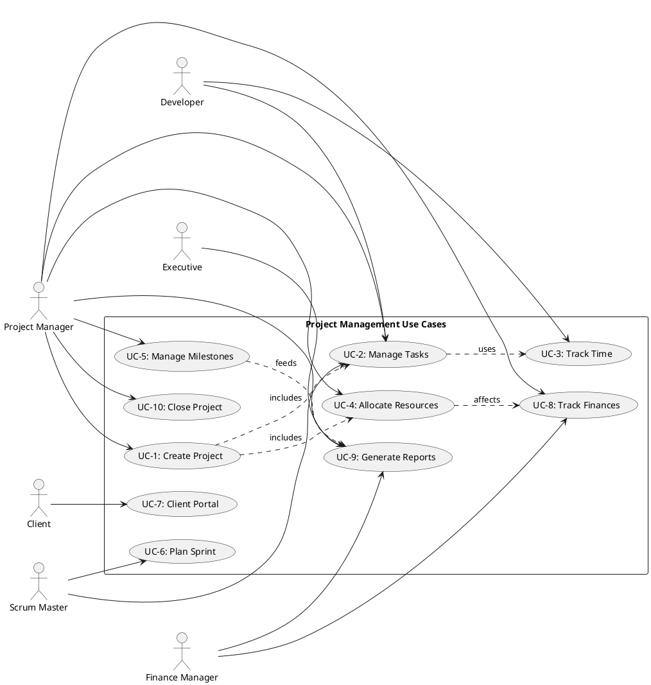

### System Boundary Diagram

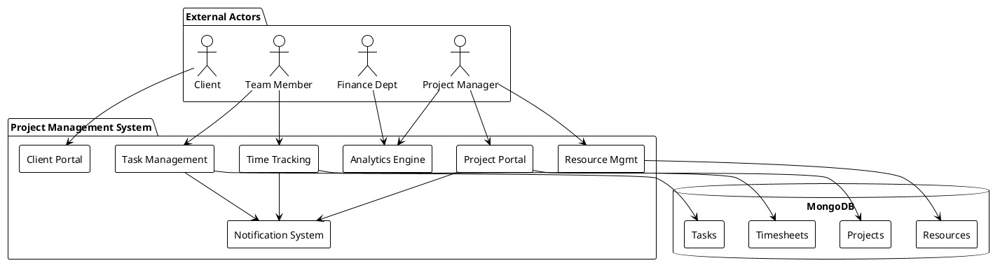

---

## Entity Relationship Diagram

### Database Schema Relationships (PlantUML)

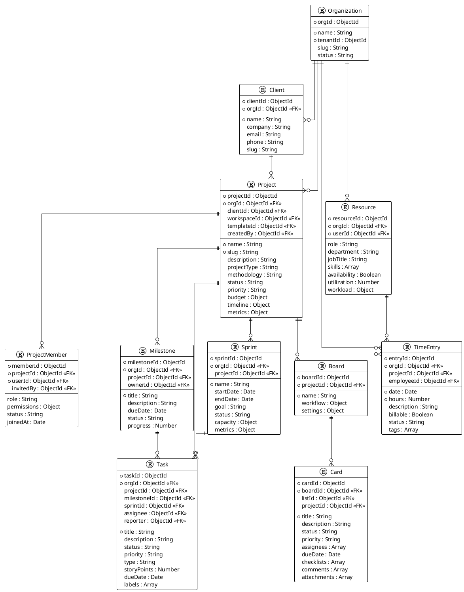

---

## Workflow Processes

### Project Initiation Workflow

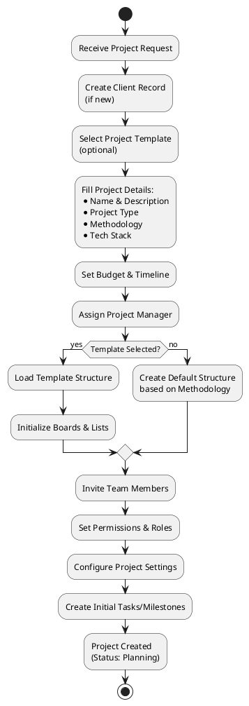

### Task Lifecycle Workflow

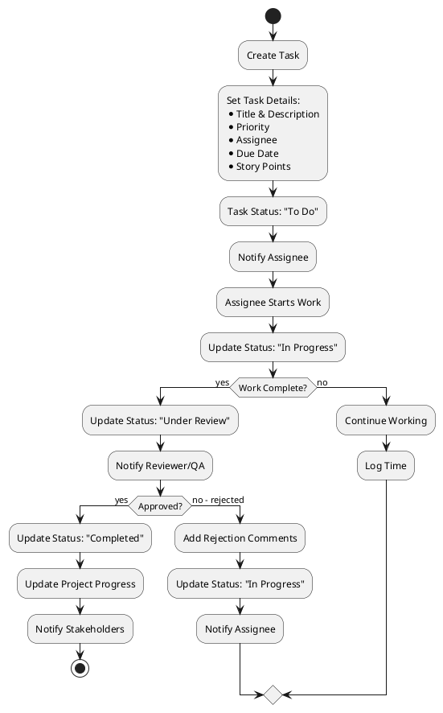

### Sprint Planning Workflow

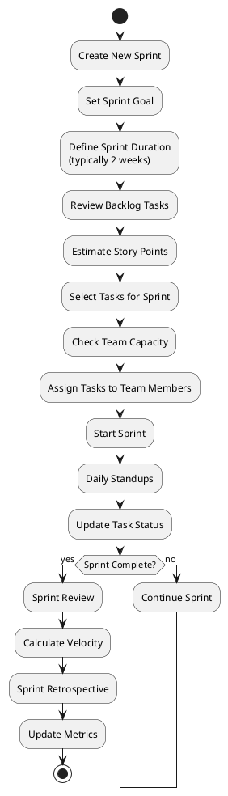

---

## Data Flow Diagrams

### Project Data Flow

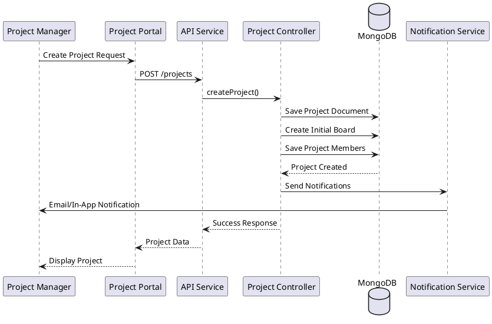

### Time Tracking Data Flow

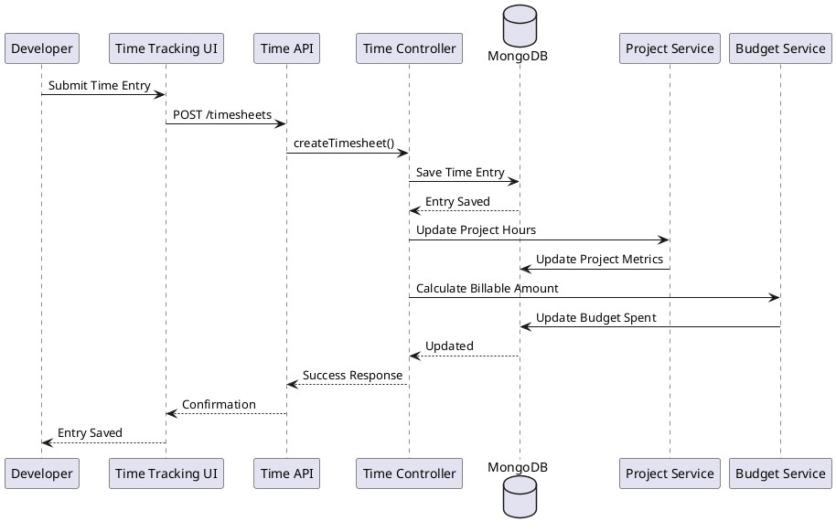

---

## State Transition Diagrams

### Project State Transitions

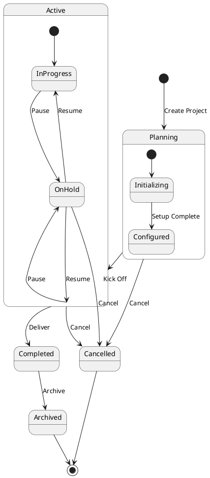

### Task State Transitions

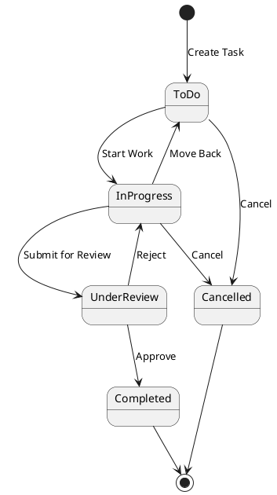

---

## API Endpoints

### Core Project Endpoints

| Method | Endpoint | Description | Auth Required |
|--------|----------|-------------|---------------|
| GET | `/api/tenant/:slug/organization/projects` | List all projects | Yes |
| GET | `/api/tenant/:slug/organization/projects/:id` | Get project details | Yes |
| POST | `/api/tenant/:slug/organization/projects` | Create project | PM Role |
| PATCH | `/api/tenant/:slug/organization/projects/:id` | Update project | PM Role |
| DELETE | `/api/tenant/:slug/organization/projects/:id` | Delete project | PM Role |
| GET | `/api/tenant/:slug/organization/projects/metrics` | Get project metrics | Yes |

### Task Endpoints

| Method | Endpoint | Description | Auth Required |
|--------|----------|-------------|---------------|
| GET | `/api/tenant/:slug/organization/projects/tasks` | List tasks | Yes |
| POST | `/api/tenant/:slug/organization/projects/tasks` | Create task | Yes |
| PATCH | `/api/tenant/:slug/organization/projects/tasks/:id` | Update task | Yes |
| DELETE | `/api/tenant/:slug/organization/projects/tasks/:id` | Delete task | Yes |

### Resource & Time Tracking

| Method | Endpoint | Description | Auth Required |
|--------|----------|-------------|---------------|
| GET | `/api/tenant/:slug/organization/projects/resources` | List resources | Yes |
| POST | `/api/tenant/:slug/organization/projects/resources/:id/allocate` | Allocate resource | PM Role |
| GET | `/api/tenant/:slug/organization/projects/timesheets` | List timesheets | Yes |
| POST | `/api/tenant/:slug/organization/projects/timesheets` | Create timesheet | Yes |
| PATCH | `/api/tenant/:slug/organization/projects/timesheets/:id` | Update timesheet | Yes |

---

## User Roles & Permissions

### Role Hierarchy

```
Super Admin (Highest)
    │
    ├── Organization Manager
    │       │
    │       ├── PMO Manager
    │       │       │
    │       │       └── Project Manager
    │       │               │
    │       │               ├── Scrum Master
    │       │               │
    │       │               └── Department Lead
    │       │                       │
    │       │                       └── Contributor
    │       │                               │
    │       │                               ├── Developer
    │       │                               ├── Designer
    │       │                               └── QA Engineer
    │       │
    │       └── Finance Manager
    │
    └── Client (Separate Hierarchy)
            │
            └── Client User
```

### Permission Matrix

| Action | Super Admin | PM | Developer | Client | Finance |
|--------|------------|----|-----------|--------|---------|
| Create Project | ✅ | ✅ | ❌ | ❌ | ❌ |
| Edit Project | ✅ | ✅ | ❌ | ❌ | ❌ |
| Delete Project | ✅ | ✅ | ❌ | ❌ | ❌ |
| Create Task | ✅ | ✅ | ✅ | Limited | ❌ |
| Edit Task | ✅ | ✅ | ✅ | Limited | ❌ |
| Delete Task | ✅ | ✅ | ❌ | ❌ | ❌ |
| Allocate Resources | ✅ | ✅ | ❌ | ❌ | ❌ |
| Track Time | ✅ | ✅ | ✅ | ❌ | ❌ |
| View Budget | ✅ | ✅ | ❌ | ❌ | ✅ |
| Approve Deliverables | ✅ | ✅ | ❌ | ✅ | ❌ |
| Generate Reports | ✅ | ✅ | Limited | ❌ | ✅ |

---

## Metrics & KPIs

### Project-Level Metrics

1. **Completion Rate**: % of tasks completed
2. **Budget Utilization**: Spent / Total Budget
3. **Schedule Adherence**: Actual Duration / Planned Duration
4. **Resource Utilization**: Allocated Hours / Available Hours
5. **Quality Metrics**: Defect Rate, Rework Percentage
6. **Client Satisfaction**: Approval Rate, Feedback Score

### Portfolio-Level Metrics

1. **Total Active Projects**: Count of active projects
2. **Project Health Distribution**: On Track / At Risk / Delayed
3. **Portfolio Budget**: Total budget across all projects
4. **Team Utilization**: Average resource utilization
5. **Project Success Rate**: % of projects completed on time/budget
6. **Revenue Metrics**: Total revenue, revenue per project

### Sprint Metrics (Scrum)

1. **Velocity**: Story points completed per sprint
2. **Sprint Burndown**: Remaining work over time
3. **Sprint Goal Achievement**: % of sprint goal met
4. **Capacity Utilization**: Actual hours / Planned hours

---

## Conclusion

This comprehensive documentation provides a complete overview of the Project Management Department in the Tenant Software House ERP system. It covers all aspects from use cases to technical implementation, providing stakeholders with a clear understanding of the system's capabilities and workflows.

For implementation details, refer to the individual component documentation in the codebase.

---

**Document Version**: 1.0  
**Last Updated**: 2024  
**Maintained By**: Development Team
