---

# UNIVERSITY OF EDUCATION

**Software Requirement Specifications**

**Project Title:**

The Wolf Stack (TWS): Multi-Tenant SaaS ERP Portal

**Submitted By:**

- bsf2205881 - Muneeb UR Rehman
- bsf2205882 - Muhammad Subhan
- bsf2205894 - Muhammad Ahmad Hashir

**Submitted To:**

Dr. M Ahsan Raza

**Project ID:**

IT-UEM-BS-F22M8

**Department of Information Sciences**  
**University of Education, Lahore**  
**Multan Campus**

---

# Software Requirements Specifications (SRS)
## TWS - Multi-Tenant Enterprise Resource Planning (ERP) Platform

---

## Table of Contents

1. Introduction
   1.1 Purpose
   1.2 Scope
   1.3 System Overview
   1.4 References
2. Definitions
3. Functional Requirements
4. Non-Functional Requirements
5. Use Cases
   5.1 Actors in the System
   5.2 Use Case Diagram
   5.3 Use Case Specifications
       UC-01: User Login / Authentication
       UC-02: Tenant Registration & Provisioning
       UC-03: Tenant Management
       UC-04: User Management (Tenant Level)
       UC-05: Role & Permission Management
       UC-06: Industry-Specific Module Access
       UC-07: Common Module Management
       UC-08: Dashboard & Analytics
       UC-09: Report Generation
       UC-10: Profile Management
       UC-11: Subscription & Billing Management
       UC-12: Audit Logging & Compliance
       UC-13: Password Recovery
       UC-14: Module Activation & Configuration
6. Data Flow Diagram
7. Entity Relationship Diagram
8. Database Schema
9. State Transition Diagram

---

## 1. Introduction

### 1.1 Purpose

The purpose of this Software Requirement Specification (SRS) document is to define the functional and non-functional requirements for the TWS (The Wolf Stack) Multi-Tenant Enterprise Resource Planning (ERP) Platform.

This system provides a comprehensive cloud-based SaaS solution that enables organizations from multiple industries (Education, Healthcare, Retail, Manufacturing, Software House) to manage their business operations through a unified, multi-tenant ERP system with industry-specific modules and common ERP functionalities.

This SRS will serve as a reference for:
- Developers
- Testers
- Project supervisors
- University stakeholders
- System architects

It ensures that the system is built according to agreed requirements.

### 1.2 Scope

The TWS Multi-Tenant ERP Platform is designed to:

**For Supra Administrators:**
- Create and manage tenant organizations
- Monitor platform health and performance
- Manage subscription plans and billing
- Configure Master ERP templates
- View platform-wide analytics

**For Tenant Administrators:**
- Manage organization users and roles
- Configure industry-specific modules
- Customize branding and settings
- View organization analytics
- Manage subscriptions

**For End Users (Managers, Employees, Industry-specific roles):**
- Access role-based dashboards
- Manage industry-specific data (students, patients, products, projects, etc.)
- Use common ERP modules (HR, Finance, Projects)
- Generate and export reports
- Manage personal profiles

**System Scope Summary:**

The system includes:
- Multi-tenant architecture with data isolation
- Industry-specific ERP modules (Education, Healthcare, Retail, Manufacturing, Software House)
- Common ERP modules (HR, Finance, Projects, Inventory, Messaging)
- Role-based access control (RBAC)
- Real-time features (WebSocket-based messaging and notifications)
- Reporting and analytics
- API integration
- Audit logging and compliance

The system eliminates manual processes, improves data accuracy, and increases operational efficiency across multiple industries.

### 1.3 System Overview

The system uses:
- **Frontend**: React.js web application for user interface
- **Backend**: Node.js/Express.js RESTful API server
- **Database**: MongoDB with tenant-isolated databases
- **Real-Time**: Socket.IO for WebSocket communication
- **Authentication**: JWT (JSON Web Tokens) for secure authentication
- **File Storage**: Local file system or cloud storage (S3-compatible)
- **Email Service**: SMTP or third-party service for notifications

**Main Components:**

1. **Multi-Tenant Management Module**
   - Tenant creation and provisioning
   - Database isolation per tenant
   - Subscription management
   - Resource quota management

2. **Authentication & Authorization Module**
   - User login and registration
   - JWT token management
   - Role-based access control
   - Two-factor authentication (2FA)

3. **Industry-Specific Modules**
   - Education ERP: Students, Teachers, Classes, Courses, Exams, Grades
   - Healthcare ERP: Patients, Doctors, Appointments, Medical Records, Prescriptions
   - Retail ERP: Products, Categories, Suppliers, POS, Sales, Inventory
   - Manufacturing ERP: Production Orders, Quality Control, Equipment, Maintenance
   - Software House ERP: Projects, Time Tracking, Client Portal, Code Quality

4. **Common ERP Modules**
   - HR Management: Employees, Payroll, Attendance, Departments, Teams
   - Finance: Chart of Accounts, Transactions, Invoicing, Financial Reports
   - Projects: Project Templates, Tasks, Time Tracking, Resource Allocation
   - Inventory: Stock Management, Warehouse Management, Reorder Alerts
   - Messaging: Internal Messaging, Notifications, Real-time Chat

5. **Reporting & Analytics Module**
   - Role-specific dashboards
   - Customizable reports
   - Data export (PDF, Excel, CSV)
   - Real-time metrics and KPIs

6. **Admin Panel**
   - Supra Admin: Platform-wide management
   - Tenant Admin: Organization-specific management
   - User management
   - Module configuration
   - System settings

### 1.4 References

1. IEEE SRS Standard 830
2. MongoDB Official Documentation
3. React.js Official Documentation
4. Node.js/Express.js Documentation
5. JWT (JSON Web Tokens) Specification
6. Socket.IO Documentation
7. Research papers on multi-tenant SaaS architectures
8. Project Proposal / Vision Document
9. University guidelines for Final Year Project

---

## 2. Definitions

| Term | Definition |
|------|------------|
| **TWS** | The Wolf Stack - Platform name |
| **ERP** | Enterprise Resource Planning |
| **SaaS** | Software as a Service |
| **Tenant** | An organization using the platform with isolated data and configuration |
| **Supra Admin** | Platform-level administrator with access to all tenants |
| **Tenant Admin** | Organization-level administrator managing their tenant |
| **Master ERP** | Pre-configured template for industry-specific tenant provisioning |
| **RBAC** | Role-Based Access Control |
| **JWT** | JSON Web Token - Authentication mechanism |
| **2FA** | Two-Factor Authentication |
| **orgId** | Organization Identifier |
| **tenantId** | Tenant Identifier |
| **MVC** | Model-View-Controller architecture pattern |
| **API** | Application Programming Interface |
| **REST** | Representational State Transfer |
| **WebSocket** | Real-time bidirectional communication protocol |
| **MongoDB** | NoSQL database used for data storage |
| **React** | Frontend JavaScript framework |
| **Express** | Backend Node.js web framework |

---

## 3. Functional Requirements

| No | Requirement | Description |
|---|---|---|
| **FR1** | **User Login/Authentication** | The system allows users to log in securely to access their respective roles. Supra Admins, Tenant Admins, Managers, Employees, and Industry-specific roles must enter valid credentials (email and password) to access system features. The system ensures that only authorized personnel can perform administrative tasks, while users can access features based on their role permissions. Login attempts are monitored, and incorrect credentials prevent access until proper authentication is provided. JWT tokens are used for session management with refresh token mechanism. |
| **FR2** | **Tenant Registration & Provisioning** | The system enables Supra Admins to register new tenant organizations into the platform. For each tenant, details such as organization name, tenant slug, industry type, subscription plan, and admin user credentials are recorded. The system creates an isolated database for each tenant, seeds default data (industry-specific and common), and sends a welcome email to the tenant admin. Once registered, the tenant's profile is stored securely and can be used for business operations. |
| **FR3** | **Tenant Management** | Supra Admins can manage tenant organizations including viewing tenant details, updating tenant information, deactivating/reactivating tenants, changing subscription plans, extending trial periods, and viewing usage statistics. All tenant management actions are logged in the audit log for compliance and tracking purposes. |
| **FR4** | **Industry-Specific Module Access** | The system provides industry-specific modules based on tenant configuration: • **Education**: Student management, Teacher management, Classes, Courses, Academic Year, Exams, Grades, Admissions • **Healthcare**: Patient management, Doctor management, Appointments, Medical Records, Prescriptions, Billing • **Retail**: Product management, Category management, Suppliers, POS terminal, Sales, Inventory, Customers • **Manufacturing**: Production orders, Quality control, Equipment management, Maintenance • **Software House**: Project management, Time tracking, Client portal, Code quality tracking Users can access these modules based on their role permissions and tenant configuration. |
| **FR5** | **Common Module Management** | The system provides common ERP modules available across all industries: • **HR Management**: Employee management, Payroll, Attendance, Departments, Teams, Leave management • **Finance**: Chart of accounts, Transactions, Invoicing, Financial reports, Budgeting • **Projects**: Project templates, Task management, Project tracking, Resource allocation, Time tracking • **Inventory**: Stock management, Warehouse management, Reorder levels, Stock alerts • **Messaging**: Internal messaging, Notifications, Real-time chat These modules are accessible to all tenants regardless of industry type. |
| **FR6** | **Dashboard & Analytics** | The system provides role-specific dashboards with real-time metrics and KPIs: • **Supra Admin Dashboard**: Platform overview, total tenants, subscription distribution, tenant growth trends • **Tenant Admin Dashboard**: Organization overview, user statistics, module usage • **Industry-Specific Dashboards**: Tailored metrics for each industry (e.g., Retail: Sales revenue, Products count, Low stock alerts; Education: Student enrollment, Teacher assignments) Dashboards display interactive charts, visualizations, and allow filtering by date range and other criteria. |
| **FR7** | **Report Generation** | The system provides comprehensive report generation features that allow users to access information in an organized manner. Reports can be generated for various modules including attendance, grades, sales, financial, project progress, and activity reports. Reports can be filtered by date range, department, user, status, and other custom filters. Users can view reports directly within the system interface or export them to formats such as PDF, Excel, or CSV for record-keeping and administrative purposes. This functionality ensures transparency, facilitates easy monitoring of trends, and supports decision-making for management. |
| **FR8** | **Profile Management** | The system allows users to manage their profiles including updating personal information (name, email, phone, address), uploading profile pictures, changing passwords with validation, and configuring preferences (theme, language, timezone, notifications). Users can view their activity history and manage notification settings. |
| **FR9** | **Subscription & Billing Management** | The system manages tenant subscriptions including multiple subscription plans (Trial, Basic, Professional, Enterprise), trial period management (default 14 days), subscription status tracking (Active, Suspended, Cancelled), billing cycle management (Monthly, Annual), usage tracking and limits per plan, and subscription upgrade/downgrade. Supra Admins can change subscription plans, extend trials, and manage billing cycles. |
| **FR10** | **Audit Logging** | The system automatically logs all critical actions for security monitoring, compliance requirements, and troubleshooting purposes. Audit logs include user actions (creation, modification, deletion), data access and modifications, login attempts and authentication events, permission changes, and export operations. Audit logs include: User ID, Timestamp, Action, Entity Type, IP Address, User Agent. Audit logs are searchable and exportable. |

---

## 4. Non-Functional Requirements

| No | Requirement | Description |
|---|---|---|
| **NFR1** | **Performance** | • Dashboard pages should load within 2-3 seconds • API endpoints should respond within 500ms for standard operations • Database queries should be optimized with proper indexing • System must support at least 100 concurrent users per tenant • File uploads should support files up to 100MB per file • Real-time updates should have latency less than 100ms • System performance must remain consistent as the number of registered tenants increases |
| **NFR2** | **Usability** | The system should have a user-friendly interface that is easy to navigate for all user types (Supra Admins, Tenant Admins, Managers, Employees, Industry-specific roles). Minimal technical knowledge is required to perform tasks like tenant management, user management, report generation, or module configuration. Clear instructions, buttons, and labels enhance the overall user experience. The interface should be responsive for Desktop (1920x1080+), Tablet (768px-1024px), and Mobile (320px-767px) devices. |
| **NFR3** | **Reliability & Accuracy** | The system must consistently perform operations with high accuracy, maintaining reliable data storage and retrieval. Data records should be reliable, preventing loss or duplication of information. The system should handle multiple users and tenants without errors to ensure trustworthy operation. System must maintain 99.5% uptime with automatic failover for critical services. |
| **NFR4** | **Security** | • Passwords must be encrypted using bcrypt (minimum 10 rounds) • JWT tokens must have expiration and refresh token mechanism • System must prevent SQL Injection (using parameterized queries with Mongoose) • System must prevent XSS (Cross-Site Scripting) attacks • System must prevent CSRF (Cross-Site Request Forgery) attacks • Data encryption at rest and in transit (HTTPS/TLS) • Role-based access control (RBAC) enforcement at API and UI levels • Session management with automatic logout after inactivity • Input validation and sanitization for all user inputs • Tenant data isolation to prevent cross-tenant data access |
| **NFR5** | **Maintainability** | The system is designed to be easily maintainable to support future updates and enhancements. It uses a modular structure, separating multi-tenant management, authentication, industry-specific modules, common modules, reporting, and user interface into distinct components. This allows developers to modify or update one module without affecting the others. Clear documentation of code and database design ensures that new developers can quickly understand the system's workflow. Error handling and logging are implemented to simplify debugging and monitoring. The database is flexible and scalable, allowing addition of new fields or collections without disrupting existing data. Widely used technologies like Node.js, Express.js, React.js, and MongoDB make maintenance easier and cost-effective. Overall, the system's design ensures reliability, adaptability, and long-term usability. |

---

## 5. Use Cases

### 5.1 Actors in the System

The Actors/Attributes shown in the Use Case Diagram are defined below:

**1. Supra Admin**
A platform-level administrator who can:
- Manually create tenants (for enterprise or exception cases)
- Monitor platform health and performance
- Manage Master ERP templates
- Override subscription settings for exception cases
- View platform-wide analytics and tenant activity
- Audit user activity across tenants for compliance

**2. Tenant Admin**
An organization-level administrator who can:
- Self-register and create tenant through industry landing pages
- Configure organization settings and branding
- Manage users, roles, and permissions
- Activate and configure modules
- View tenant-specific analytics
- Manage subscription plans (upgrade/downgrade)
- View user activity history within tenant

**3. Manager**
A department or team manager who can:
- Manage team members
- View reports
- Approve requests
- Assign tasks
- Monitor team performance

**4. Employee**
A standard user with basic permissions who can:
- View assigned tasks
- Submit timesheets
- Access personal information
- View schedules
- Mark attendance

**5. Industry-Specific Roles**
- **Education**: Principal, Teacher, Student
- **Healthcare**: Doctor, Patient
- **Retail**: Store Manager, Cashier
- **Manufacturing**: Production Manager
- **Software House**: Project Manager, Developer

### 5.2 Use Case Diagram

The Use Case Diagram for the TWS Multi-Tenant ERP Platform is provided in PlantUML format in the following files:
- `TWS_USE_CASE_DIAGRAM.puml` - Complete detailed diagram
- `TWS_USE_CASE_DIAGRAM_MAIN.puml` - Main diagram with all relationships
- `TWS_USE_CASE_DIAGRAM_A4.puml` - A4 landscape optimized version

**To view the diagrams:**
1. Use PlantUML viewer (VS Code extension, online at http://www.plantuml.com/plantuml, or desktop application)
2. The diagrams follow UML Use Case Diagram conventions with actors and use cases

**Main Use Case Diagram Preview (Mermaid fallback):**

```mermaid
flowchart TB
    subgraph LeftActors[" "]
        direction TB
        SupraAdmin[Supra<br/>Admin]
        TenantAdmin[Tenant<br/>Admin]
        Manager[Manager]
        Employee[Employee]
    end

    subgraph System["TWS MULTI-TENANT ERP SYSTEM"]
        direction TB
        
        UC01[UC-01: Login]
        UC02[UC-02: Tenant Signup]
        UC03[UC-03: Tenant Mgmt]
        UC04[UC-04: User Mgmt]
        UC05[UC-05: Role Mgmt]
        UC06[UC-06: Template Mgmt]
        UC10[UC-10: Dashboard]
        UC11[UC-11: Reports]
        UC12[UC-12: Messaging]
        UC13[UC-13: Subscription]
        UC14[UC-14: Profile]
        UC15[UC-15: Password Reset]
        UC16[UC-16: Activity History]
        
        UC07[UC-07: Education ERP]
        UC08[UC-08: Healthcare ERP]
        UC09[UC-09: Software House ERP]
    end

    subgraph RightActors[" "]
        direction TB
        Principal[Principal]
        Teacher[Teacher]
        Student[Student]
        Doctor[Doctor]
        Patient[Patient]
        ProjectMgr[Project<br/>Manager]
        Developer[Developer]
        PreTenant[Pre-Tenant<br/>User]
    end

    %% Supra Admin
    SupraAdmin --> UC01
    SupraAdmin --> UC03
    SupraAdmin --> UC06
    SupraAdmin --> UC13
    SupraAdmin --> UC16
    SupraAdmin --> UC10
    SupraAdmin --> UC11

    %% Tenant Admin
    TenantAdmin --> UC01
    TenantAdmin --> UC02
    TenantAdmin --> UC04
    TenantAdmin --> UC05
    TenantAdmin --> UC07
    TenantAdmin --> UC08
    TenantAdmin --> UC09
    TenantAdmin --> UC10
    TenantAdmin --> UC11
    TenantAdmin --> UC12
    TenantAdmin --> UC13
    TenantAdmin --> UC14
    TenantAdmin --> UC16

    %% Manager
    Manager --> UC01
    Manager --> UC04
    Manager --> UC10
    Manager --> UC11
    Manager --> UC12
    Manager --> UC14

    %% Employee
    Employee --> UC01
    Employee --> UC10
    Employee --> UC12
    Employee --> UC14
    Employee --> UC15

    %% Education Actors
    Principal --> UC01
    Principal --> UC07
    Principal --> UC10
    Principal --> UC11
    Principal --> UC12
    Principal --> UC14

    Teacher --> UC01
    Teacher --> UC07
    Teacher --> UC10
    Teacher --> UC11
    Teacher --> UC12
    Teacher --> UC14

    Student --> UC01
    Student --> UC07
    Student --> UC10
    Student --> UC12
    Student --> UC14
    Student --> UC15

    %% Healthcare Actors
    Doctor --> UC01
    Doctor --> UC08
    Doctor --> UC10
    Doctor --> UC11
    Doctor --> UC12
    Doctor --> UC14

    Patient --> UC01
    Patient --> UC08
    Patient --> UC10
    Patient --> UC12
    Patient --> UC14
    Patient --> UC15

    %% Software House Actors
    ProjectMgr --> UC01
    ProjectMgr --> UC09
    ProjectMgr --> UC10
    ProjectMgr --> UC11
    ProjectMgr --> UC12
    ProjectMgr --> UC14

    Developer --> UC01
    Developer --> UC09
    Developer --> UC10
    Developer --> UC12
    Developer --> UC14

    %% Pre-Tenant User
    PreTenant --> UC01
    PreTenant --> UC02

    %% Use Case Relationships
    UC01 -.->|leads to| UC10
    UC02 -.->|creates| UC04
    UC02 -.->|applies| UC06
    UC04 -.->|requires| UC05
    UC07 -.->|generates| UC11
    UC08 -.->|generates| UC11
    UC09 -.->|generates| UC11
    UC14 -.->|tracks| UC16
    UC15 -.->|resets| UC01

    %% Styling
    classDef actor fill:#e1f5ff,stroke:#01579b,stroke-width:2px
    classDef useCase fill:#fff3e0,stroke:#e65100,stroke-width:2px
    classDef industryUC fill:#e8f5e9,stroke:#2e7d32,stroke-width:2px

    class SupraAdmin,TenantAdmin,Manager,Employee,Principal,Teacher,Student,Doctor,Patient,ProjectMgr,Developer,PreTenant actor
    class UC01,UC02,UC03,UC04,UC05,UC06,UC10,UC11,UC12,UC13,UC14,UC15,UC16 useCase
    class UC07,UC08,UC09 industryUC
```

**Note:** For detailed views and alternative layouts, refer to `TWS_USE_CASE_DIAGRAM.md` and `TWS_USE_CASE_DIAGRAM_COMPACT.md`.

The Use Case Diagram shows:

- **Supra Admin** interacting with: Tenant Management, Platform Monitoring, Master ERP Management, Subscription Management
- **Tenant Admin** interacting with: User Management, Module Configuration, Organization Settings, Tenant Analytics
- **Managers** interacting with: Team Management, Report Generation, Task Assignment, Approval Workflows
- **Employees** interacting with: Attendance Management, Task Viewing, Profile Management
- **Industry-specific roles** interacting with their respective modules (Education, Healthcare, Retail, Manufacturing, Software House)

### 5.3 Use Case Specifications

**Summary of Use Cases:**

| UC ID | Name | Primary Actor | Priority |
|---|---|---|---|
| UC-01 | User Login / Authentication | All Users | 5 (Critical) |
| UC-02 | Self-Serve Tenant Signup & Provisioning | User (Pre-Tenant) | 5 (Critical) |
| UC-03 | Tenant Management (Supra Admin) | Supra Admin | 4 (High) |
| UC-04 | User Management (Tenant Level) | Tenant Admin | 5 (Critical) |
| UC-05 | Role & Permission Management | Tenant Admin | 5 (Critical) |
| UC-06 | Master ERP Template Management | Supra Admin | 4 (High) |
| UC-07 | Education ERP Module Management | User | 5 (Critical) |
| UC-08 | Healthcare ERP Module Management | Doctor, Patient, Receptionist, Tenant Admin | 5 (Critical) |
| UC-09 | Software House ERP Module Management | Project Manager, Developer, Client, Tenant Admin | 5 (Critical) |
| UC-10 | Dashboard & Analytics | All Users | 4 (High) |
| UC-11 | Report Generation & Export | User | 4 (High) |
| UC-12 | Messaging & Notifications | User | 4 (High) |
| UC-13 | Subscription & Billing Management | Tenant Admin / Supra Admin | 4 (High) |
| UC-14 | User Profile Management | All Users | 3 (Medium) |
| UC-15 | Password Recovery | User | 4 (High) |
| UC-16 | User Activity History | Tenant Admin / Supra Admin | 3 (Medium) |

---

#### UC-01: User Login / Authentication

| Number | UC-01 |
|--------|-------|
| **Name** | User Login / Authentication |
| **Summary** | Allows Supra Admins, Tenant Admins, Managers, Employees, and Industry-specific users to authenticate using email and password to access system features with role-based dashboard redirection. |
| **Priority** | Critical |
| **Preconditions** | • User account must exist in the database • Valid email and password must be available • User account must be active and not suspended • Tenant must be active (for tenant users) |
| **Postconditions** | User is logged in, JWT tokens are generated, user is redirected to role-specific dashboard, login activity is logged in audit log, last login timestamp is updated. |
| **Primary Actor(s)** | User (Supra Admin, Tenant Admin, Manager, Employee, Industry-specific roles) |
| **Secondary Actor(s)** | System |
| **Trigger** | User navigates to login page and clicks the "Login" button. |

**Main Scenario:**

| Step | Action |
|------|--------|
| 1 | User opens the login page |
| 2 | User selects login type (Supra Admin, Tenant Login, Education Login, etc.) |
| 3 | User enters email and password |
| 4 | System validates the entered credentials format |
| 5 | System queries database for user record |
| 6 | System verifies password using bcrypt comparison |
| 7 | System checks if account is active and not suspended |
| 8 | System checks if account belongs to active tenant (if tenant user) |
| 9 | If 2FA enabled, system prompts for verification code |
| 10 | System generates JWT access token (expires in 15 minutes) |
| 11 | System generates refresh token (expires in 7 days) |
| 12 | System stores refresh token in database |
| 13 | System logs login activity in audit log (User ID, IP Address, Timestamp, User Agent) |
| 14 | System updates user's last login timestamp |
| 15 | System redirects user to role-based dashboard: • Supra Admin → Supra Admin Dashboard • Tenant Admin → Tenant Admin Dashboard • Manager → Manager Dashboard • Employee → Employee Dashboard • Industry roles → Industry-specific Dashboard |

**Extension:**

| Step | Branching Action |
|------|------------------|
| 4a | Invalid email format → System displays error: "Invalid email format" |
| 6a | Invalid credentials → System displays error: "Incorrect email or password" |
| 7a | Account inactive → System displays error: "Account is inactive, contact administrator" |
| 7b | Account suspended → System displays error: "Account suspended, contact support" |
| 8a | Tenant inactive → System displays error: "Your organization's subscription is inactive" |
| 9a | 2FA code incorrect → System displays error: "Invalid verification code, please try again" |
| 9b | User forgets password → Redirects to password recovery page (UC-13) |
| 12a | Session expired → System redirects to login page with message: "Session expired, please login again" |
| 6b | Rate limiting → System blocks login after 5 failed attempts for 15 minutes |

**Open Issues:**

| Issue # | Question |
|--------|----------|
| 1 | Should the system support social login (Google, Microsoft)? |
| 2 | Should the system support biometric authentication? |
| 3 | Should password reset be integrated into login flow? |

---

#### UC-02: Self-Serve Tenant Signup & Provisioning

| Number | UC-02 |
|--------|-------|
| **Name** | Self-Serve Tenant Signup & Provisioning |
| **Summary** | User initiates self-service tenant signup from industry-specific landing pages, verifies email, and completes tenant and organization setup with automatic provisioning, database creation, and data seeding. |
| **Priority** | Critical |
| **Preconditions** | • User accesses industry-specific landing page (Education, Healthcare, Retail, Manufacturing, Software House) • Email service must be configured • MongoDB database must be accessible |
| **Postconditions** | Pre-tenant user account created, email verified, tenant created with isolated database, default organization created, user assigned Tenant Admin role, industry ERP template applied, default data seeded, tenant marked as Active, user logged in and redirected to tenant subdomain, welcome email sent, onboarding checklist presented. |
| **Primary Actor(s)** | User (Pre-Tenant State) |
| **Secondary Actor(s)** | System, Email Service |
| **Trigger** | User navigates to industry-specific landing page and clicks "Sign Up" or "Get Started" button. |

**Main Scenario:**

| Step | Action |
|------|--------|
| 1 | User navigates to industry-specific landing page (Education/Healthcare/Retail/Manufacturing/Software House) |
| 2 | User clicks "Sign Up" or "Get Started" button |
| 3 | User fills signup form: • Email Address • Password (with validation rules) • Industry is auto-assigned based on landing page |
| 4 | System validates email format and password strength |
| 5 | System creates pre-tenant user account with status "Unverified" |
| 6 | System securely hashes and stores password using bcrypt |
| 7 | System generates email verification code or verification link |
| 8 | System sends verification email to user |
| 9 | User receives email and clicks verification link or enters verification code |
| 10 | System verifies email code/link and marks user account as "Verified" |
| 11 | System redirects verified user to organization setup page |
| 12 | User provides organization details: • Organization Name • Desired Tenant Slug or Subdomain • Timezone, Currency, Language (optional) |
| 13 | System validates organization details |
| 14 | System checks if tenant slug/subdomain is unique |
| 15 | System creates tenant record in main database |
| 16 | System generates unique tenant ID |
| 17 | System creates isolated tenant database (`tws_<tenantId>`) |
| 18 | System creates default organization record in tenant database |
| 19 | System assigns Tenant Admin role to verified user |
| 20 | System associates user with tenant and organization |
| 21 | System automatically applies industry ERP master template based on landing page |
| 22 | System seeds industry-specific default data: • Education: Academic Year, Teachers, Classes, Courses, Students, Exams, Grades • Healthcare: Doctors, Patients, Appointments, Medical Records, Prescriptions • Retail: Categories, Suppliers, Products, Customers, Sales • Manufacturing: Equipment, Production Orders, Quality Control, Maintenance • Software House: Projects, Sprints, Roles, Technology Stack |
| 23 | System seeds common ERP default data: • Default departments (HR, Finance, Project Management, Operations, Sales & Marketing) • Default teams within departments • Chart of accounts • Sample employees and payroll setup • Project templates • Sample project with tasks • Sample finance transactions • Sample clients and vendors • Meeting templates • Notification templates |
| 24 | System sets tenant status to "Active" |
| 25 | System sets subscription to "Trial" with 14-day default period |
| 26 | System automatically logs in user with created credentials |
| 27 | System redirects user to tenant subdomain (`<tenant-slug>.domain.com`) |
| 28 | System sends welcome email to Tenant Admin |
| 29 | System presents role-based and industry-specific onboarding checklist on first login |
| 30 | System tracks onboarding progress |
| 31 | System displays success message with tenant access information |

**Extension:**

| Step | Branching Action |
|------|------------------|
| 3a | Invalid email format → System displays error: "Invalid email format" |
| 3b | Weak password → System displays error: "Password must meet requirements (minimum 8 characters, uppercase, lowercase, number)" |
| 4a | Email already exists → System displays error: "Email already registered. Please login or use password recovery." |
| 8a | Email sending failure → System displays error: "Unable to send verification email. Please try again." |
| 9a | Verification link expired → System displays error: "Verification link expired. Please request a new verification email." |
| 9b | Invalid verification code → System displays error: "Invalid verification code. Please check and try again." |
| 10a | User account not found → System displays error: "Verification failed. Please sign up again." |
| 12a | Invalid organization name → System displays error: "Organization name is required" |
| 14a | Duplicate tenant slug → System displays error: "This subdomain is already taken. Please choose another." |
| 14b | Invalid slug format → System displays error: "Subdomain can only contain lowercase letters, numbers, and hyphens" |
| 17a | Database creation failure → System rolls back transaction, displays error: "Unable to create tenant database. Please contact support." |
| 22a | Template application failure → System logs error but continues: "Template application failed (non-critical), tenant created successfully" |
| 23a | Data seeding failure → System logs warning but continues: "Some default data could not be seeded (non-critical), tenant is functional" |
| 28a | Welcome email failure → Tenant created successfully, but welcome email failed (logged as non-critical error) |
| 29a | Onboarding checklist failure → System logs error but user can proceed: "Onboarding checklist unavailable, but tenant is functional" |

**Open Issues:**

| Issue # | Question |
|--------|----------|
| 1 | Should the system support custom domain configuration during signup? |
| 2 | Should tenant creation be asynchronous with progress tracking for large data seeding? |
| 3 | Should the system allow users to skip onboarding checklist? |
| 4 | Should the system support social login (Google, Microsoft) for initial signup? |

---

#### UC-03: Tenant Management (Supra Admin)

| Number | UC-03 |
|--------|-------|
| **Name** | Tenant Management |
| **Summary** | Supra Admin manages tenant organizations including creation, update, deactivation, monitoring, and subscription management. |
| **Priority** | High |
| **Preconditions** | • Supra Admin must be logged in • User must have Supra Admin role |
| **Postconditions** | Tenant information updated in database. Changes reflected in tenant list, audit log updated, and tenant admin notified (if applicable). |
| **Primary Actor(s)** | Supra Admin |
| **Secondary Actor(s)** | System |
| **Trigger** | Supra Admin navigates to Tenant Management dashboard. |

**Main Scenario:**

| Step | Action |
|------|--------|
| 1 | Supra Admin navigates to Tenant Management dashboard |
| 2 | System displays list of all tenants with filters (Status, Plan, Industry, Date Range) |
| 3 | Admin views tenant statistics: • Total tenants, Active tenants, Trial tenants, Suspended tenants • Subscription plan distribution • Tenant growth trends (chart) |
| 4 | Admin can perform actions: • View Tenant Details • Edit Tenant • Deactivate/Reactivate Tenant • Delete Tenant • Change Subscription Plan • Extend Trial • View Usage Statistics |
| 5 | System validates all actions |
| 6 | System updates database |
| 7 | System logs all actions in audit log |
| 8 | System sends notification to tenant admin (if subscription changed) |
| 9 | System displays confirmation message |

**Extension:**

| Step | Branching Action |
|------|------------------|
| 4a | Unauthorized access → System displays error: "You do not have Supra Admin privileges" |
| 4b | Tenant has active users → System prevents deletion: "Cannot delete tenant with active users. Deactivate tenant first." |
| 4c | Dependency conflict → System prevents action: "Cannot perform action, tenant has active dependencies" |
| 4d | System error → System displays error: "Unable to process request, please try again" |

**Open Issues:**

| Issue # | Question |
|--------|----------|
| 1 | Should the system support bulk tenant operations? |
| 2 | Should the system allow tenant data export before deletion? |

---

#### UC-04: User Management (Tenant Level)

| Number | UC-04 |
|--------|-------|
| **Name** | User Management (Tenant Level) |
| **Summary** | Tenant Admin creates, manages, and assigns users (employees, teachers, doctors, etc.) with roles and permissions within their organization. |
| **Priority** | Critical |
| **Preconditions** | • Tenant Admin must be authenticated • Staff information must be available • Departments must exist (for employees) • Subscription plan has available user slots |
| **Postconditions** | Staff record stored successfully, staff member can log in (if credentials provided), staff member can be assigned to departments/teams, staff member can be used for attendance and payroll management. |
| **Primary Actor(s)** | Tenant Admin |
| **Secondary Actor(s)** | System |
| **Trigger** | Tenant Admin navigates to HR/Staff Management and selects "Register Staff" option. |

**Main Scenario:**

| Step | Action |
|------|--------|
| 1 | Tenant Admin opens Staff Registration module |
| 2 | Admin selects staff type (Teacher, Doctor, Employee, etc.) based on industry |
| 3 | Admin enters staff details: • Personal Information (Name, Date of Birth, Gender, Contact Information) • Professional Information (Employee ID, Joining Date, Department, Designation, Qualifications, Experience) • Industry-specific information (Subjects for teachers, Specialization for doctors, etc.) • Salary Information (if applicable) |
| 4 | Admin assigns role and permissions |
| 5 | System validates the entered details |
| 6 | System checks if employee ID already exists |
| 7 | System stores staff profile in database |
| 8 | System creates user account with assigned role |
| 9 | System links staff to department/team |
| 10 | System sends invitation email to user |
| 11 | System displays success message |
| 12 | System logs user creation in audit log |

**Extension:**

| Step | Branching Action |
|------|------------------|
| 5a | Missing required fields → System displays error: "[field] is required" |
| 6a | Duplicate Employee ID → System displays error: "Employee ID already exists" |
| 8a | Email already exists → System displays error: "Email already in use" |
| 7a | Quota Exceeded → System displays error: "User limit reached. Please upgrade subscription." |
| 10a | Email sending failure → User created successfully, but invitation email failed (logged as non-critical error) |

**Open Issues:**

| Issue # | Question |
|--------|----------|
| 1 | Should we allow bulk user import via CSV? |
| 2 | Should the system support user photo upload during registration? |
| 3 | Should staff have different access-level groups (e.g., HOD, Senior Teacher, Junior Teacher)? |

---

#### UC-05: Role & Permission Management (RBAC)

| Number | UC-05 |
|--------|-------|
| **Name** | Role & Permission Management |
| **Summary** | Tenant Admin creates custom roles, assigns permissions, and manages role hierarchies for fine-grained access control. |
| **Priority** | Critical |
| **Preconditions** | • Tenant Admin must be authenticated • RBAC module must be enabled |
| **Postconditions** | Role created/updated with specific permission set, permissions assigned, users with role updated, audit log updated. |
| **Primary Actor(s)** | Tenant Admin |
| **Secondary Actor(s)** | System |
| **Trigger** | Tenant Admin navigates to "Roles & Permissions" section. |

**Main Scenario:**

| Step | Action |
|------|--------|
| 1 | Admin navigates to Roles & Permissions |
| 2 | Admin clicks "Create Role" or selects existing role |
| 3 | Admin defines Role Name and Description |
| 4 | Admin toggles permissions for each module (Create, Read, Update, Delete) |
| 5 | Admin configures feature permissions (Export, Approve, Manage Users, etc.) |
| 6 | Admin sets role hierarchy (who reports to whom) |
| 7 | System validates permission combinations |
| 8 | Admin saves the role |
| 9 | System updates role definition in database |
| 10 | System updates all users with this role |
| 11 | System logs action in audit log |

**Extension:**

| Step | Branching Action |
|------|------------------|
| 4a | Permission conflict → System warns about conflicting permissions |
| 4b | Admin tries to remove own admin privileges → System prevents action |
| 6a | Invalid hierarchy → System prevents circular reporting structures |
| 8a | Role in use → System prevents deletion if users assigned to role |

**Open Issues:**

| Issue # | Question |
|--------|----------|
| 1 | Should we support field-level permissions? |
| 2 | Should the system support custom permission sets? |

---

#### UC-06: Master ERP Template Management

| Number | UC-06 |
|--------|-------|
| **Name** | Master ERP Template Management |
| **Summary** | Supra Admin defines and manages industry-specific Master ERP templates that include modules, menus, permissions, and default data. Templates are version-controlled and automatically applied during tenant creation for self-serve onboarding. |
| **Priority** | High |
| **Preconditions** | • Supra Admin must be logged in and authenticated • Template management module must be accessible |
| **Postconditions** | Master ERP template created/updated with version control. Template includes modules, menus, permissions, and default data. Template can be applied to new tenants automatically. Existing tenant configurations can be updated when template version changes (respecting tenant isolation). |
| **Primary Actor(s)** | Supra Admin |
| **Secondary Actor(s)** | System |
| **Trigger** | Supra Admin navigates to Master ERP Template Management section. |

**Main Scenario:**

| Step | Action |
|------|--------|
| 1 | Supra Admin navigates to Master ERP Template Management |
| 2 | System displays list of existing templates by industry (Education, Healthcare, Retail, Manufacturing, Software House) |
| 3 | Admin selects "Create New Template" or selects existing template to edit |
| 4 | Admin defines template details: • Industry Type • Template Name and Version • Template Description |
| 5 | Admin configures template components: • Modules to include (industry-specific and common ERP modules) • Menu structure and navigation • Default permissions for roles • Default data to seed (sample records, configurations) |
| 6 | Admin defines industry-specific default data: • Education: Academic Year structure, Class templates, Course templates, Grade scales • Healthcare: Department structure, Appointment types, Medical record templates • Retail: Category structure, Product templates, POS configurations • Manufacturing: Equipment types, Production order templates • Software House: Project templates, Technology stack defaults, Billing configurations |
| 7 | Admin defines common ERP default data: • Default departments and teams • Chart of accounts • Project templates • Meeting templates • Notification templates |
| 8 | Admin saves template with version number |
| 9 | System validates template configuration |
| 10 | System stores template in version-controlled repository |
| 11 | System marks template as "Active" for new tenant provisioning |
| 12 | System logs template creation/update in audit log |
| 13 | System displays success message |

**Main Scenario (Template Update for Existing Tenants):**

| Step | Action |
|------|--------|
| 1 | Supra Admin updates existing template version |
| 2 | System identifies tenants using the template |
| 3 | Admin selects update strategy: • Apply to new tenants only • Notify existing tenants of updates • Apply updates to existing tenants (with confirmation) |
| 4 | If applying to existing tenants, system respects tenant isolation and applies updates only to configuration, not tenant data |
| 5 | System logs template update and tenant impact in audit log |

**Extension:**

| Step | Branching Action |
|------|------------------|
| 4a | Invalid template configuration → System displays error: "Template configuration is invalid: [error details]" |
| 5a | Missing required modules → System displays warning: "Template must include at least one module" |
| 8a | Version conflict → System displays error: "Template version already exists" |
| 10a | Template storage failure → System displays error: "Unable to save template. Please try again." |
| 4b | Tenant data conflict → System prevents update: "Cannot update template, conflicts with existing tenant data" |

**Open Issues:**

| Issue # | Question |
|--------|----------|
| 1 | Should the system support template rollback? |
| 2 | Should the system support template preview before applying? |
| 3 | Should the system support custom template creation by Supra Admin? |
| 4 | Should template updates be optional for existing tenants? |

---

#### UC-07: Education ERP Module Management

| Number | UC-07 |
|--------|-------|
| **Name** | Education ERP Module Management |
| **Summary** | Users manage education-specific data including student profiles with guardians and enrollment information, teacher profiles with subjects and schedules, class scheduling and timetable management, courses with codes and credits, academic years and semesters, exams with grade entry and GPA calculations, and admission workflows with approval processes. |
| **Priority** | Critical |
| **Preconditions** | • User must be logged in • Tenant must have Education ERP module enabled • User must have appropriate role permissions (Principal, Teacher, Admin) |
| **Postconditions** | Education data created/updated in tenant database. Changes reflected in UI, related records updated (e.g., student-class associations), audit log updated, and reports updated. |
| **Primary Actor(s)** | Principal, Teacher, Tenant Admin, Manager |
| **Secondary Actor(s)** | System |
| **Trigger** | User navigates to Education section from dashboard. |

**Main Scenario (Student Management):**

| Step | Action |
|------|--------|
| 1 | User navigates to Education → Students |
| 2 | System displays student list with filters (Class, Academic Year, Status) |
| 3 | User clicks "Add Student" or selects existing student |
| 4 | User enters student details: • Personal Information (Name, Date of Birth, Gender, Contact) • Guardian Information (Father, Mother, Guardian with contact details) • Enrollment Information (Admission Date, Admission Number, Class, Section, Roll Number, Academic Year) |
| 5 | System validates student data |
| 6 | System checks for duplicate admission numbers |
| 7 | System stores student profile in database |
| 8 | System associates student with class and academic year |
| 9 | System logs action in audit log |

**Main Scenario (Teacher Management):**

| Step | Action |
|------|--------|
| 1 | User navigates to Education → Teachers |
| 2 | System displays teacher list |
| 3 | User creates/updates teacher profile: • Personal Information • Professional Information (Employee ID, Joining Date, Department, Designation, Qualifications, Experience) • Subject Assignments • Class Assignments • Schedule Information |
| 4 | System validates and stores teacher data |
| 5 | System links teacher to subjects and classes |

**Main Scenario (Class & Timetable Management):**

| Step | Action |
|------|--------|
| 1 | User navigates to Education → Classes |
| 2 | User creates/updates class: • Class Name and Code • Academic Year • Section • Capacity • Class Teacher Assignment • Subject Schedule (day, period, subject, teacher) |
| 3 | System validates class configuration |
| 4 | System generates timetable |
| 5 | System stores class and schedule data |

**Main Scenario (Course Management):**

| Step | Action |
|------|--------|
| 1 | User navigates to Education → Courses |
| 2 | User creates/updates course: • Course Name and Code • Description • Credits • Duration (Semester/Year/Quarter) • Prerequisites • Objectives • Syllabus Topics |
| 3 | System validates course data |
| 4 | System stores course information |

**Main Scenario (Academic Year Management):**

| Step | Action |
|------|--------|
| 1 | User navigates to Education → Academic Years |
| 2 | User creates academic year: • Year Name • Start Date • End Date • Terms (Term Name, Start Date, End Date) • Holidays |
| 3 | System validates dates and terms |
| 4 | System stores academic year configuration |

**Main Scenario (Exam & Grade Management):**

| Step | Action |
|------|--------|
| 1 | User navigates to Education → Exams |
| 2 | User creates exam: • Exam Type (Quiz, Midterm, Final, Assignment, Project) • Subject • Class • Exam Date • Total Marks |
| 3 | Teacher enters grades for students: • Student Selection • Marks Obtained • System calculates Percentage and Grade |
| 4 | System calculates GPA for students |
| 5 | System stores exam and grade data |

**Main Scenario (Admission Management):**

| Step | Action |
|------|--------|
| 1 | User navigates to Education → Admissions |
| 2 | User creates admission application: • Applicant Information • Previous School Information • Documents Upload • Application Status |
| 3 | Admin reviews and approves/rejects application |
| 4 | System updates admission status |
| 5 | If approved, system creates student profile |

**Extension:**

| Step | Branching Action |
|------|------------------|
| 4a | Invalid data → System displays validation error: "[field] is required" |
| 6a | Duplicate admission number → System displays error: "Admission number already exists" |
| 3a | Class capacity exceeded → System displays warning: "Class is full. Cannot add more students." |
| 5a | Schedule conflict → System displays error: "Teacher has conflicting schedule" |
| 3b | Insufficient permissions → System displays error: "You do not have permission to perform this action" |

**Open Issues:**

| Issue # | Question |
|--------|----------|
| 1 | Should the system support bulk student import via CSV? |
| 2 | Should the system support online admission applications? |
| 3 | Should the system support parent portal for viewing student progress? |

---

#### UC-08: Healthcare ERP Module Management

| Number | UC-08 |
|--------|-------|
| **Name** | Healthcare ERP Module Management |
| **Summary** | Users manage healthcare-specific data including patient profiles with medical history and vitals, doctor profiles with specializations and schedules, appointment booking and calendar management, medical records and treatment notes, prescriptions, billing and invoicing, and department management (cardiology, pediatrics, etc.). Patients can view their own medical records, appointments, prescriptions, and billing information. |
| **Priority** | Critical |
| **Preconditions** | • User must be logged in • Tenant must have Healthcare ERP module enabled • User must have appropriate role permissions (Doctor, Patient, Receptionist, Tenant Admin) |
| **Postconditions** | Healthcare data created/updated in tenant database. Changes reflected in UI, related records updated (e.g., appointment-doctor associations), audit log updated, and reports updated. |
| **Primary Actor(s)** | Doctor, Patient, Receptionist, Tenant Admin |
| **Secondary Actor(s)** | System |
| **Trigger** | User navigates to Healthcare section from dashboard. |

**Main Scenario (Patient Management):**

| Step | Action |
|------|--------|
| 1 | User navigates to Healthcare → Patients |
| 2 | System displays patient list with filters (Status, Department, Date Range) |
| 3 | User clicks "Add Patient" or selects existing patient |
| 4 | User enters patient details: • Personal Information (Name, Date of Birth, Gender, Blood Group, Marital Status, Nationality, Occupation) • Contact Information (Email, Phone, Address, Emergency Contact) • Medical Information (Allergies, Current Medications, Medical History, Family History, Vital Signs) |
| 5 | System validates patient data |
| 6 | System checks for duplicate patient IDs |
| 7 | System stores patient profile in database |
| 8 | System logs action in audit log |

**Main Scenario (Doctor Management):**

| Step | Action |
|------|--------|
| 1 | User navigates to Healthcare → Doctors |
| 2 | System displays doctor list |
| 3 | User creates/updates doctor profile: • Personal Information • Professional Information (Employee ID, Joining Date, Department, Specialization, Designation, License Number, License Expiry, Qualifications, Experience) • Consultation Fees (Consultation Fee, Follow-up Fee) • Schedule Configuration (Working Days, Working Hours, Break Time, Consultation Duration, Max Patients Per Day) |
| 4 | System validates doctor data and license information |
| 5 | System stores doctor profile in database |
| 6 | System links doctor to department and specializations |

**Main Scenario (Appointment Booking):**

| Step | Action |
|------|--------|
| 1 | User navigates to Healthcare → Appointments |
| 2 | User clicks "Book Appointment" |
| 3 | User selects patient (existing or new) |
| 4 | User selects doctor and department |
| 5 | System displays available time slots based on doctor's schedule |
| 6 | User selects appointment date and time |
| 7 | User enters appointment details: • Appointment Type (Consultation, Follow-up, Emergency, Surgery, Checkup, Vaccination) • Reason for Visit • Symptoms (if applicable) |
| 8 | System validates appointment (checks doctor availability, no conflicts) |
| 9 | System creates appointment with status "Scheduled" |
| 10 | System sends confirmation notification to patient and doctor |
| 11 | System updates doctor's calendar |
| 12 | System logs appointment creation in audit log |

**Main Scenario (Medical Records Management):**

| Step | Action |
|------|--------|
| 1 | Doctor navigates to Healthcare → Medical Records |
| 2 | Doctor selects patient |
| 3 | Doctor creates medical record: • Record Type (Consultation, Lab Result, Imaging, Surgery, Vaccination, Emergency, Other) • Chief Complaint • History of Present Illness • Physical Examination (Vital Signs, General Appearance, Cardiovascular, Respiratory, Gastrointestinal, Neurological, Musculoskeletal, Skin, Other) • Diagnosis (Primary, Secondary, ICD-10 Code) • Treatment (Medications, Procedures, Recommendations) • Lab Results (if applicable) • Imaging Results (if applicable) • Follow-up Instructions |
| 4 | System validates medical record data |
| 5 | System stores medical record linked to patient and appointment |
| 6 | System updates patient's medical history |
| 7 | System logs medical record creation in audit log |

**Main Scenario (Prescription Management):**

| Step | Action |
|------|--------|
| 1 | Doctor navigates to Healthcare → Prescriptions |
| 2 | Doctor selects patient and appointment |
| 3 | Doctor creates prescription: • Medications (Name, Generic Name, Dosage, Frequency, Duration, Quantity, Instructions, Side Effects, Contraindications) • General Instructions • Follow-up Date (if required) |
| 4 | System validates prescription data |
| 5 | System stores prescription linked to patient, doctor, and appointment |
| 6 | System updates prescription status to "Active" |
| 7 | System sends prescription notification to patient |
| 8 | System logs prescription creation in audit log |

**Main Scenario (Billing & Invoicing):**

| Step | Action |
|------|--------|
| 1 | User navigates to Healthcare → Billing |
| 2 | User selects patient and appointment |
| 3 | System displays services provided: • Consultation Fee • Procedure Charges • Lab Test Charges • Medication Charges • Other Services |
| 4 | User applies discounts or adjustments (if applicable) |
| 5 | System calculates total amount |
| 6 | System generates invoice |
| 7 | User processes payment: • Payment Method (Cash, Card, Insurance, Online) • Payment Amount • Transaction Reference |
| 8 | System updates invoice status to "Paid" |
| 9 | System creates financial transaction record |
| 10 | System sends invoice to patient |
| 11 | System logs billing transaction in audit log |

**Main Scenario (Department Management):**

| Step | Action |
|------|--------|
| 1 | Admin navigates to Healthcare → Departments |
| 2 | Admin creates/updates department: • Department Name (Cardiology, Pediatrics, Orthopedics, etc.) • Description • Department Head (Doctor) • Location • Contact Information |
| 3 | System validates department data |
| 4 | System stores department information |
| 5 | System links doctors to departments |

**Main Scenario (Patient Viewing Own Records):**

| Step | Action |
|------|--------|
| 1 | Patient navigates to Healthcare → My Records |
| 2 | System displays patient's medical records with filters (Date Range, Record Type) |
| 3 | Patient views medical record details: • Record Type and Date • Chief Complaint • Diagnosis • Treatment Information • Lab Results (if applicable) • Imaging Results (if applicable) |
| 4 | Patient navigates to Healthcare → My Appointments |
| 5 | System displays patient's appointments (Upcoming, Past, Cancelled) |
| 6 | Patient views appointment details: • Doctor Name and Department • Appointment Date and Time • Appointment Type • Status • Reason for Visit |
| 7 | Patient navigates to Healthcare → My Prescriptions |
| 8 | System displays patient's prescriptions (Active, Completed, Expired) |
| 9 | Patient views prescription details: • Prescription Date • Prescribed Medications • Dosage and Instructions • Follow-up Date (if applicable) |
| 10 | Patient navigates to Healthcare → My Billing |
| 11 | System displays patient's invoices and payment history |
| 12 | Patient views billing details: • Invoice Number and Date • Services Provided • Amount and Payment Status • Payment Method |

**Extension:**

| Step | Branching Action |
|------|------------------|
| 4a | Invalid data → System displays validation error: "[field] is required" |
| 6a | Duplicate patient ID → System displays error: "Patient ID already exists" |
| 8a | Doctor unavailable → System displays error: "Doctor is not available at selected time" |
| 8b | Appointment conflict → System displays error: "Time slot already booked" |
| 5a | License expired → System displays warning: "Doctor's license has expired" |
| 3b | Insufficient permissions → System displays error: "You do not have permission to perform this action" |
| 7a | Insurance verification failed → System displays error: "Patient insurance verification failed" |
| 3c | Patient accessing other patient's records → System displays error: "Access denied. You can only view your own records." |
| 9a | Patient attempting to modify medical records → System displays error: "You do not have permission to modify medical records. Please contact your doctor." |

**Open Issues:**

| Issue # | Question |
|--------|----------|
| 1 | Should the system support online appointment booking by patients? |
| 2 | Should the system integrate with lab systems for automatic result import? |
| 3 | Should the system support telemedicine appointments? |
| 4 | Should the system support insurance claim processing? |

---

#### UC-09: Software House ERP Module Management

| Number | UC-09 |
|--------|-------|
| **Name** | Software House ERP Module Management |
| **Summary** | Users manage software house-specific data including projects using Agile, Scrum, or Kanban boards, time tracking for billable hours, client portal for communication and project oversight, HRM integration for employee records and attendance, finance management with invoicing and hourly rate configuration, and internal messaging and chat system functionality. Clients can access the client portal to view project progress, communicate with the team, and approve milestones. |
| **Priority** | Critical |
| **Preconditions** | • User must be logged in • Tenant must have Software House ERP module enabled • User must have appropriate role permissions (Project Manager, Developer, Client, Tenant Admin) |
| **Postconditions** | Software house data created/updated in tenant database. Changes reflected in UI, project boards updated, time entries tracked, invoices generated, audit log updated, and reports updated. |
| **Primary Actor(s)** | Project Manager, Developer, Client, Tenant Admin |
| **Secondary Actor(s)** | System |
| **Trigger** | User navigates to Software House section from dashboard. |

**Main Scenario (Project Management - Agile/Scrum/Kanban):**

| Step | Action |
|------|--------|
| 1 | User navigates to Software House → Projects |
| 2 | System displays project list with filters (Status, Client, Methodology) |
| 3 | Project Manager clicks "Create Project" |
| 4 | Project Manager enters project details: • Project Name and Description • Client Selection • Project Type (Web Application, Mobile App, API Development, System Integration, Maintenance Support, Consulting) • Methodology Selection (Agile, Scrum, Kanban, Waterfall, Hybrid) • Technology Stack (Frontend, Backend, Database, Cloud, Tools) • Budget and Timeline • Team Members Assignment |
| 5 | System creates project |
| 6 | System initializes project board based on methodology: • Agile/Scrum: Creates Sprints, Backlog, To Do, In Progress, Review, Done columns • Kanban: Creates custom workflow columns • Waterfall: Creates phases (Planning, Design, Development, Testing, Deployment) |
| 7 | Project Manager creates tasks/stories: • Task Title and Description • Assignee • Priority • Estimated Hours • Story Points (for Scrum) • Labels and Tags |
| 8 | System adds tasks to project board |
| 9 | Team members move tasks across board columns as work progresses |
| 10 | System tracks project progress and metrics |

**Main Scenario (Time Tracking for Billable Hours):**

| Step | Action |
|------|--------|
| 1 | Developer navigates to Software House → Time Tracking |
| 2 | Developer selects project and task |
| 3 | Developer logs time entry: • Date • Start Time and End Time (or Duration) • Billable Hours • Non-Billable Hours • Description of Work Performed |
| 4 | System validates time entry (checks for overlaps, maximum hours per day) |
| 5 | System stores time entry linked to project, task, and user |
| 6 | System calculates billable amount based on user's hourly rate |
| 7 | System updates project's actual hours and costs |
| 8 | System logs time entry in audit log |

**Main Scenario (Client Portal Access):**

| Step | Action |
|------|--------|
| 1 | Client receives portal access credentials |
| 2 | Client logs into client portal |
| 3 | System displays client's projects with access level settings |
| 4 | Client views project progress: • Project Status • Completed Tasks • In-Progress Tasks • Project Timeline • Budget vs Actual Costs |
| 5 | Client can comment on tasks (if enabled) |
| 6 | Client can approve milestones (if enabled) |
| 7 | System sends notifications to project team when client comments or approves |
| 8 | System logs client portal activity in audit log |

**Main Scenario (HRM Integration - Employee Management):**

| Step | Action |
|------|--------|
| 1 | Admin navigates to Software House → Employees |
| 2 | System displays employee list (integrated with HRM module) |
| 3 | Admin views/updates employee records: • Employee Profile • Department and Position • Skills and Certifications • Hourly Rate Configuration • Billable Rate vs Cost Rate |
| 4 | Admin assigns employees to projects and teams |
| 5 | System links employees to projects for time tracking |
| 6 | System tracks employee utilization and billable hours |

**Main Scenario (Finance Management - Invoicing & Hourly Rates):**

| Step | Action |
|------|--------|
| 1 | Admin navigates to Software House → Finance |
| 2 | Admin configures hourly rates: • Employee Hourly Rates • Project-Specific Rates • Role-Based Rates |
| 3 | Admin generates invoice from project: • Select Project • Select Time Period • System calculates billable hours and amounts • System includes time entries with descriptions • Admin adds expenses (if applicable) • Admin applies tax rates |
| 4 | System generates invoice with line items |
| 5 | Admin reviews and sends invoice to client |
| 6 | System creates financial transaction record |
| 7 | System updates project profitability metrics |
| 8 | System tracks accounts receivable |
| 9 | System logs invoice generation in audit log |

**Main Scenario (Internal Messaging & Chat):**

| Step | Action |
|------|--------|
| 1 | User navigates to Software House → Messages |
| 2 | System displays messaging interface (integrated with messaging module) |
| 3 | User selects recipient or project team |
| 4 | User sends message: • Text Message • File Attachments • Project/Task References |
| 5 | System delivers message via real-time chat (Socket.IO) |
| 6 | Recipient receives notification (in-app, email, push) |
| 7 | System stores message history |
| 8 | System logs messaging activity in audit log |

**Main Scenario (Project Reporting & Analytics):**

| Step | Action |
|------|--------|
| 1 | Project Manager navigates to Software House → Reports |
| 2 | System displays available reports: • Project Progress Reports • Time Tracking Reports • Financial Reports (Profit Summary, Equity Dividend) • Team Utilization Reports • Client Billing Reports |
| 3 | User selects report type and applies filters (Date Range, Project, Team Member) |
| 4 | System generates report with data visualization |
| 5 | User exports report (PDF, Excel, CSV) |
| 6 | System logs report generation in audit log |

**Extension:**

| Step | Branching Action |
|------|------------------|
| 4a | Invalid data → System displays validation error: "[field] is required" |
| 5a | Budget exceeded → System displays warning: "Project budget exceeded" |
| 6a | Methodology not supported → System displays error: "Selected methodology not available" |
| 3a | Time entry overlap → System displays error: "Time entry overlaps with existing entry" |
| 4b | Client portal access denied → System displays error: "Client does not have access to this project" |
| 5b | Hourly rate not configured → System displays warning: "Hourly rate not set for user. Using default rate." |
| 7a | Invoice generation failure → System displays error: "Unable to generate invoice. Please try again." |
| 3b | Insufficient permissions → System displays error: "You do not have permission to perform this action" |
| 4c | Client accessing unauthorized project → System displays error: "Access denied. You do not have access to this project." |
| 5c | Client attempting to modify project data → System displays error: "You do not have permission to modify project data. Please contact the project manager." |

**Open Issues:**

| Issue # | Question |
|--------|----------|
| 1 | Should the system support integration with Git repositories for automatic time tracking? |
| 2 | Should the system support automated invoice generation based on milestones? |
| 3 | Should the system support code quality metrics tracking? |
| 4 | Should the system support automated sprint planning? |

---

#### UC-10: Dashboard & Analytics

| Number | UC-08 |
|--------|-------|
| **Name** | Dashboard & Analytics |
| **Summary** | Users view role-specific dashboards with real-time metrics, KPIs, charts, and analytics for quick insights into system status and performance. |
| **Priority** | High |
| **Preconditions** | • User must be logged in • User must have dashboard access permission |
| **Postconditions** | Dashboard displays real-time metrics. User can interact with charts and filters, data is cached for performance, and user can navigate to detailed reports. |
| **Primary Actor(s)** | All authenticated users (role-specific dashboards) |
| **Secondary Actor(s)** | System |
| **Trigger** | User logs in and is redirected to dashboard, or user navigates to dashboard section. |

**Main Scenario:**

| Step | Action |
|------|--------|
| 1 | User logs in and is redirected to role-based dashboard |
| 2 | System displays dashboard with role-specific metrics and KPIs |
| 3 | System displays interactive charts and visualizations |
| 4 | User can filter data by date range and other criteria |
| 5 | User clicks on metric to view detailed report |
| 6 | System displays detailed information |

**Extension:**

| Step | Branching Action |
|------|------------------|
| 2a | Data loading failure → System displays error: "Unable to load dashboard data, please refresh" |
| 2b | No data available → System displays message: "No data available for selected period" |
| 2c | Permission denied → System displays error: "You do not have permission to view this dashboard" |
| 3a | API Timeout → System shows "Failed to load" on widget-basis |

**Open Issues:**

| Issue # | Question |
|--------|----------|
| 1 | Should the system support custom dashboard widgets? |
| 2 | Should the system support dashboard sharing? |
| 3 | Customizable widget layout for users? |

---

#### UC-11: Report Generation & Export

| Number | UC-11 |
|--------|-------|
| **Name** | Report Generation & Export |
| **Summary** | Users generate and export reports for various modules with customizable date ranges, filters, and report parameters. Reports include Supra Admin reports (tenant usage, revenue, platform statistics), Tenant Admin reports (user activity, module usage, financial reports), and industry-specific reports (Education: attendance, grades, courses; Healthcare: patient visits, medical summaries; Software House: finance reports, profit summary, equity dividend). Reports can be exported in PDF, Excel, and CSV formats. |
| **Priority** | High |
| **Preconditions** | • User must be authenticated • User must have report generation permissions • Relevant data must exist in database |
| **Postconditions** | Report generated successfully in selected format, report available for viewing and download, report generation logged in audit log. |
| **Primary Actor(s)** | Tenant Admin, Manager, Supra Admin |
| **Secondary Actor(s)** | System |
| **Trigger** | User navigates to Reports section and clicks "Generate Report" button. |

**Main Scenario:**

| Step | Action |
|------|--------|
| 1 | User navigates to Reports section |
| 2 | User selects report type: • **Supra Admin Reports**: Tenant Usage, Revenue, Platform Statistics • **Tenant Admin Reports**: User Activity, Module Usage, Financial Reports • **Education Reports**: Attendance Reports, Grade Reports, Course Reports, Student Performance Reports • **Healthcare Reports**: Patient Visit Reports, Medical Summary Reports, Appointment Reports, Billing Reports • **Software House Reports**: Finance Reports, Profit Summary Reports, Equity Dividend Reports, Project Progress Reports, Time Tracking Reports, Client Billing Reports |
| 3 | User applies filters: • Date Range (Start Date, End Date) • Department/Module • User/Employee • Status • Custom filters based on report type |
| 4 | User clicks "Generate Report" |
| 5 | System gathers data from database based on filters |
| 6 | System processes and formats data |
| 7 | System generates report in selected format (PDF, Excel, CSV) |
| 8 | System displays report preview |
| 9 | User clicks "Download" or "Export" |
| 10 | System generates file and provides download link |
| 11 | System logs report generation in audit log (User ID, Report Type, Filters, Timestamp) |
| 12 | User downloads file to local device |

**Extension:**

| Step | Branching Action |
|------|------------------|
| 5a | Insufficient data → System displays message: "No records available for selected criteria" |
| 7a | Export failure → System displays error: "Unable to generate report file, please try again" |
| 2a | Unauthorized access → System displays error: "You do not have permission to generate this report" |
| 3a | Invalid date range → System displays error: "Invalid date range, please select valid dates" |
| 7b | File too large → System displays error: "Report is too large, please narrow your filters" or queues job |

**Open Issues:**

| Issue # | Question |
|--------|----------|
| 1 | Should reports support graphical charts? |
| 2 | Should the system support scheduled report generation? |
| 3 | Should the system support report templates? |
| 4 | Scheduled email reports? |

---

#### UC-12: Messaging & Notifications

| Number | UC-12 |
|--------|-------|
| **Name** | Messaging & Notifications |
| **Summary** | Users communicate through an internal chat system using real-time communication (Socket.IO). The system supports multiple notification types including email, in-app, and push notifications. Notification templates can be configured for system events. Users can set individual notification preferences. The system provides event-triggered real-time updates and alerts. |
| **Priority** | High |
| **Preconditions** | • User must be logged in • Messaging module must be enabled for tenant • User must have appropriate permissions |
| **Postconditions** | Messages sent and delivered in real-time, notifications sent via configured channels, notification preferences saved, message history stored, and activity logged in audit log. |
| **Primary Actor(s)** | All authenticated users, Tenant Admin (for template configuration) |
| **Secondary Actor(s)** | System, Email Service, Push Notification Service |
| **Trigger** | User navigates to Messages section, or system event triggers notification. |

**Main Scenario (Internal Chat Messaging):**

| Step | Action |
|------|--------|
| 1 | User navigates to Messages section |
| 2 | System displays messaging interface with chat list |
| 3 | User selects recipient (individual user or group/team) |
| 4 | System establishes real-time WebSocket connection (Socket.IO) |
| 5 | User types and sends message: • Text Message • File Attachments • Emoji/Reactions • Project/Task References (if applicable) |
| 6 | System delivers message in real-time via Socket.IO |
| 7 | Recipient receives message instantly in chat interface |
| 8 | System stores message in database with metadata (sender, recipient, timestamp, read status) |
| 9 | System updates message read status when recipient views message |
| 10 | System logs messaging activity in audit log |

**Main Scenario (Notification Configuration - Tenant Admin):**

| Step | Action |
|------|--------|
| 1 | Tenant Admin navigates to Settings → Notifications |
| 2 | System displays notification template management interface |
| 3 | Admin creates/edits notification templates: • Template Name • Event Type (User Created, Task Assigned, Payment Received, etc.) • Email Template (Subject, Body) • In-App Notification Template • Push Notification Template |
| 4 | Admin configures notification channels for each event: • Email (Enabled/Disabled) • In-App (Enabled/Disabled) • Push (Enabled/Disabled) |
| 5 | System validates template configuration |
| 6 | System saves notification templates |
| 7 | System logs template configuration in audit log |

**Main Scenario (User Notification Preferences):**

| Step | Action |
|------|--------|
| 1 | User navigates to Profile Settings → Notifications |
| 2 | System displays notification preferences interface |
| 3 | User configures notification preferences: • Email Notifications (On/Off) • In-App Notifications (On/Off) • Push Notifications (On/Off) • Notification Types (Task Assignments, Messages, Deadlines, etc.) • Quiet Hours (Do Not Disturb schedule) |
| 4 | System saves user notification preferences |
| 5 | System applies preferences to future notifications |
| 6 | System logs preference changes in audit log |

**Main Scenario (Event-Triggered Notifications):**

| Step | Action |
|------|--------|
| 1 | System event occurs (e.g., Task Assigned, Payment Received, Deadline Approaching) |
| 2 | System identifies affected users |
| 3 | System retrieves notification template for event type |
| 4 | System checks user notification preferences |
| 5 | System generates notifications based on enabled channels: • **Email**: System sends email using configured template • **In-App**: System creates in-app notification and displays in notification center • **Push**: System sends push notification to user's device (if ExpoPushToken available) |
| 6 | System delivers notifications via Socket.IO for real-time updates |
| 7 | System stores notification records in database |
| 8 | System logs notification delivery in audit log |

**Main Scenario (Real-Time Updates & Alerts):**

| Step | Action |
|------|--------|
| 1 | User has active WebSocket connection (Socket.IO) |
| 2 | System event occurs that affects user (e.g., new message, task update, system alert) |
| 3 | System pushes real-time update via Socket.IO |
| 4 | User's browser receives update instantly |
| 5 | System updates UI in real-time (e.g., message appears, notification badge updates) |
| 6 | System plays notification sound (if enabled) |
| 7 | System displays browser notification (if permission granted) |

**Extension:**

| Step | Branching Action |
|------|------------------|
| 4a | WebSocket connection failed → System falls back to polling or displays "Reconnecting..." message |
| 5a | Message delivery failure → System retries delivery and logs error |
| 6a | File attachment too large → System displays error: "File size exceeds limit. Maximum size: 100MB" |
| 3a | Recipient offline → System stores message and delivers when recipient comes online |
| 5b | Email sending failure → System logs error but continues with other notification channels |
| 7a | Push notification failure → System logs error but continues with other channels |
| 3b | User has notifications disabled → System skips notification for that user |

**Open Issues:**

| Issue # | Question |
|--------|----------|
| 1 | Should the system support message encryption for sensitive communications? |
| 2 | Should the system support video/voice calls integration? |
| 3 | Should the system support message search and archiving? |
| 4 | Should the system support notification batching to reduce email volume? |

---

#### UC-14: User Profile Management

| Number | UC-14 |
|--------|-------|
| **Name** | User Profile Management |
| **Summary** | Users update their personal information including contact details, profile image, password, and preferences (theme, language, timezone, notifications). System maintains user activity history including login events, password changes, profile updates, and security-related actions. Tenant Admins can view activity history for users within their tenant. Supra Admin can audit user activity across tenants. |
| **Priority** | Medium |
| **Preconditions** | • User must be logged in • User profile must exist in tenant database |
| **Postconditions** | User profile updated in database. Changes reflected immediately in UI, password changed and sessions invalidated (if password changed), preferences applied immediately, user activity history updated, and audit log updated with profile changes. |
| **Primary Actor(s)** | All authenticated users, Tenant Admin (for viewing activity history), Supra Admin (for auditing activity) |
| **Secondary Actor(s)** | System |
| **Trigger** | User navigates to Profile Settings (clicking on profile icon/name), or Admin navigates to User Activity History section. |

**Main Scenario (User Profile Update):**

| Step | Action |
|------|--------|
| 1 | User navigates to Profile Settings |
| 2 | System displays profile page with tabs (Personal Information, Security, Preferences, Notifications, Activity History) |
| 3 | User updates personal information (Name, Email, Phone, Address, Profile Picture) |
| 4 | System validates input (email format, phone format, etc.) |
| 5 | User clicks "Save" |
| 6 | System updates user record in tenant database |
| 7 | System records profile update in user activity history (action: PROFILE_UPDATE, timestamp, fields changed) |
| 8 | System logs profile update in audit log |
| 9 | System displays success message |
| 10 | User navigates to Activity History tab |
| 11 | System displays user activity history including: • Login events (timestamp, IP address, device) • Password changes • Profile updates • Security-related actions (2FA enabled/disabled, etc.) |

**Main Scenario (Password Change):**

| Step | Action |
|------|--------|
| 1 | User navigates to Profile Settings → Security tab |
| 2 | User enters current password |
| 3 | User enters new password and confirmation |
| 4 | System validates password strength and match |
| 5 | System verifies current password |
| 6 | System hashes new password using bcrypt |
| 7 | System updates password in database |
| 8 | System invalidates all existing sessions |
| 9 | System records password change in user activity history |
| 10 | System logs password change in audit log |
| 11 | System displays success message: "Password changed successfully. Please login again." |
| 12 | System redirects user to login page |

**Main Scenario (View Activity History - Tenant Admin):**

| Step | Action |
|------|--------|
| 1 | Tenant Admin navigates to User Management |
| 2 | Admin selects a user from the list |
| 3 | Admin clicks "View Activity History" |
| 4 | System displays user activity history filtered by tenant: • Login events • Password changes • Profile updates • Security actions • All actions with timestamps, IP addresses, and device information |
| 5 | Admin can filter by date range, action type |
| 6 | Admin can export activity history (CSV/Excel) |

**Main Scenario (Audit Activity - Supra Admin):**

| Step | Action |
|------|--------|
| 1 | Supra Admin navigates to Tenant Management |
| 2 | Admin selects a tenant |
| 3 | Admin navigates to User Activity section |
| 4 | System displays user activity across all tenants or filtered by selected tenant |
| 5 | Admin can filter by tenant, user, date range, action type |
| 6 | Admin can export activity data for compliance purposes |

**Extension:**

| Step | Branching Action |
|------|------------------|
| 4a | Invalid email format → System displays error: "Invalid email format" |
| 4b | Email already exists → System displays error: "Email is already in use by another user" |
| 4c | Incorrect current password → System displays error: "Current password is incorrect" |
| 4d | Weak password → System displays error: "Password must be at least 8 characters with uppercase, lowercase, and number" |
| 4e | Password mismatch → System displays error: "New password and confirmation do not match" |
| 4f | File upload error → System displays error: "Unable to upload profile picture, please try again" |

**Open Issues:**

| Issue # | Question |
|--------|----------|
| 1 | Should the system support profile picture cropping? |
| 2 | Should the system support profile data export? |
| 3 | Two-factor auth setup by user? |

---

#### UC-13: Subscription & Billing Management

| Number | UC-13 |
|--------|-------|
| **Name** | Subscription & Billing Management |
| **Summary** | Tenant Admin manages their own subscription (upgrade/downgrade plans, view usage) or Supra Admin manages tenant subscriptions (plan changes, billing cycles, trial extensions, override settings for exceptions). |
| **Priority** | High |
| **Preconditions** | • Tenant Admin or Supra Admin must be logged in • Tenant must exist and be provisioned • Subscription must be associated with tenant |
| **Postconditions** | Subscription updated in database. Tenant resource limits adjusted (if plan changed), tenant access updated (if status changed), email notification sent to tenant admin, usage metrics tracked, and audit log updated with subscription changes. |
| **Primary Actor(s)** | Tenant Admin, Supra Admin |
| **Secondary Actor(s)** | System |
| **Trigger** | Tenant Admin navigates to Subscription Settings, or Supra Admin navigates to Tenant Management and selects tenant. |

**Main Scenario (Tenant Admin):**

| Step | Action |
|------|--------|
| 1 | Tenant Admin navigates to Subscription Settings |
| 2 | System displays current subscription details: • Current Plan (Trial, Basic, Professional, Enterprise) • Billing Cycle (Monthly, Annual) • Subscription Status (Trial, Active, Suspended, Canceled) • Trial End Date (if on trial) • Next Billing Date • Usage Statistics (Users, Storage, API Calls, etc.) • Plan-based Resource Limits |
| 3 | Tenant Admin views available plans and features |
| 4 | Tenant Admin performs actions: • Upgrade Subscription Plan (takes effect immediately) • Downgrade Subscription Plan (takes effect at next billing cycle) • Change Billing Cycle (Monthly ↔ Annual) |
| 5 | System validates action (checks usage limits for downgrades) |
| 6 | System updates subscription in database |
| 7 | System adjusts tenant resource limits based on new plan |
| 8 | System tracks usage metrics at tenant level |
| 9 | System logs subscription changes in audit log |
| 10 | System sends confirmation email to Tenant Admin |
| 11 | System displays confirmation message |

**Main Scenario (Supra Admin):**

| Step | Action |
|------|--------|
| 1 | Supra Admin navigates to Tenant Management |
| 2 | Admin selects tenant from list |
| 3 | Admin views tenant subscription details (same as Tenant Admin view) |
| 4 | Admin performs actions: • Change Subscription Plan • Update Billing Cycle • Extend Trial Period • Suspend/Reactivate Subscription • Cancel Subscription • Override subscription settings (for exception cases) |
| 5 | System validates all actions |
| 6 | System updates database |
| 7 | System adjusts tenant resource limits (if plan changed) |
| 8 | System tracks usage metrics |
| 9 | System logs subscription changes in audit log |
| 10 | System sends email notifications to tenant admin |
| 11 | System displays confirmation message |

**Extension:**

| Step | Branching Action |
|------|------------------|
| 4a | Invalid plan transition → System displays error: "Cannot downgrade from Enterprise to Basic directly. Please contact support." |
| 4b | Trial expired → System displays warning: "Trial period expired, subscription required for continued access" |
| 4c | Payment failure → System displays error: "Payment processing failed, subscription suspended" |
| 4d | Usage exceeds limits → System prevents downgrade: "Current usage exceeds new plan limits. Cannot downgrade." |

**Open Issues:**

| Issue # | Question |
|--------|----------|
| 1 | Should the system support prorated billing? |
| 2 | Should the system support custom subscription plans? |
| 3 | Payment gateway integration? |

---

#### UC-12: Audit Logging & Compliance

| Number | UC-12 |
|--------|-------|
| **Name** | Audit Logging & Compliance |
| **Summary** | System automatically logs all critical actions for security monitoring, compliance requirements, and troubleshooting purposes. |
| **Priority** | Critical |
| **Preconditions** | • System must be operational • User must be logged in (for viewing logs) |
| **Postconditions** | Audit log entry stored in database. Logs available for viewing and export, compliance requirements met (GDPR, FERPA, HIPAA, SOX), security monitoring enabled, and forensic analysis possible. |
| **Primary Actor(s)** | System (Automated), Supra Admin, Tenant Admin (View Only) |
| **Secondary Actor(s)** | System |
| **Trigger** | System detects critical action (User creation, Data modification, Login, Export, Permission change, etc.). |

**Main Scenario:**

| Step | Action |
|------|--------|
| 1 | System detects critical action |
| 2 | System captures audit log data (User Information, Action Details, Entity Information, Context, Details) |
| 3 | System stores audit log entry in database |
| 4 | Supra Admin/Tenant Admin navigates to Audit Logs section |
| 5 | System displays audit log list with filters (User, Action Type, Entity Type, Date Range, IP Address) |
| 6 | Admin applies filters |
| 7 | System queries audit logs from database |
| 8 | System displays filtered results in table |
| 9 | Admin clicks on log entry to view full details |
| 10 | Admin can export audit logs (CSV/Excel) |

**Extension:**

| Step | Branching Action |
|------|------------------|
| 3a | Log storage failure → System logs error but continues processing: "Audit log storage failed, action still processed" |
| 7a | Log retrieval failure → System displays error: "Unable to retrieve audit logs, please try again" |
| 4a | Insufficient permissions → System displays error: "You do not have permission to view audit logs" |
| 7b | No logs found → System displays message: "No audit logs found for selected criteria" |
| 2a | Database write fail → System logs to backup file immediately |

**Open Issues:**

| Issue # | Question |
|--------|----------|
| 1 | Should the system support real-time audit log alerts? |
| 2 | Should the system support audit log retention policies? |
| 3 | Log retention policy (e.g., 1 year)? |

---

#### UC-13: Password Reset / Forgot Password

| Number | UC-13 |
|--------|-------|
| **Name** | Password Reset / Forgot Password |
| **Summary** | Users reset their forgotten passwords through secure email-based token verification. |
| **Priority** | High |
| **Preconditions** | • User account must exist • Email service must be configured |
| **Postconditions** | Password reset, all sessions invalidated, user must login with new password. |
| **Primary Actor(s)** | User |
| **Secondary Actor(s)** | System, Email Service |
| **Trigger** | User clicks "Forgot Password" on login screen. |

**Main Scenario:**

| Step | Action |
|------|--------|
| 1 | User clicks "Forgot Password" on login screen |
| 2 | User enters email address |
| 3 | System verifies email exists |
| 4 | System generates secure token and sends email link |
| 5 | User clicks link and enters new password |
| 6 | System updates password and invalidates token |
| 7 | User logs in with new password |

**Extension:**

| Step | Branching Action |
|------|------------------|
| 3a | Email not found → System sends generic "If account exists..." message (Security best practice) |
| 5a | Token expired → User requests new link |
| 5b | Invalid token → System displays "Invalid reset link" |
| 5c | Weak password → System rejects password not meeting requirements |
| 5d | Password mismatch → System displays "Passwords do not match" |

**Open Issues:**

| Issue # | Question |
|--------|----------|
| 1 | Security questions for recovery? |
| 2 | Should the system support SMS-based password reset? |

---

#### UC-14: Module Activation / Deactivation

| Number | UC-14 |
|--------|-------|
| **Name** | Module Activation / Deactivation |
| **Summary** | Tenant Admin activates or deactivates modules (HR, Finance, Projects, Industry-specific) based on subscription plan and business needs. |
| **Priority** | Medium |
| **Preconditions** | • Tenant Admin must be logged in • Module must be available in subscription plan |
| **Postconditions** | Module status updated, navigation menu updated, user access updated, audit log updated. |
| **Primary Actor(s)** | Tenant Admin |
| **Secondary Actor(s)** | System |
| **Trigger** | Tenant Admin navigates to "Modules & Integrations" section. |

**Main Scenario:**

| Step | Action |
|------|--------|
| 1 | Admin views list of available modules |
| 2 | Admin toggles a module (e.g., Enable "Payroll") |
| 3 | System checks if module is included in Subscription Plan |
| 4 | If included, System activates module and shows in menu |
| 5 | Admin clicks Configure on active module |
| 6 | Admin sets module preferences |
| 7 | System updates module configuration |
| 8 | System logs module status change in audit log |

**Extension:**

| Step | Branching Action |
|------|------------------|
| 3a | Not in Plan → System prompts "Upgrade Plan to access this module" |
| 6a | Dependency conflict → System prevents deactivation: "Cannot deactivate module, other modules depend on it" |
| 7a | Active data warning → System warns: "Module contains active data. Deactivation may affect functionality." |

**Open Issues:**

| Issue # | Question |
|--------|----------|
| 1 | Trial for specific modules? |
| 2 | Should the system support module-level feature toggles? |

---

## 6. Data Flow Diagram

*(Refer to `TWS_DATAFLOW_DIAGRAM.puml` for the Level 1 Logical Data Flow Diagram)*

**Key Components (Logical, Tech-Agnostic):**

### External Entities:
- **Supra Admin**: Platform-level administrator managing tenants and platform configuration
- **Tenant Admin**: Organization-level administrator managing tenant users and modules
- **Tenant Users**: Authenticated tenant users (Managers, Employees, industry roles)
- **Email Service**: External email delivery service
- **File Storage System**: External file storage for documents and uploads

### Processes (Level 1):
1. **1.0 Authenticate Users**: Handles login, authentication result, session validity
2. **2.0 Provision Tenants**: Creates and configures tenants; tracks provisioning status
3. **3.0 Manage Users & Roles**: User CRUD, role assignment, permissions
4. **4.0 Manage Business Data (Industry & ERP)**: Handles operational data across industry and common modules
5. **5.0 Messaging & Notifications**: Manages messages and notifications, requests email delivery
6. **6.0 Reports & Files**: Generates reports, accesses file metadata, and manages file retrieval

### Data Stores (Logical):
- **D1: Authentication Data Store**: Credentials, session/auth status
- **D2: Tenant Configuration Store**: Tenant setup and configuration data
- **D3: User & Role Store**: User profiles, roles, permissions
- **D4: Operational Data Store (Industry & ERP)**: Business data across modules
- **D5: Messaging Store**: Messages, notification preferences
- **D6: Audit Log Store**: Audit events across processes
- **D7: File Metadata Store**: File metadata, access control

### Key Data Flows (Simplified):
- **Authentication**: External Users/Admins → P1 → D1 (auth result, session info)
- **Tenant Provisioning**: Supra Admin → P2 → D2 (tenant setup/config); P2 logs to D6
- **User & Role Management**: Tenant Admin → P3 → D3; P3 logs to D6
- **Business Data**: Tenant Users/Admins → P4 → D4 (operational data), P4 reads D3 for access control and logs to D6
- **Messaging**: Tenant Users/Admins → P5 → D5; P5 logs to D6; P5 requests delivery via Email Service
- **Reports & Files**: Supra/Tenant Admins and Users → P6 → D4 (read data), D7 (file metadata); P6 logs to D6; P6 interacts with File Storage System

---

## 7. Entity Relationship Diagram

*(Refer to `ERD_DIAGRAM.puml` for the rendered ERD.)*

**Key Entities (aligned with current ERD):**
- SupraAdmin
- Tenant
- Organization
- User
- Employee
- Project
- Task
- AuditLog
- Education: Student, Teacher, Class, Grade, Course, AcademicYear
- Healthcare: Patient, Doctor, Appointment, MedicalRecord, Prescription

**Key Relationships (summarized):**
- SupraAdmin → Tenant (1:M)
- Tenant → Organization (1:1)
- Organization → User (1:M)
- User → Employee (1:1)
- Organization → Project (1:M)
- Project → Task (1:M)
- Organization → AuditLog (1:M)
- Education: Organization → Student/Teacher/Class/Course/Grade/AcademicYear (1:M as shown in ERD)
- Healthcare: Organization → Patient/Doctor/Appointment/MedicalRecord/Prescription (1:M as shown in ERD)

## 8. Database Schema (excerpt)

**1. SupraAdmin Table**
| Column Name | Data Type | Key | Description |
|-------------|-----------|-----|-------------|
| SupraAdminId | ObjectId | PK | Unique Admin ID |
| Email | String | UNIQUE | Admin login email |
| Password | String | | Hashed password |
| FullName | String | | Admin full name |
| Role | String | | Enum: super_admin, admin, support, billing |
| Status | String | | Enum: active, suspended, inactive |
| CreatedAt | Date | | Record creation time |

**2. Tenant Table**
| Column Name | Data Type | Key | Description |
|-------------|-----------|-----|-------------|
| TenantId | ObjectId | PK | Unique Tenant ID |
| Name | String | | Organization name |
| Slug | String | UNIQUE | Tenant slug identifier |
| ErpCategory | String | | Enum: education, healthcare, software_house |
| Subscription | Object | | plan, status, billingCycle, trialEndDate |
| Status | String | | Enum: active, suspended, cancelled, pending_setup |
| CreatedAt | Date | | Record creation time |

**3. Organization Table**
| Column Name | Data Type | Key | Description |
|-------------|-----------|-----|-------------|
| OrganizationId | ObjectId | PK | Unique Organization ID |
| Name | String | | Organization name |
| Slug | String | UNIQUE | Organization slug |
| TenantId | ObjectId | FK | References Tenant(TenantId) |
| Status | String | | Enum: active, suspended, cancelled |
| CreatedAt | Date | | Record creation time |

**4. User Table**
| Column Name | Data Type | Key | Description |
|-------------|-----------|-----|-------------|
| UserId | ObjectId | PK | Unique User ID |
| Email | String | UNIQUE | User login email |
| Password | String | | Hashed password |
| FullName | String | | User full name |
| Role | String | | Enum: super_admin, org_manager, admin, employee, principal, teacher, student, doctor, etc. |
| OrgId | ObjectId | FK | References Organization(OrganizationId) |
| Status | String | | Enum: active, suspended, inactive |
| CreatedAt | Date | | Record creation time |

**5. AuditLog Table**
| Column Name | Data Type | Key | Description |
|-------------|-----------|-----|-------------|
| AuditLogId | ObjectId | PK | Auto Increment |
| TenantId | String | | Tenant identifier |
| OrgId | ObjectId | FK | References Organization(OrganizationId) |
| UserId | ObjectId | FK | References User(UserId) |
| Action | String | | Enum: CREATE, UPDATE, DELETE, LOGIN, EXPORT, etc. |
| Resource | String | | Enum: USER, ORGANIZATION, TENANT, PROJECT, TASK, STUDENT, TEACHER, PATIENT, DOCTOR, APPOINTMENT, etc. |
| ResourceId | String | | Resource identifier |
| IpAddress | String | | IP address of user |
| Timestamp | Date | | Action timestamp |

*(Additional tables for education and healthcare entities follow the ERD in `ERD_DIAGRAM.puml`.)*

---

## 9. State Transition Diagram

*(Refer to `TWS_STATE_TRANSITION_DIAGRAM.puml` for complete State Transition Diagram)*

**Key States and Transitions:**

### Tenant States:
- **Pending Setup** → **Active** (Setup Completed)
- **Pending Setup** → **Cancelled** (Cancelled During Setup)
- **Active** → **Suspended** (Compliance/Billing Issue)
- **Suspended** → **Active** (Issue Resolved)
- **Active** → **Cancelled** (Terminated)
- **Suspended** → **Cancelled** (Terminated)

### User States:
- **Pending Activation** → **Active** (Provisioned/Activated)
- **Active** → **Suspended** (Policy Violation)
- **Suspended** → **Active** (Reinstated)
- **Active** → **Deactivated** (Deactivated)
- **Pending Activation** → **Deactivated** (Activation Failed)
- **Suspended** → **Deactivated** (Deactivation After Violation)
- **Inactive** → **Active** (Activated)

### Subscription States:
- **Trial** → **Active** (Payment Confirmed)
- **Trial** → **Expired** (Trial Period Ended)
- **Trial** → **Cancelled** (Cancelled)
- **Active** → **Suspended** (Non-Payment)
- **Active** → **Cancelled** (Cancelled)
- **Active** → **Expired** (Subscription Ended)
- **Suspended** → **Active** (Payment Received)
- **Suspended** → **Cancelled** (Cancelled)

### Project States:
- **Planning** → **Active** (Kicked Off)
- **Planning** → **Cancelled** (Cancelled)
- **Active** → **On Hold** (Paused)
- **On Hold** → **Active** (Resumed)
- **Active** → **Completed** (Delivered)
- **Active** → **Cancelled** (Cancelled)
- **Completed** → **Archived** (Archived)

**Note:** The state transition diagram illustrates the lifecycle of key entities in the TWS platform. All state changes are logged in the audit log for compliance and tracking purposes.

---

**Document End**
`