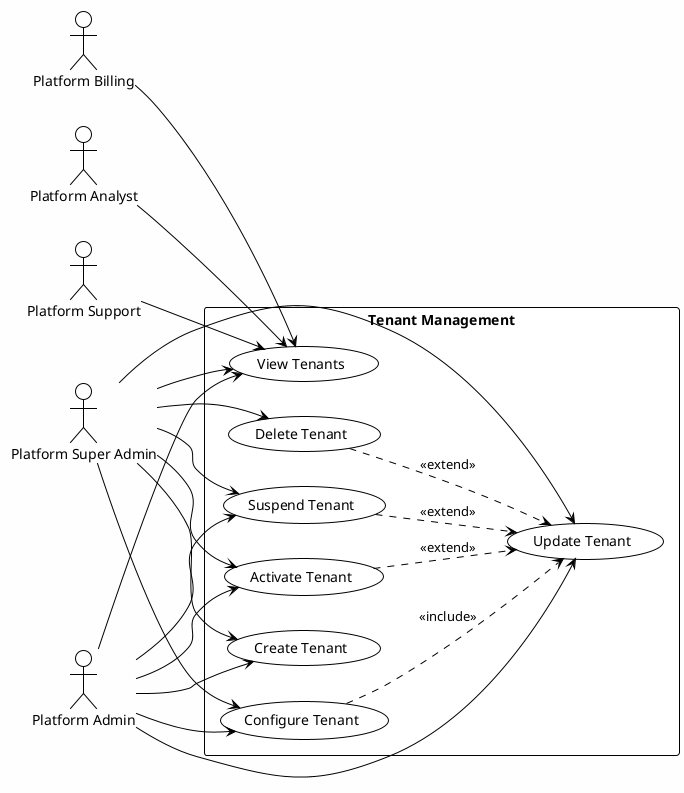
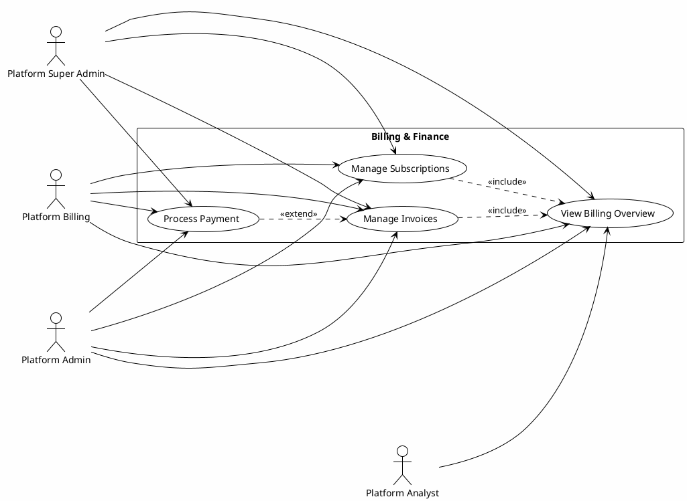
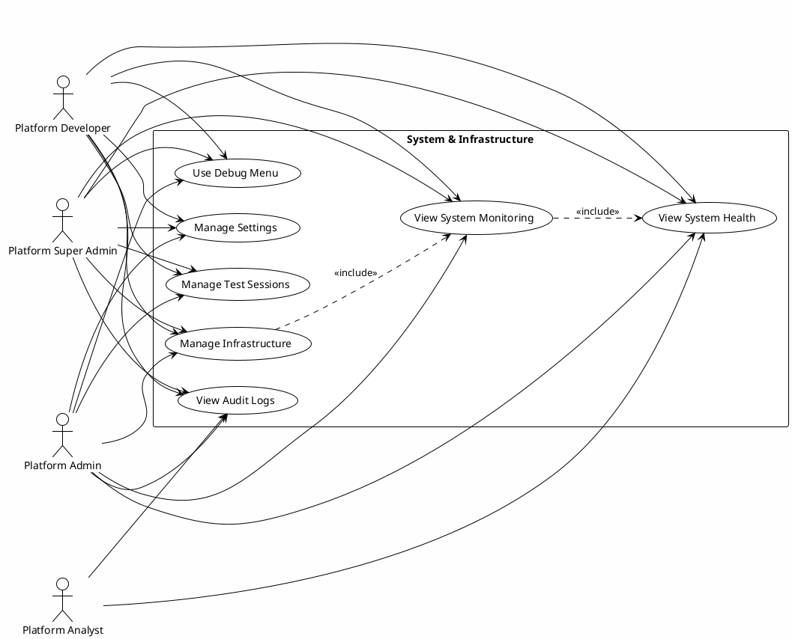

# Software Requirements Specification
## Supra Admin Portal — Use Case Diagrams

**Document Version:** 1.0  
**Project:** TWS (The Wolf Stack) Multi-Tenant ERP Platform  
**Module:** Supra Admin Portal  
**Classification:** Internal — SRS Supplement  
**Date:** January 31, 2026

---

## Table of Contents

1. [Introduction](#1-introduction)
2. [Actor Definitions](#2-actor-definitions)
3. [Use Case Descriptions](#3-use-case-descriptions)
4. [Use Case Diagrams](#4-use-case-diagrams)
5. [Actor–Use Case Mapping Matrix](#5-actoruse-case-mapping-matrix)
6. [Include/Extend Relationships](#6-includeextend-relationships)

---

# 1. Introduction

## 1.1 Purpose

This document provides university-level Software Requirements Specification (SRS) artifacts for the **Supra Admin Portal** of the TWS platform. It defines actors, use cases, and their relationships through formal use case diagrams conforming to UML 2.x standards.

## 1.2 Scope

The Supra Admin Portal is the platform-level administration console that enables TWS staff to manage tenants, billing, users, system infrastructure, and platform-wide operations. Access is restricted to authenticated platform administrators with role-based permissions.

## 1.3 System Boundary

The system boundary encompasses all Supra Admin Portal functionality accessible via `/supra-admin` routes, including:

- Dashboard and analytics
- Tenant and organization management
- Billing and revenue management
- Platform user management
- ERP template and category management
- System monitoring and infrastructure
- Communication and messaging
- Settings and configuration

---

# 2. Actor Definitions

## 2.1 Primary Actors

| Actor | Description | Role Identifier | Access Level |
|-------|-------------|-----------------|--------------|
| **Platform Super Admin** | Highest-privilege administrator with unrestricted access to all portal features. Typically system owners or senior platform engineers. | `super_admin` / `platform_super_admin` | Full (wildcard `*`) |
| **Platform Admin** | Full operational administrator. Can perform all tenant, billing, user, and system operations except role escalation to Super Admin. | `platform_admin` | Full operational |
| **Platform Support** | Customer support staff. Can view tenants, manage support tickets, view analytics, and send notifications. | `platform_support` | Read tenants; full support |
| **Platform Billing** | Finance and billing team. Manages invoices, subscriptions, payments, and revenue analytics. | `platform_billing` | Full billing; read tenants |
| **Platform Analyst** | Data and reporting specialist. Access to analytics, audit logs, and reports. | `platform_analyst` | Full analytics; read tenants, billing |
| **Platform Developer** | Technical/DevOps staff. Manages system configuration, templates, backups, and infrastructure. | `platform_developer` | Full system; read tenants |

## 2.2 Secondary Actors

| Actor | Description | Interaction |
|-------|-------------|-------------|
| **Authentication System** | External auth service (JWT, session). Validates credentials before portal access. | <<include>> in Login |
| **Tenant System** | Tenant database and provisioning service. | <<include>> in Tenant Management use cases |

## 2.3 Actor Hierarchy

```
                    ┌─────────────────────────┐
                    │ Platform Super Admin    │
                    │ (inherits all)          │
                    └───────────┬─────────────┘
                                │ generalizes
        ┌───────────────────────┼───────────────────────┐
        │                       │                       │
        ▼                       ▼                       ▼
┌───────────────┐     ┌─────────────────┐     ┌─────────────────┐
│ Platform      │     │ Platform        │     │ Platform        │
│ Admin         │     │ Support         │     │ Billing         │
└───────────────┘     └─────────────────┘     └─────────────────┘
        │                       │                       │
        └───────────────────────┼───────────────────────┘
                                │
                ┌───────────────┴───────────────┐
                ▼                               ▼
        ┌───────────────┐             ┌─────────────────┐
        │ Platform      │             │ Platform        │
        │ Analyst       │             │ Developer       │
        └───────────────┘             └─────────────────┘
```

---

# 3. Use Case Descriptions

## 3.1 Authentication & Session

| UC-ID | Use Case Name | Description | Primary Actor |
|-------|---------------|-------------|---------------|
| UC-01 | Authenticate | Supra admin logs in with email and password. System validates credentials and issues JWT. | All platform actors |
| UC-02 | Logout | Supra admin terminates session and is redirected to login. | All platform actors |
| UC-03 | Manage Session | View and terminate active sessions across the platform. | Platform Admin, Super Admin |

## 3.2 Dashboard & Analytics

| UC-ID | Use Case Name | Description | Primary Actor |
|-------|---------------|-------------|---------------|
| UC-04 | View Dashboard | Access platform overview with KPIs, tenant counts, and quick stats. | All platform actors |
| UC-05 | View Analytics | View revenue, tenant usage, and system health analytics. | Platform Admin, Analyst, Billing, Super Admin |
| UC-06 | Export Analytics | Export analytics data for external reporting. | Platform Admin, Analyst, Super Admin |

## 3.3 Tenant & Organization Management

| UC-ID | Use Case Name | Description | Primary Actor |
|-------|---------------|-------------|---------------|
| UC-07 | View Tenants | List all tenant organizations with filters and search. | All platform actors |
| UC-08 | Create Tenant | Create new tenant organization with industry type and configuration. | Platform Admin, Super Admin |
| UC-09 | Update Tenant | Modify tenant details, settings, and configuration. | Platform Admin, Super Admin |
| UC-10 | Suspend Tenant | Disable tenant access (e.g., for non-payment). | Platform Admin, Super Admin |
| UC-11 | Activate Tenant | Re-enable suspended tenant. | Platform Admin, Super Admin |
| UC-12 | Delete Tenant | Permanently remove tenant and associated data. | Platform Super Admin |
| UC-13 | Configure Tenant | Set tenant-specific ERP modules, departments, and features. | Platform Admin, Super Admin |

## 3.4 Billing & Finance

| UC-ID | Use Case Name | Description | Primary Actor |
|-------|---------------|-------------|---------------|
| UC-14 | View Billing Overview | View billing summary, revenue, and outstanding invoices. | Platform Admin, Billing, Analyst, Super Admin |
| UC-15 | Manage Invoices | Create, update, and delete invoices. | Platform Admin, Billing, Super Admin |
| UC-16 | Process Payment | Record payment against invoice. | Platform Admin, Billing, Super Admin |
| UC-17 | Manage Subscriptions | Create, update, upgrade, downgrade, or cancel subscriptions. | Platform Admin, Billing, Super Admin |

## 3.5 User Management

| UC-ID | Use Case Name | Description | Primary Actor |
|-------|---------------|-------------|---------------|
| UC-18 | View Platform Users | List all platform admins and portal users. | Platform Admin, Super Admin |
| UC-19 | Create Platform User | Create new platform admin with role and department. | Platform Admin, Super Admin |
| UC-20 | Update Platform User | Modify user details, role, or department. | Platform Admin, Super Admin |
| UC-21 | Delete Platform User | Remove platform user from system. | Platform Admin, Super Admin |
| UC-22 | Assign Portal Responsibility | Assign user to Supra Admin portal area (e.g., Finance, HR). | Platform Admin, Super Admin |
| UC-23 | Manage Department Access | Configure department-level permissions and access. | Platform Admin, Super Admin |
| UC-24 | Manage Departments | Create, update, and delete platform departments. | Platform Admin, Super Admin |

## 3.6 Access Control

| UC-ID | Use Case Name | Description | Primary Actor |
|-------|---------------|-------------|---------------|
| UC-25 | Request Access Approval | Request approval to access tenant or resource. | Platform Admin, Super Admin |
| UC-26 | Approve Access | Approve pending access request. | Platform Admin, Super Admin |
| UC-27 | Reject Access | Reject pending access request. | Platform Admin, Super Admin |
| UC-28 | Revoke Access | Revoke previously granted access. | Platform Admin, Super Admin |

## 3.7 ERP Management

| UC-ID | Use Case Name | Description | Primary Actor |
|-------|---------------|-------------|---------------|
| UC-29 | View ERP Categories | View all ERP categories (Education, Healthcare, Software House). | Platform Admin, Developer, Super Admin |
| UC-30 | Manage Master ERP Templates | Create, update, and delete master ERP templates. | Platform Admin, Developer, Super Admin |
| UC-31 | Configure Tenant ERP | Assign ERP modules and templates to tenants. | Platform Admin, Super Admin |

## 3.8 System & Infrastructure

| UC-ID | Use Case Name | Description | Primary Actor |
|-------|---------------|-------------|---------------|
| UC-32 | View System Health | View system health status and metrics. | Platform Admin, Analyst, Developer, Super Admin |
| UC-33 | View System Monitoring | View real-time monitoring, alerts, logs, and metrics. | Platform Admin, Developer, Super Admin |
| UC-34 | Manage Infrastructure | View servers, databases, APIs; restart servers; run security scans. | Platform Admin, Developer, Super Admin |
| UC-35 | Manage Settings | View and update platform-wide settings. | Platform Admin, Developer, Super Admin |
| UC-36 | View Audit Logs | View and export audit logs. | Platform Admin, Analyst, Super Admin |
| UC-37 | Manage Test Sessions | Create, start, stop, and delete test sessions. | Platform Admin, Developer, Super Admin |
| UC-38 | Use Debug Menu | Access debug endpoints, system info, logs, and performance data. | Platform Admin, Developer, Super Admin |

## 3.9 Communication

| UC-ID | Use Case Name | Description | Primary Actor |
|-------|---------------|-------------|---------------|
| UC-39 | View Internal Messages | View internal messaging inbox. | Platform Admin, Super Admin |
| UC-40 | Compose Message | Send internal message to platform users. | Platform Admin, Super Admin |
| UC-41 | Manage Announcements | Create and manage platform-wide announcements. | Platform Admin, Super Admin |
| UC-42 | Manage Default Contacts | Configure default contact assignments. | Platform Admin, Super Admin |
| UC-43 | View Messaging Analytics | View messaging usage and analytics. | Platform Admin, Analyst, Super Admin |

---

# 4. Use Case Diagrams

## 4.1 High-Level Use Case Diagram (All Actors)

```plantuml
@startuml Supra_Admin_High_Level_Use_Case_Diagram
!theme plain
skinparam backgroundColor #FEFEFE
skinparam useCase {
  BackgroundColor #E8F4FD
  BorderColor #2E7DBF
}
skinparam actor {
  BackgroundColor #FFF
  BorderColor #333
}

left to right direction

actor "Platform Super Admin" as SA
actor "Platform Admin" as PA
actor "Platform Support" as PS
actor "Platform Billing" as PB
actor "Platform Analyst" as PAnalyst
actor "Platform Developer" as PD

rectangle "Supra Admin Portal" {
  
  package "Authentication" {
    usecase "Authenticate" as UC01
    usecase "Logout" as UC02
    usecase "Manage Session" as UC03
  }
  
  package "Dashboard & Analytics" {
    usecase "View Dashboard" as UC04
    usecase "View Analytics" as UC05
    usecase "Export Analytics" as UC06
  }
  
  package "Tenant Management" {
    usecase "View Tenants" as UC07
    usecase "Create Tenant" as UC08
    usecase "Update Tenant" as UC09
    usecase "Suspend/Activate Tenant" as UC10_11
    usecase "Delete Tenant" as UC12
    usecase "Configure Tenant" as UC13
  }
  
  package "Billing & Finance" {
    usecase "View Billing Overview" as UC14
    usecase "Manage Invoices" as UC15
    usecase "Process Payment" as UC16
    usecase "Manage Subscriptions" as UC17
  }
  
  package "User Management" {
    usecase "View Platform Users" as UC18
    usecase "Create Platform User" as UC19
    usecase "Update Platform User" as UC20
    usecase "Delete Platform User" as UC21
    usecase "Assign Portal Responsibility" as UC22
    usecase "Manage Department Access" as UC23
    usecase "Manage Departments" as UC24
  }
  
  package "Access Control" {
    usecase "Request Access Approval" as UC25
    usecase "Approve/Reject Access" as UC26_27
    usecase "Revoke Access" as UC28
  }
  
  package "ERP Management" {
    usecase "View ERP Categories" as UC29
    usecase "Manage Master ERP Templates" as UC30
    usecase "Configure Tenant ERP" as UC31
  }
  
  package "System & Infrastructure" {
    usecase "View System Health" as UC32
    usecase "View System Monitoring" as UC33
    usecase "Manage Infrastructure" as UC34
    usecase "Manage Settings" as UC35
    usecase "View Audit Logs" as UC36
    usecase "Manage Test Sessions" as UC37
    usecase "Use Debug Menu" as UC38
  }
  
  package "Communication" {
    usecase "View Internal Messages" as UC39
    usecase "Compose Message" as UC40
    usecase "Manage Announcements" as UC41
    usecase "Manage Default Contacts" as UC42
    usecase "View Messaging Analytics" as UC43
  }
}

SA --> UC01
SA --> UC02
SA --> UC03
SA --> UC04
SA --> UC05
SA --> UC06
SA --> UC07
SA --> UC08
SA --> UC09
SA --> UC10_11
SA --> UC12
SA --> UC13
SA --> UC14
SA --> UC15
SA --> UC16
SA --> UC17
SA --> UC18
SA --> UC19
SA --> UC20
SA --> UC21
SA --> UC22
SA --> UC23
SA --> UC24
SA --> UC25
SA --> UC26_27
SA --> UC28
SA --> UC29
SA --> UC30
SA --> UC31
SA --> UC32
SA --> UC33
SA --> UC34
SA --> UC35
SA --> UC36
SA --> UC37
SA --> UC38
SA --> UC39
SA --> UC40
SA --> UC41
SA --> UC42
SA --> UC43

PA --> UC01
PA --> UC02
PA --> UC03
PA --> UC04
PA --> UC05
PA --> UC06
PA --> UC07
PA --> UC08
PA --> UC09
PA --> UC10_11
PA --> UC13
PA --> UC14
PA --> UC15
PA --> UC16
PA --> UC17
PA --> UC18
PA --> UC19
PA --> UC20
PA --> UC21
PA --> UC22
PA --> UC23
PA --> UC24
PA --> UC25
PA --> UC26_27
PA --> UC28
PA --> UC29
PA --> UC30
PA --> UC31
PA --> UC32
PA --> UC33
PA --> UC34
PA --> UC35
PA --> UC36
PA --> UC37
PA --> UC38
PA --> UC39
PA --> UC40
PA --> UC41
PA --> UC42
PA --> UC43

PS --> UC01
PS --> UC02
PS --> UC04
PS --> UC07

PB --> UC01
PB --> UC02
PB --> UC04
PB --> UC05
PB --> UC07
PB --> UC14
PB --> UC15
PB --> UC16
PB --> UC17

PAnalyst --> UC01
PAnalyst --> UC02
PAnalyst --> UC04
PAnalyst --> UC05
PAnalyst --> UC06
PAnalyst --> UC07
PAnalyst --> UC14
PAnalyst --> UC36
PAnalyst --> UC43

PD --> UC01
PD --> UC02
PD --> UC04
PD --> UC07
PD --> UC29
PD --> UC30
PD --> UC32
PD --> UC33
PD --> UC34
PD --> UC35
PD --> UC36
PD --> UC37
PD --> UC38

@enduml
```



## 4.2 Use Case Diagram — Tenant Management (Focused)



## 4.3 Use Case Diagram — Billing & Finance (Focused)



## 4.4 Use Case Diagram — System & Infrastructure (Focused)



## 4.5 Mermaid Alternative (for GitHub/Markdown rendering)

For environments where PlantUML is not available, the following Mermaid diagram provides a simplified view:

```mermaid
flowchart TB
    subgraph Actors
        SA[Platform Super Admin]
        PA[Platform Admin]
        PS[Platform Support]
        PB[Platform Billing]
        PAnalyst[Platform Analyst]
        PD[Platform Developer]
    end

    subgraph "Supra Admin Portal - Use Cases"
        subgraph Auth
            UC01[Authenticate]
            UC02[Logout]
            UC03[Manage Session]
        end
        
        subgraph Dashboard
            UC04[View Dashboard]
            UC05[View Analytics]
            UC06[Export Analytics]
        end
        
        subgraph Tenants
            UC07[View Tenants]
            UC08[Create Tenant]
            UC09[Update Tenant]
            UC10[Suspend/Activate]
            UC12[Delete Tenant]
        end
        
        subgraph Billing
            UC14[View Billing]
            UC15[Manage Invoices]
            UC16[Process Payment]
        end
        
        subgraph Users
            UC18[View Users]
            UC19[Create User]
            UC20[Update User]
            UC21[Delete User]
        end
        
        subgraph System
            UC32[System Health]
            UC33[System Monitoring]
            UC34[Infrastructure]
            UC35[Settings]
        end
    end

    SA --> UC01 & UC02 & UC03 & UC04 & UC05 & UC06 & UC07 & UC08 & UC09 & UC10 & UC12 & UC14 & UC15 & UC16 & UC18 & UC19 & UC20 & UC21 & UC32 & UC33 & UC34 & UC35
    PA --> UC01 & UC02 & UC03 & UC04 & UC05 & UC07 & UC08 & UC09 & UC10 & UC14 & UC15 & UC16 & UC18 & UC19 & UC20 & UC21 & UC32 & UC33 & UC34 & UC35
    PS --> UC01 & UC02 & UC04 & UC07
    PB --> UC01 & UC02 & UC04 & UC05 & UC07 & UC14 & UC15 & UC16
    PAnalyst --> UC01 & UC02 & UC04 & UC05 & UC07 & UC14 & UC32
    PD --> UC01 & UC02 & UC04 & UC07 & UC32 & UC33 & UC34 & UC35
```



---

# 5. Actor–Use Case Mapping Matrix

| Use Case | Super Admin | Platform Admin | Support | Billing | Analyst | Developer |
|----------|:-----------:|:--------------:|:-------:|:-------:|:-------:|:---------:|
| UC-01 Authenticate | ✓ | ✓ | ✓ | ✓ | ✓ | ✓ |
| UC-02 Logout | ✓ | ✓ | ✓ | ✓ | ✓ | ✓ |
| UC-03 Manage Session | ✓ | ✓ | — | — | — | — |
| UC-04 View Dashboard | ✓ | ✓ | ✓ | ✓ | ✓ | ✓ |
| UC-05 View Analytics | ✓ | ✓ | — | ✓ | ✓ | — |
| UC-06 Export Analytics | ✓ | ✓ | — | — | ✓ | — |
| UC-07 View Tenants | ✓ | ✓ | ✓ | ✓ | ✓ | ✓ |
| UC-08 Create Tenant | ✓ | ✓ | — | — | — | — |
| UC-09 Update Tenant | ✓ | ✓ | — | — | — | — |
| UC-10 Suspend Tenant | ✓ | ✓ | — | — | — | — |
| UC-11 Activate Tenant | ✓ | ✓ | — | — | — | — |
| UC-12 Delete Tenant | ✓ | — | — | — | — | — |
| UC-13 Configure Tenant | ✓ | ✓ | — | — | — | — |
| UC-14 View Billing Overview | ✓ | ✓ | — | ✓ | ✓ | — |
| UC-15 Manage Invoices | ✓ | ✓ | — | ✓ | — | — |
| UC-16 Process Payment | ✓ | ✓ | — | ✓ | — | — |
| UC-17 Manage Subscriptions | ✓ | ✓ | — | ✓ | — | — |
| UC-18 View Platform Users | ✓ | ✓ | — | — | — | — |
| UC-19 Create Platform User | ✓ | ✓ | — | — | — | — |
| UC-20 Update Platform User | ✓ | ✓ | — | — | — | — |
| UC-21 Delete Platform User | ✓ | ✓ | — | — | — | — |
| UC-22 Assign Portal Responsibility | ✓ | ✓ | — | — | — | — |
| UC-23 Manage Department Access | ✓ | ✓ | — | — | — | — |
| UC-24 Manage Departments | ✓ | ✓ | — | — | — | — |
| UC-25 Request Access Approval | ✓ | ✓ | — | — | — | — |
| UC-26 Approve Access | ✓ | ✓ | — | — | — | — |
| UC-27 Reject Access | ✓ | ✓ | — | — | — | — |
| UC-28 Revoke Access | ✓ | ✓ | — | — | — | — |
| UC-29 View ERP Categories | ✓ | ✓ | — | — | — | ✓ |
| UC-30 Manage Master ERP | ✓ | ✓ | — | — | — | ✓ |
| UC-31 Configure Tenant ERP | ✓ | ✓ | — | — | — | — |
| UC-32 View System Health | ✓ | ✓ | — | — | ✓ | ✓ |
| UC-33 View System Monitoring | ✓ | ✓ | — | — | — | ✓ |
| UC-34 Manage Infrastructure | ✓ | ✓ | — | — | — | ✓ |
| UC-35 Manage Settings | ✓ | ✓ | — | — | — | ✓ |
| UC-36 View Audit Logs | ✓ | ✓ | — | — | ✓ | ✓ |
| UC-37 Manage Test Sessions | ✓ | ✓ | — | — | — | ✓ |
| UC-38 Use Debug Menu | ✓ | ✓ | — | — | — | ✓ |
| UC-39 View Internal Messages | ✓ | ✓ | — | — | — | — |
| UC-40 Compose Message | ✓ | ✓ | — | — | — | — |
| UC-41 Manage Announcements | ✓ | ✓ | — | — | — | — |
| UC-42 Manage Default Contacts | ✓ | ✓ | — | — | — | — |
| UC-43 View Messaging Analytics | ✓ | ✓ | — | — | ✓ | — |

---

# 6. Include/Extend Relationships

## 6.1 Include Relationships

| Base Use Case | Included Use Case | Description |
|---------------|-------------------|-------------|
| Authenticate | Validate Credentials | System validates email/password before granting access |
| Create Tenant | Configure Tenant | New tenant requires initial configuration |
| Manage Invoices | View Billing Overview | Invoice management requires billing context |
| Manage Subscriptions | View Billing Overview | Subscription management requires billing context |
| View System Monitoring | View System Health | Monitoring dashboard includes health metrics |
| Manage Infrastructure | View System Monitoring | Infrastructure view is part of monitoring |

## 6.2 Extend Relationships

| Base Use Case | Extending Use Case | Condition |
|---------------|-------------------|-----------|
| Update Tenant | Suspend Tenant | When tenant must be disabled |
| Update Tenant | Activate Tenant | When suspended tenant must be re-enabled |
| Update Tenant | Delete Tenant | When tenant must be permanently removed |
| Manage Invoices | Process Payment | When payment is recorded against invoice |

---

# Appendix A: Diagram Rendering Instructions

## PlantUML

1. Copy any `@startuml` ... `@enduml` block into [PlantUML Online Server](https://www.plantuml.com/plantuml/uml/)
2. Or use VS Code extension: *PlantUML* by jebbs
3. Or use CLI: `java -jar plantuml.jar diagram.puml`

## Mermaid

1. Use in GitHub/GitLab Markdown — Mermaid is rendered natively
2. Use in VS Code with *Mermaid* extension
3. Use [Mermaid Live Editor](https://mermaid.live/)

---

**Document End**

*This SRS supplement aligns with IEEE 830-1998 and ISO/IEC/IEEE 29148:2018 standards for software requirements specification.*
