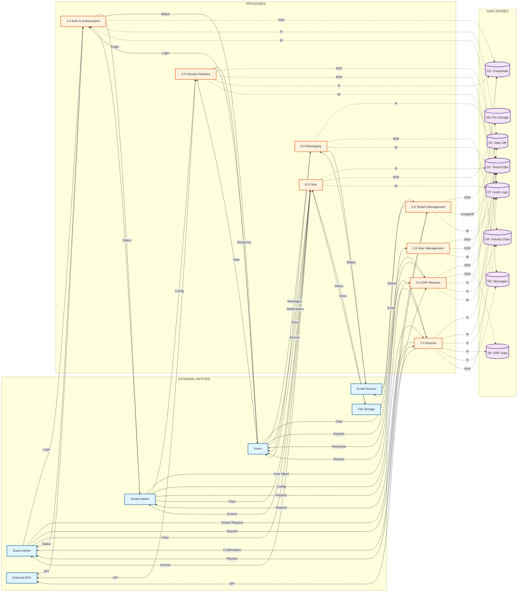

# TWS Multi-Tenant ERP Platform - Data Flow Diagram (DFD)

## Level 1 Data Flow Diagram

This diagram illustrates the data flow between external entities, processes, and data stores in the TWS Multi-Tenant Enterprise Resource Planning (ERP) Platform.

**How to Use:**
1. **For Mermaid Renderers**: Copy ONLY the code between ```mermaid and ``` (lines 18-147)
2. **For Standalone File**: Use `TWS_DATAFLOW_DIAGRAM.mmd` file directly
3. **Online Renderer**: Go to https://mermaid.live and paste the Mermaid code

**Print Instructions:**
- **Orientation**: Landscape (A4: 297 x 210 mm / 11.69 x 8.27 inches)
- **Page Size**: A4
- **Scale**: Fit to page width (100% or Auto)
- **Margins**: Minimum 10mm on all sides
- **Legend**: 
  - **Solid arrows (→)**: Data flows between external entities and processes
  - **Dotted arrows (-.->)**: Data flows between processes and data stores (R=Read, W=Write)
  - **Double arrows (<-->)**: Bidirectional API communication
- **Note**: When printing from Mermaid renderer, ensure landscape orientation is selected in print settings



## Process Descriptions

### 1.0 Manage Authentication & Authorization
- **Inputs**: Login credentials from Supra Admin, Tenant Admin, and Users
- **Outputs**: Login status, JWT tokens, session information
- **Data Stores**: 
  - Reads/Writes: D3 (User Credentials DB)
  - Reads: D1 (Main Database for tenant validation)
  - Writes: D7 (Audit Logs)
- **Functions**: User authentication, JWT token generation, role-based access control, session management

### 2.0 Manage Tenants & Provisioning
- **Inputs**: Tenant creation requests, tenant management requests from Supra Admin
- **Outputs**: Tenant confirmation, tenant status, onboarding status
- **Data Stores**:
  - Reads/Writes: D1 (Main Database)
  - Creates/Writes: D2 (Tenant Databases - isolated per tenant)
  - Writes: D7 (Audit Logs)
- **External**: Sends welcome emails via Email Service
- **Functions**: Tenant creation, database provisioning, default data seeding, subscription management

### 3.0 Manage Users & Roles
- **Inputs**: User management requests from Tenant Admin
- **Outputs**: User status, role assignments
- **Data Stores**:
  - Reads/Writes: D2 (Tenant Databases)
  - Reads/Writes: D3 (User Credentials DB)
  - Writes: D7 (Audit Logs)
- **Functions**: User CRUD operations, role assignment, permission management

### 4.0 Manage Industry Modules
- **Inputs**: Industry-specific data from Users and Tenant Admin
- **Outputs**: Industry data responses, module status
- **Data Stores**:
  - Reads/Writes: D2 (Tenant Databases)
  - Reads/Writes: D4 (Industry Module Data DB - Education/Healthcare/Retail/Manufacturing/Software House)
  - Reads: D3 (User Credentials for authorization)
  - Writes: D7 (Audit Logs)
- **Functions**: Industry-specific CRUD operations, module configuration, data management

### 5.0 Manage Common ERP Modules
- **Inputs**: ERP data from Users and Tenant Admin
- **Outputs**: ERP data responses, module status
- **Data Stores**:
  - Reads/Writes: D2 (Tenant Databases)
  - Reads/Writes: D5 (Common ERP Data DB - HR/Finance/Projects/Attendance)
  - Reads: D3 (User Credentials)
  - Reads: D4 (Industry Module Data for integration)
  - Writes: D7 (Audit Logs)
- **Functions**: HR management, financial transactions, project management, attendance tracking

### 6.0 Manage Messaging & Notifications
- **Inputs**: Messages from Users
- **Outputs**: Messages, notifications, alerts
- **Data Stores**:
  - Reads: D2 (Tenant Databases)
  - Reads/Writes: D6 (Messaging & Notifications DB)
  - Writes: D7 (Audit Logs)
- **External**: Sends emails via Email Service
- **Functions**: Internal messaging, real-time notifications, email notifications, WebSocket communication

### 7.0 Generate Reports & Analytics
- **Inputs**: Report criteria from Supra Admin, Tenant Admin, and Users
- **Outputs**: Platform reports, organization reports, industry-specific reports
- **Data Stores**:
  - Reads: D1 (Main Database)
  - Reads: D2 (Tenant Databases)
  - Reads: D4 (Industry Module Data)
  - Reads: D5 (Common ERP Data)
  - Reads: D6 (Messaging & Notifications)
  - Reads/Writes: D7 (Audit Logs)
- **Functions**: Report generation, data aggregation, analytics, data export (PDF, Excel, CSV)

### 8.0 Manage Files & Documents
- **Inputs**: File uploads from Supra Admin, Tenant Admin, and Users
- **Outputs**: File access, file status
- **Data Stores**:
  - Reads: D2 (Tenant Databases)
  - Reads/Writes: D8 (File Storage DB - metadata)
  - Writes: D7 (Audit Logs)
- **External**: Stores actual files in File Storage system
- **Functions**: File upload, file management, access control, file sharing

## Data Store Descriptions

### D1: Main Database (Tenants & SupraAdmins)
- Stores platform-level data
- Contains: SupraAdmin records, Tenant records, platform configuration
- Accessed by: P1 (Read), P2 (Read/Write), P7 (Read)

### D2: Tenant Databases (Isolated per Tenant)
- One database per tenant: `tws_<tenantId>`
- Stores tenant-specific data: Organizations, Users, Departments, Teams
- Accessed by: P2 (Create/Write), P3 (Read/Write), P4 (Read/Write), P5 (Read/Write), P6 (Read), P7 (Read), P8 (Read)

### D3: User Credentials DB
- Stores user authentication data
- Contains: User credentials, JWT refresh tokens, session data
- Accessed by: P1 (Read/Write), P3 (Read/Write), P4 (Read), P5 (Read)

### D4: Industry Module Data DB
- Stores industry-specific data
- Contains: Education (Students, Teachers, Classes, Grades), Healthcare (Patients, Doctors, Appointments), Retail (Products, Sales, Inventory), Manufacturing (Production Orders, Equipment), Software House (Projects, Clients)
- Accessed by: P4 (Read/Write), P5 (Read), P7 (Read)

### D5: Common ERP Data DB
- Stores common ERP module data
- Contains: HR (Employees, Payroll, Attendance), Finance (Transactions, Invoices, Chart of Accounts), Projects (Projects, Tasks, Time Tracking)
- Accessed by: P5 (Read/Write), P7 (Read)

### D6: Messaging & Notifications DB
- Stores messaging and notification data
- Contains: Messages, Notifications, Notification preferences
- Accessed by: P6 (Read/Write), P7 (Read)

### D7: Audit Logs DB
- Stores audit trail data
- Contains: User actions, data access logs, security events, compliance logs
- Accessed by: All processes (Write), P7 (Read)

### D8: File Storage DB
- Stores file metadata
- Contains: File information, access permissions, file relationships
- Accessed by: P8 (Read/Write), P7 (Read)

## External Entity Descriptions

### Supra Admin
- Platform-level administrator
- Manages all tenants, subscriptions, and platform configuration
- Accesses: Tenant management, platform reports, system settings

### Tenant Admin
- Organization-level administrator
- Manages tenant users, modules, and configurations
- Accesses: User management, module configuration, organization reports

### Users
- End users with various roles (Managers, Employees, Principal, Teacher, Student, Doctor, Patient, etc.)
- Access role-based features and data
- Accesses: Industry modules, common ERP modules, messaging, reports

### Email Service
- External email service provider
- Sends: Welcome emails, notifications, alerts
- Used by: P2 (Tenant provisioning), P6 (Notifications)

### File Storage
- External file storage system (local or cloud)
- Stores: Uploaded files, documents, images
- Used by: P8 (File management)

### External APIs
- Third-party integrations and mobile applications
- Accesses: Authentication, Industry modules, Common ERP modules
- Used for: API integrations, mobile app backend

## Data Flow Summary

1. **Authentication Flow**: Users → P1 → D3 → P1 → Users
2. **Tenant Provisioning Flow**: Supra Admin → P2 → D1, D2 → P2 → Supra Admin
3. **User Management Flow**: Tenant Admin → P3 → D2, D3 → P3 → Tenant Admin
4. **Industry Module Flow**: Users → P4 → D2, D4 → P4 → Users
5. **ERP Module Flow**: Users → P5 → D2, D5 → P5 → Users
6. **Messaging Flow**: Users → P6 → D6 → P6 → Users, Email Service
7. **Reporting Flow**: Users/Admins → P7 → D1-D7 → P7 → Users/Admins
8. **File Management Flow**: Users/Admins → P8 → D8, File Storage → P8 → Users/Admins
