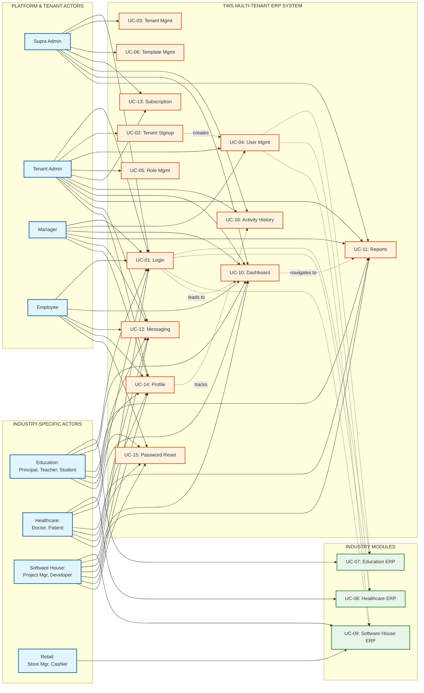

# TWS Multi-Tenant ERP Platform - Use Case Diagram

## Use Case Diagram

This diagram illustrates the interactions between actors and use cases in the TWS Multi-Tenant Enterprise Resource Planning (ERP) Platform.

**Print Instructions:**
- **Orientation**: Landscape (A4: 297 x 210 mm)
- **Page Size**: A4
- **Scale**: Fit to page width
- **Note**: This diagram shows all actors and their relationships with system use cases

```mermaid
flowchart TB
    subgraph Actors["ACTORS"]
        direction LR
        SupraAdmin[Supra Admin]
        TenantAdmin[Tenant Admin]
        Manager[Manager]
        Employee[Employee]
        Principal[Principal]
        Teacher[Teacher]
        Student[Student]
        Doctor[Doctor]
        Patient[Patient]
        StoreManager[Store Manager]
        Cashier[Cashier]
        ProductionMgr[Production Manager]
        ProjectMgr[Project Manager]
        Developer[Developer]
        PreTenantUser[Pre-Tenant User]
    end

    subgraph System["TWS MULTI-TENANT ERP SYSTEM"]
        direction TB
        
        subgraph Auth["Authentication & Access"]
            UC01[UC-01: User Login<br/>Authentication]
            UC02[UC-02: Self-Serve Tenant<br/>Signup & Provisioning]
            UC15[UC-15: Password<br/>Recovery]
        end
        
        subgraph Admin["Administration"]
            UC03[UC-03: Tenant<br/>Management]
            UC04[UC-04: User<br/>Management]
            UC05[UC-05: Role & Permission<br/>Management]
            UC06[UC-06: Master ERP<br/>Template Management]
            UC13[UC-13: Subscription &<br/>Billing Management]
            UC16[UC-16: User Activity<br/>History]
        end
        
        subgraph Industry["Industry Modules"]
            UC07[UC-07: Education ERP<br/>Module Management]
            UC08[UC-08: Healthcare ERP<br/>Module Management]
            UC09[UC-09: Software House ERP<br/>Module Management]
        end
        
        subgraph Common["Common Features"]
            UC10[UC-10: Dashboard &<br/>Analytics]
            UC11[UC-11: Report Generation<br/>& Export]
            UC12[UC-12: Messaging &<br/>Notifications]
            UC14[UC-14: User Profile<br/>Management]
        end
    end

    %% Supra Admin Relationships
    SupraAdmin -->|Manages| UC03
    SupraAdmin -->|Manages| UC06
    SupraAdmin -->|Manages| UC13
    SupraAdmin -->|Views| UC16
    SupraAdmin -->|Accesses| UC01
    SupraAdmin -->|Views| UC10
    SupraAdmin -->|Generates| UC11
    SupraAdmin -->|Manages| UC14

    %% Tenant Admin Relationships
    TenantAdmin -->|Initiates| UC02
    TenantAdmin -->|Manages| UC04
    TenantAdmin -->|Manages| UC05
    TenantAdmin -->|Manages| UC13
    TenantAdmin -->|Views| UC16
    TenantAdmin -->|Accesses| UC01
    TenantAdmin -->|Manages| UC07
    TenantAdmin -->|Manages| UC08
    TenantAdmin -->|Manages| UC09
    TenantAdmin -->|Views| UC10
    TenantAdmin -->|Generates| UC11
    TenantAdmin -->|Uses| UC12
    TenantAdmin -->|Manages| UC14

    %% Manager Relationships
    Manager -->|Accesses| UC01
    Manager -->|Manages| UC04
    Manager -->|Views| UC10
    Manager -->|Generates| UC11
    Manager -->|Uses| UC12
    Manager -->|Manages| UC14

    %% Employee Relationships
    Employee -->|Accesses| UC01
    Employee -->|Views| UC10
    Employee -->|Uses| UC12
    Employee -->|Manages| UC14
    Employee -->|Requests| UC15

    %% Education Actors
    Principal -->|Accesses| UC01
    Principal -->|Manages| UC07
    Principal -->|Views| UC10
    Principal -->|Generates| UC11
    Principal -->|Uses| UC12
    Principal -->|Manages| UC14

    Teacher -->|Accesses| UC01
    Teacher -->|Uses| UC07
    Teacher -->|Views| UC10
    Teacher -->|Generates| UC11
    Teacher -->|Uses| UC12
    Teacher -->|Manages| UC14

    Student -->|Accesses| UC01
    Student -->|Views| UC07
    Student -->|Views| UC10
    Student -->|Uses| UC12
    Student -->|Manages| UC14
    Student -->|Requests| UC15

    %% Healthcare Actors
    Doctor -->|Accesses| UC01
    Doctor -->|Manages| UC08
    Doctor -->|Views| UC10
    Doctor -->|Generates| UC11
    Doctor -->|Uses| UC12
    Doctor -->|Manages| UC14

    Patient -->|Accesses| UC01
    Patient -->|Views| UC08
    Patient -->|Views| UC10
    Patient -->|Uses| UC12
    Patient -->|Manages| UC14
    Patient -->|Requests| UC15

    %% Retail Actors
    StoreManager -->|Accesses| UC01
    StoreManager -->|Manages| UC09
    StoreManager -->|Views| UC10
    StoreManager -->|Generates| UC11
    StoreManager -->|Uses| UC12
    StoreManager -->|Manages| UC14

    Cashier -->|Accesses| UC01
    Cashier -->|Uses| UC09
    Cashier -->|Views| UC10
    Cashier -->|Uses| UC12
    Cashier -->|Manages| UC14

    %% Manufacturing Actors
    ProductionMgr -->|Accesses| UC01
    ProductionMgr -->|Manages| UC09
    ProductionMgr -->|Views| UC10
    ProductionMgr -->|Generates| UC11
    ProductionMgr -->|Uses| UC12
    ProductionMgr -->|Manages| UC14

    %% Software House Actors
    ProjectMgr -->|Accesses| UC01
    ProjectMgr -->|Manages| UC09
    ProjectMgr -->|Views| UC10
    ProjectMgr -->|Generates| UC11
    ProjectMgr -->|Uses| UC12
    ProjectMgr -->|Manages| UC14

    Developer -->|Accesses| UC01
    Developer -->|Uses| UC09
    Developer -->|Views| UC10
    Developer -->|Uses| UC12
    Developer -->|Manages| UC14

    %% Pre-Tenant User
    PreTenantUser -->|Initiates| UC02
    PreTenantUser -->|Accesses| UC01

    %% Use Case Relationships
    UC01 -.->|leads to| UC10
    UC02 -.->|creates| UC04
    UC02 -.->|applies| UC06
    UC04 -.->|requires| UC05
    UC07 -.->|generates| UC11
    UC08 -.->|generates| UC11
    UC09 -.->|generates| UC11
    UC10 -.->|navigates to| UC11
    UC14 -.->|tracks| UC16
    UC15 -.->|resets| UC01

    %% Styling
    classDef actor fill:#e1f5ff,stroke:#01579b,stroke-width:2px
    classDef useCase fill:#fff3e0,stroke:#e65100,stroke-width:2px
    classDef system fill:#f3e5f5,stroke:#4a148c,stroke-width:1px

    class SupraAdmin,TenantAdmin,Manager,Employee,Principal,Teacher,Student,Doctor,Patient,StoreManager,Cashier,ProductionMgr,ProjectMgr,Developer,PreTenantUser actor
    class UC01,UC02,UC03,UC04,UC05,UC06,UC07,UC08,UC09,UC10,UC11,UC12,UC13,UC14,UC15,UC16 useCase
```

## Detailed Use Case Diagram (Alternative View - Grouped by Actor Type)

For better clarity, here's an alternative view organized by actor groups:

## Actor-Use Case Relationship Matrix

| Actor | Use Cases |
|-------|-----------|
| **Supra Admin** | UC-01, UC-03, UC-06, UC-10, UC-11, UC-13, UC-16 |
| **Tenant Admin** | UC-01, UC-02, UC-04, UC-05, UC-07, UC-08, UC-09, UC-10, UC-11, UC-12, UC-13, UC-14, UC-16 |
| **Manager** | UC-01, UC-04, UC-10, UC-11, UC-12, UC-14 |
| **Employee** | UC-01, UC-10, UC-12, UC-14, UC-15 |
| **Principal** | UC-01, UC-07, UC-10, UC-11, UC-12, UC-14 |
| **Teacher** | UC-01, UC-07, UC-10, UC-11, UC-12, UC-14 |
| **Student** | UC-01, UC-07 (View), UC-10, UC-12, UC-14, UC-15 |
| **Doctor** | UC-01, UC-08, UC-10, UC-11, UC-12, UC-14 |
| **Patient** | UC-01, UC-08 (View), UC-10, UC-12, UC-14, UC-15 |
| **Store Manager** | UC-01, UC-09, UC-10, UC-11, UC-12, UC-14 |
| **Cashier** | UC-01, UC-09, UC-10, UC-12, UC-14 |
| **Production Manager** | UC-01, UC-09, UC-10, UC-11, UC-12, UC-14 |
| **Project Manager** | UC-01, UC-09, UC-10, UC-11, UC-12, UC-14 |
| **Developer** | UC-01, UC-09, UC-10, UC-12, UC-14 |
| **Pre-Tenant User** | UC-01, UC-02 |

## Use Case Relationships

### Include Relationships
- **UC-01 (Login)** includes authentication for all subsequent use cases
- **UC-10 (Dashboard)** includes navigation to other modules

### Extend Relationships
- **UC-15 (Password Recovery)** extends **UC-01 (Login)** when user forgets password
- **UC-11 (Reports)** extends industry modules (UC-07, UC-08, UC-09) for report generation
- **UC-16 (Activity History)** extends **UC-14 (Profile Management)** for activity tracking

### Dependency Relationships
- **UC-02 (Tenant Signup)** creates **UC-04 (User Management)** requirement
- **UC-04 (User Management)** requires **UC-05 (Role Management)** for role assignment
- **UC-02 (Tenant Signup)** applies **UC-06 (Master ERP Template)** during provisioning

## Legend

- **Solid Lines (→)**: Direct actor-use case relationships
- **Dotted Lines (-.->)**: Use case-to-use case relationships (include/extend/dependency)
- **Actor Colors**: Blue - External entities
- **Use Case Colors**: Orange - System processes
- **Industry Module Colors**: Green - Industry-specific functionality

