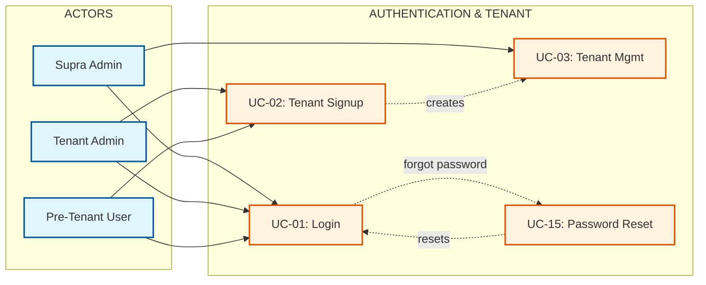
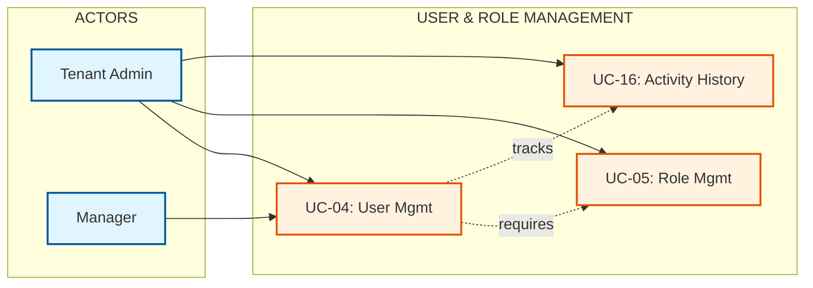
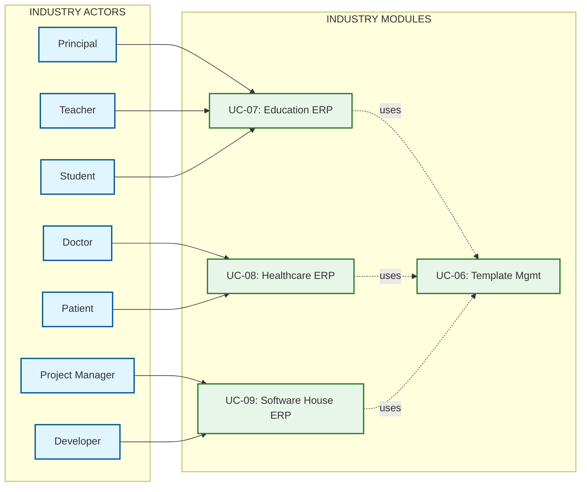
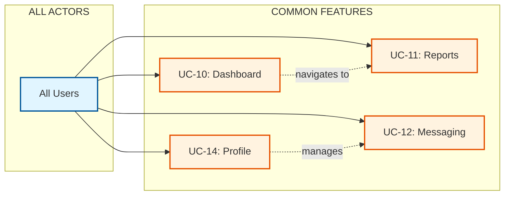

# TWS Multi-Tenant ERP Platform - Use Case Diagram (A4 Printable)

## Use Case Diagram - Main View

This diagram shows all actors and their interactions with system use cases, optimized for A4 landscape printing.

```mermaid
flowchart TB
    subgraph LeftActors[" "]
        direction TB
        SupraAdmin[Supra<br/>Admin]
        TenantAdmin[Tenant<br/>Admin]
        Manager[Manager]
        Employee[Employee]
    end

    subgraph System["TWS MULTI-TENANT ERP SYSTEM"]
        direction TB
        
        UC01[UC-01: Login]
        UC02[UC-02: Tenant Signup]
        UC03[UC-03: Tenant Mgmt]
        UC04[UC-04: User Mgmt]
        UC05[UC-05: Role Mgmt]
        UC06[UC-06: Template Mgmt]
        UC10[UC-10: Dashboard]
        UC11[UC-11: Reports]
        UC12[UC-12: Messaging]
        UC13[UC-13: Subscription]
        UC14[UC-14: Profile]
        UC15[UC-15: Password Reset]
        UC16[UC-16: Activity History]
        
        UC07[UC-07: Education ERP]
        UC08[UC-08: Healthcare ERP]
        UC09[UC-09: Software House ERP]
    end

    subgraph RightActors[" "]
        direction TB
        Principal[Principal]
        Teacher[Teacher]
        Student[Student]
        Doctor[Doctor]
        Patient[Patient]
        ProjectMgr[Project<br/>Manager]
        Developer[Developer]
        PreTenant[Pre-Tenant<br/>User]
    end

    %% Supra Admin
    SupraAdmin --> UC01
    SupraAdmin --> UC03
    SupraAdmin --> UC06
    SupraAdmin --> UC13
    SupraAdmin --> UC16
    SupraAdmin --> UC10
    SupraAdmin --> UC11

    %% Tenant Admin
    TenantAdmin --> UC01
    TenantAdmin --> UC02
    TenantAdmin --> UC04
    TenantAdmin --> UC05
    TenantAdmin --> UC07
    TenantAdmin --> UC08
    TenantAdmin --> UC09
    TenantAdmin --> UC10
    TenantAdmin --> UC11
    TenantAdmin --> UC12
    TenantAdmin --> UC13
    TenantAdmin --> UC14
    TenantAdmin --> UC16

    %% Manager
    Manager --> UC01
    Manager --> UC04
    Manager --> UC10
    Manager --> UC11
    Manager --> UC12
    Manager --> UC14

    %% Employee
    Employee --> UC01
    Employee --> UC10
    Employee --> UC12
    Employee --> UC14
    Employee --> UC15

    %% Education Actors
    Principal --> UC01
    Principal --> UC07
    Principal --> UC10
    Principal --> UC11
    Principal --> UC12
    Principal --> UC14

    Teacher --> UC01
    Teacher --> UC07
    Teacher --> UC10
    Teacher --> UC11
    Teacher --> UC12
    Teacher --> UC14

    Student --> UC01
    Student --> UC07
    Student --> UC10
    Student --> UC12
    Student --> UC14
    Student --> UC15

    %% Healthcare Actors
    Doctor --> UC01
    Doctor --> UC08
    Doctor --> UC10
    Doctor --> UC11
    Doctor --> UC12
    Doctor --> UC14

    Patient --> UC01
    Patient --> UC08
    Patient --> UC10
    Patient --> UC12
    Patient --> UC14
    Patient --> UC15

    %% Software House Actors
    ProjectMgr --> UC01
    ProjectMgr --> UC09
    ProjectMgr --> UC10
    ProjectMgr --> UC11
    ProjectMgr --> UC12
    ProjectMgr --> UC14

    Developer --> UC01
    Developer --> UC09
    Developer --> UC10
    Developer --> UC12
    Developer --> UC14

    %% Pre-Tenant User
    PreTenant --> UC01
    PreTenant --> UC02

    %% Use Case Relationships
    UC01 -.->|leads to| UC10
    UC02 -.->|creates| UC04
    UC02 -.->|applies| UC06
    UC04 -.->|requires| UC05
    UC07 -.->|generates| UC11
    UC08 -.->|generates| UC11
    UC09 -.->|generates| UC11
    UC14 -.->|tracks| UC16
    UC15 -.->|resets| UC01

    %% Styling
    classDef actor fill:#e1f5ff,stroke:#01579b,stroke-width:2px
    classDef useCase fill:#fff3e0,stroke:#e65100,stroke-width:2px
    classDef industryUC fill:#e8f5e9,stroke:#2e7d32,stroke-width:2px

    class SupraAdmin,TenantAdmin,Manager,Employee,Principal,Teacher,Student,Doctor,Patient,ProjectMgr,Developer,PreTenant actor
    class UC01,UC02,UC03,UC04,UC05,UC06,UC10,UC11,UC12,UC13,UC14,UC15,UC16 useCase
    class UC07,UC08,UC09 industryUC
```

## Use Case Diagram - Detailed View (Multiple Pages)

For comprehensive documentation, here are detailed views organized by functional area:

### Diagram 1: Authentication & Tenant Management

### Diagram 2: User & Role Management

### Diagram 3: Industry Modules

### Diagram 4: Common Features

## Complete Actor-Use Case Mapping

### Supra Admin Use Cases
- UC-01: User Login / Authentication
- UC-03: Tenant Management
- UC-06: Master ERP Template Management
- UC-10: Dashboard & Analytics
- UC-11: Report Generation & Export
- UC-13: Subscription & Billing Management
- UC-16: User Activity History

### Tenant Admin Use Cases
- UC-01: User Login / Authentication
- UC-02: Self-Serve Tenant Signup & Provisioning
- UC-04: User Management
- UC-05: Role & Permission Management
- UC-07: Education ERP Module Management
- UC-08: Healthcare ERP Module Management
- UC-09: Software House ERP Module Management
- UC-10: Dashboard & Analytics
- UC-11: Report Generation & Export
- UC-12: Messaging & Notifications
- UC-13: Subscription & Billing Management
- UC-14: User Profile Management
- UC-16: User Activity History

### Manager Use Cases
- UC-01: User Login / Authentication
- UC-04: User Management
- UC-10: Dashboard & Analytics
- UC-11: Report Generation & Export
- UC-12: Messaging & Notifications
- UC-14: User Profile Management

### Employee Use Cases
- UC-01: User Login / Authentication
- UC-10: Dashboard & Analytics
- UC-12: Messaging & Notifications
- UC-14: User Profile Management
- UC-15: Password Recovery

### Education Actors Use Cases
- **Principal**: UC-01, UC-07, UC-10, UC-11, UC-12, UC-14
- **Teacher**: UC-01, UC-07, UC-10, UC-11, UC-12, UC-14
- **Student**: UC-01, UC-07 (View), UC-10, UC-12, UC-14, UC-15

### Healthcare Actors Use Cases
- **Doctor**: UC-01, UC-08, UC-10, UC-11, UC-12, UC-14
- **Patient**: UC-01, UC-08 (View), UC-10, UC-12, UC-14, UC-15

### Software House Actors Use Cases
- **Project Manager**: UC-01, UC-09, UC-10, UC-11, UC-12, UC-14
- **Developer**: UC-01, UC-09, UC-10, UC-12, UC-14

### Retail Actors Use Cases
- **Store Manager**: UC-01, UC-09, UC-10, UC-11, UC-12, UC-14
- **Cashier**: UC-01, UC-09, UC-10, UC-12, UC-14

### Manufacturing Actors Use Cases
- **Production Manager**: UC-01, UC-09, UC-10, UC-11, UC-12, UC-14

### Pre-Tenant User Use Cases
- UC-01: User Login / Authentication
- UC-02: Self-Serve Tenant Signup & Provisioning

