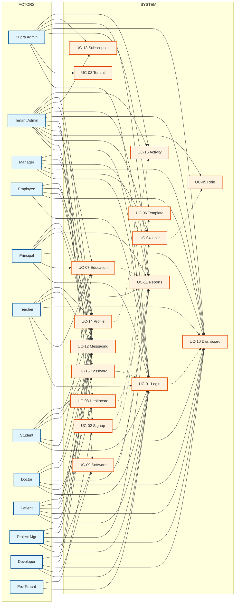

# TWS Multi-Tenant ERP Platform - Use Case Diagram (UML Style)

## Main Use Case Diagram

This diagram follows traditional UML Use Case Diagram conventions, similar to the sample provided.

```mermaid
flowchart TB
    %% Left Side Actors
    SupraAdmin[Supra Admin]
    TenantAdmin[Tenant Admin]
    Manager[Manager]
    Employee[Employee]
    
    %% Right Side Actors
    Principal[Principal]
    Teacher[Teacher]
    Student[Student]
    Doctor[Doctor]
    Patient[Patient]
    ProjectMgr[Project Manager]
    Developer[Developer]
    PreTenantUser[Pre-Tenant User]
    
    %% System Boundary - Use Cases
    subgraph SystemBoundary["TWS MULTI-TENANT ERP SYSTEM"]
        direction TB
        
        %% Authentication Group
        UC01((UC-01:<br/>User Login))
        UC02((UC-02:<br/>Tenant Signup))
        UC15((UC-15:<br/>Password Recovery))
        
        %% Administration Group
        UC03((UC-03:<br/>Tenant Management))
        UC04((UC-04:<br/>User Management))
        UC05((UC-05:<br/>Role Management))
        UC06((UC-06:<br/>Template Management))
        UC13((UC-13:<br/>Subscription Management))
        UC16((UC-16:<br/>Activity History))
        
        %% Industry Modules
        UC07((UC-07:<br/>Education ERP))
        UC08((UC-08:<br/>Healthcare ERP))
        UC09((UC-09:<br/>Software House ERP))
        
        %% Common Features
        UC10((UC-10:<br/>Dashboard))
        UC11((UC-11:<br/>Reports))
        UC12((UC-12:<br/>Messaging))
        UC14((UC-14:<br/>Profile Management))
    end

    %% Supra Admin Connections
    SupraAdmin ---|Manages| UC03
    SupraAdmin ---|Manages| UC06
    SupraAdmin ---|Manages| UC13
    SupraAdmin ---|Views| UC16
    SupraAdmin ---|Accesses| UC01
    SupraAdmin ---|Views| UC10
    SupraAdmin ---|Generates| UC11

    %% Tenant Admin Connections
    TenantAdmin ---|Initiates| UC02
    TenantAdmin ---|Manages| UC04
    TenantAdmin ---|Manages| UC05
    TenantAdmin ---|Manages| UC13
    TenantAdmin ---|Views| UC16
    TenantAdmin ---|Accesses| UC01
    TenantAdmin ---|Manages| UC07
    TenantAdmin ---|Manages| UC08
    TenantAdmin ---|Manages| UC09
    TenantAdmin ---|Views| UC10
    TenantAdmin ---|Generates| UC11
    TenantAdmin ---|Uses| UC12
    TenantAdmin ---|Manages| UC14

    %% Manager Connections
    Manager ---|Accesses| UC01
    Manager ---|Manages| UC04
    Manager ---|Views| UC10
    Manager ---|Generates| UC11
    Manager ---|Uses| UC12
    Manager ---|Manages| UC14

    %% Employee Connections
    Employee ---|Accesses| UC01
    Employee ---|Views| UC10
    Employee ---|Uses| UC12
    Employee ---|Manages| UC14
    Employee ---|Requests| UC15

    %% Education Actors
    Principal ---|Accesses| UC01
    Principal ---|Manages| UC07
    Principal ---|Views| UC10
    Principal ---|Generates| UC11
    Principal ---|Uses| UC12
    Principal ---|Manages| UC14

    Teacher ---|Accesses| UC01
    Teacher ---|Uses| UC07
    Teacher ---|Views| UC10
    Teacher ---|Generates| UC11
    Teacher ---|Uses| UC12
    Teacher ---|Manages| UC14

    Student ---|Accesses| UC01
    Student ---|Views| UC07
    Student ---|Views| UC10
    Student ---|Uses| UC12
    Student ---|Manages| UC14
    Student ---|Requests| UC15

    %% Healthcare Actors
    Doctor ---|Accesses| UC01
    Doctor ---|Manages| UC08
    Doctor ---|Views| UC10
    Doctor ---|Generates| UC11
    Doctor ---|Uses| UC12
    Doctor ---|Manages| UC14

    Patient ---|Accesses| UC01
    Patient ---|Views| UC08
    Patient ---|Views| UC10
    Patient ---|Uses| UC12
    Patient ---|Manages| UC14
    Patient ---|Requests| UC15

    %% Software House Actors
    ProjectMgr ---|Accesses| UC01
    ProjectMgr ---|Manages| UC09
    ProjectMgr ---|Views| UC10
    ProjectMgr ---|Generates| UC11
    ProjectMgr ---|Uses| UC12
    ProjectMgr ---|Manages| UC14

    Developer ---|Accesses| UC01
    Developer ---|Uses| UC09
    Developer ---|Views| UC10
    Developer ---|Uses| UC12
    Developer ---|Manages| UC14

    %% Pre-Tenant User
    PreTenantUser ---|Initiates| UC02
    PreTenantUser ---|Accesses| UC01

    %% Use Case Relationships (Include/Extend)
    UC01 -.->|<<include>>| UC10
    UC02 -.->|<<extend>>| UC04
    UC02 -.->|<<include>>| UC06
    UC04 -.->|<<include>>| UC05
    UC07 -.->|<<extend>>| UC11
    UC08 -.->|<<extend>>| UC11
    UC09 -.->|<<extend>>| UC11
    UC14 -.->|<<include>>| UC16
    UC15 -.->|<<extend>>| UC01

    %% Positioning
    SupraAdmin -.- Left1[ ]
    TenantAdmin -.- Left2[ ]
    Manager -.- Left3[ ]
    Employee -.- Left4[ ]
    
    Principal -.- Right1[ ]
    Teacher -.- Right2[ ]
    Student -.- Right3[ ]
    Doctor -.- Right4[ ]
    Patient -.- Right5[ ]
    ProjectMgr -.- Right6[ ]
    Developer -.- Right7[ ]
    PreTenantUser -.- Right8[ ]

    %% Styling
    classDef actor fill:#e1f5ff,stroke:#01579b,stroke-width:2px
    classDef useCase fill:#fff3e0,stroke:#e65100,stroke-width:2px
    classDef industryUC fill:#e8f5e9,stroke:#2e7d32,stroke-width:2px
    classDef hidden fill:transparent,stroke:transparent

    class SupraAdmin,TenantAdmin,Manager,Employee,Principal,Teacher,Student,Doctor,Patient,ProjectMgr,Developer,PreTenantUser actor
    class UC01,UC02,UC03,UC04,UC05,UC06,UC10,UC11,UC12,UC13,UC14,UC15,UC16 useCase
    class UC07,UC08,UC09 industryUC
    class Left1,Left2,Left3,Left4,Right1,Right2,Right3,Right4,Right5,Right6,Right7,Right8 hidden
```

## Use Case Diagram - Simplified View (A4 Landscape)

For printing on A4 landscape, here's a more compact version:

## Legend

- **Actors** (Rectangles): External entities that interact with the system
- **Use Cases** (Ovals/Ellipses): System functionalities
- **Solid Lines (---)**: Direct actor-use case relationships
- **Dotted Lines (-.->)**: Use case relationships (<<include>>, <<extend>>)
- **System Boundary**: Rectangle enclosing all use cases

## Use Case Relationships Explained

### Include Relationships (<<include>>)
- **UC-01 includes UC-10**: Login always leads to Dashboard
- **UC-02 includes UC-06**: Tenant signup always applies Master ERP Template
- **UC-04 includes UC-05**: User Management requires Role Management
- **UC-14 includes UC-16**: Profile Management tracks Activity History

### Extend Relationships (<<extend>>)
- **UC-15 extends UC-01**: Password Recovery extends Login (when password forgotten)
- **UC-11 extends UC-07, UC-08, UC-09**: Reports extend Industry Modules (optional report generation)
- **UC-04 extends UC-02**: User Management extends Tenant Signup (after tenant creation)

