# Software House ERP Tenant Template

**Document Version:** 1.0  
**Last Updated:** 2024  
**Classification:** Internal - Technical Documentation  
**Audience:** CTO, Product Lead, Security Auditor, Engineering Team

---

## Overview & Scope

The Software House ERP Tenant Template defines the automated provisioning, configuration, and initialization workflow for creating a new Software House tenant within the TWS SaaS platform. This template ensures consistent setup, security compliance, and industry-specific feature enablement for software development organizations.

### Scope Includes:
- Tenant record creation with Software House ERP category assignment
- Database provisioning (dedicated or shared)
- Default organization creation
- Admin user account provisioning
- Industry-specific module assignment
- Software House configuration initialization
- Default data seeding
- Onboarding workflow setup

### Scope Excludes:
- Client portal user management (separate workflow)
- Individual project creation (post-template)
- Custom integrations configuration (post-template)
- Billing plan changes (separate process)

---

## Actors & Roles

| Actor | Role | Permissions | Responsibilities |
|-------|------|-------------|------------------|
| **Supra Admin** | System Administrator | `supra_admin` | Manual tenant creation via admin panel, template application |
| **Self-Service User** | Tenant Owner | `tenant_owner` | Self-service signup, initiates template workflow |
| **Master ERP Service** | System Service | Internal | Orchestrates template application, validates configuration |
| **Database Provisioning Service** | System Service | Internal | Creates/manages tenant database connections |
| **Tenant Provisioning Service** | System Service | Internal | Executes tenant record creation, data seeding |
| **Audit Service** | System Service | Internal | Logs all template application events |

### Permission Matrix

```
┌─────────────────────┬──────────────────┬──────────────────┬──────────────────┐
│ Action              │ Supra Admin      │ Self-Service     │ System Service   │
├─────────────────────┼──────────────────┼──────────────────┼──────────────────┤
│ Create Tenant       │ ✅ Full Access   │ ✅ Self Signup   │ ✅ Automated     │
│ Apply Template      │ ✅ Full Access   │ ❌ N/A           │ ✅ Automated     │
│ Configure Modules   │ ✅ Full Access   │ ⚠️  Limited      │ ✅ Automated     │
│ Database Provision  │ ✅ Full Access   │ ❌ N/A           │ ✅ Automated     │
│ Seed Default Data   │ ✅ Full Access   │ ❌ N/A           │ ✅ Automated     │
│ View Audit Logs     │ ✅ Full Access   │ ⚠️  Own Tenant   │ ✅ Read Only     │
└─────────────────────┴──────────────────┴──────────────────┴──────────────────┘
```

---

## Preconditions & Permissions

### Prerequisites

1. **System Prerequisites:**
   - MongoDB cluster accessible and healthy
   - Redis available (optional, for caching)
   - Email service configured (for welcome emails)
   - Master ERP "software_house" record exists in database
   - Supra Admin account exists (for manual provisioning)

2. **Input Data Requirements:**
   - `masterERPId`: Must be `"software_house"` or valid Software House Master ERP ID
   - `tenantData.companyName`: Non-empty string, max 255 chars
   - `tenantData.adminEmail`: Valid email format, unique across system
   - `tenantData.adminPassword`: Minimum 8 characters, meets security policy
   - `tenantData.adminName`: Non-empty string (optional, defaults to "Administrator")
   - `tenantData.domain`: Valid domain format (optional)
   - `tenantData.slug`: URL-safe string, unique (auto-generated if not provided)
   - `tenantData.planId`: Valid subscription plan ID (defaults to "trial")

3. **Security Requirements:**
   - Request authenticated with valid JWT token
   - For Supra Admin: Token must have `supra_admin` role
   - For Self-Service: Token must be from unauthenticated signup flow
   - All database operations must use MongoDB transactions
   - Password must be hashed using bcrypt (salt rounds: 10)

4. **Business Rules:**
   - Tenant slug must be unique across all tenants
   - Email must be unique across all users
   - Domain must be unique if provided
   - Only one active tenant per domain (if domain-based routing enabled)

---

## Step-by-Step Tenant Template Setup Flow

### Phase 1: Request Validation & Authorization

**Step 1.1: Receive Provisioning Request**

```
Endpoint: POST /api/tenant/create
         POST /api/signup/software-house
         POST /api/admin/tenants (Supra Admin)

Request Body:
{
  "masterERPId": "software_house",
  "tenantData": {
    "companyName": "Acme Software Inc",
    "adminEmail": "admin@acme.com",
    "adminPassword": "SecurePass123!",
    "adminName": "John Doe",
    "domain": "acme.tws.local",
    "slug": "acme-software",
    "planId": "professional",
    "timezone": "America/New_York",
    "currency": "USD"
  },
  "createdBy": "supra_admin_user_id" // Optional, for audit
}
```

**Step 1.2: Validate Request Format**

- Validate JSON structure
- Verify required fields present
- Validate email format using RFC 5322
- Validate password strength (min 8 chars, contains uppercase, lowercase, number, special char)
- Validate domain format (if provided)
- Validate slug format (alphanumeric, hyphens, underscores only)

**Step 1.3: Authenticate Request**

- Extract JWT token from `Authorization: Bearer <token>` header
- Verify token signature and expiration
- For Supra Admin flow: Verify `decoded.role === 'supra_admin'`
- For Self-Service flow: Allow unauthenticated or verify signup token
- Store `createdBy` user ID for audit logging

**Step 1.4: Validate Master ERP Template**

- Query `MasterERP` collection: `MasterERP.findOne({ _id: masterERPId, erpCategory: 'software_house', isActive: true })`
- Verify template exists and is active
- Load template configuration:
  ```javascript
  {
    erpCategory: "software_house",
    erpModules: [
      "development_methodology",
      "tech_stack",
      "project_types",
      "time_tracking",
      "code_quality",
      "client_portal",
      "projects",
      "tasks",
      "clients",
      "hr",
      "finance"
    ],
    defaultConfiguration: { /* Software House defaults */ }
  }
  ```

**Step 1.5: Check Uniqueness Constraints**

- Query `Tenant` collection: `Tenant.findOne({ $or: [{ slug: tenantData.slug }, { domain: tenantData.domain }] })`
- If slug exists: Return `409 Conflict` with message "Tenant slug already exists"
- If domain exists: Return `409 Conflict` with message "Domain already registered"
- Query `User` collection: `User.findOne({ email: tenantData.adminEmail })`
- If email exists: Return `409 Conflict` with message "Email already registered"

### Phase 2: Tenant Record Creation

**Step 2.1: Start MongoDB Transaction**

```javascript
const session = await mongoose.startSession();
session.startTransaction();
```

**Step 2.2: Generate Unique Identifiers**

- Generate `tenantId`: `tenant_${Date.now()}_${Math.random().toString(36).substr(2, 9)}`
- Generate `slug`: Use provided slug or generate from companyName (sanitize, lowercase, replace spaces with hyphens)
- Ensure slug uniqueness: If exists, append counter: `slug-1`, `slug-2`, etc.

**Step 2.3: Create Tenant Document**

```javascript
const tenant = new Tenant({
  tenantId: generatedTenantId,
  name: tenantData.companyName,
  slug: generatedSlug,
  domain: tenantData.domain || null,
  status: 'active',
  erpCategory: 'software_house',
  erpModules: [
    'development_methodology',
    'tech_stack',
    'project_types',
    'time_tracking',
    'code_quality',
    'client_portal',
    'projects',
    'tasks',
    'clients',
    'hr',
    'finance'
  ],
  subscription: {
    plan: tenantData.planId || 'trial',
    status: 'active',
    billingCycle: 'monthly',
    trialEndDate: new Date(Date.now() + 14 * 24 * 60 * 60 * 1000)
  },
  settings: {
    timezone: tenantData.timezone || 'UTC',
    currency: tenantData.currency || 'USD',
    language: tenantData.language || 'en',
    dateFormat: tenantData.dateFormat || 'MM/DD/YYYY'
  },
  branding: {
    companyName: tenantData.companyName,
    primaryColor: tenantData.primaryColor || '#1976d2',
    secondaryColor: tenantData.secondaryColor || '#dc004e'
  },
  softwareHouseConfig: {
    defaultMethodology: 'agile',
    supportedMethodologies: ['agile', 'scrum', 'kanban', 'waterfall'],
    techStack: {
      frontend: [],
      backend: [],
      database: [],
      cloud: [],
      tools: []
    },
    supportedProjectTypes: ['web_application', 'mobile_app', 'api', 'desktop', 'other'],
    developmentSettings: {
      defaultSprintDuration: 14,
      storyPointScale: 'fibonacci',
      timeTrackingEnabled: true,
      clientPortalEnabled: true,
      codeQualityTracking: true,
      automatedTesting: false
    },
    billingConfig: {
      defaultHourlyRate: 0,
      currency: 'USD',
      billingCycle: 'monthly',
      invoiceTemplate: 'standard',
      autoInvoiceGeneration: false
    },
    teamConfig: {
      maxTeamSize: 50,
      allowRemoteWork: true,
      requireTimeTracking: true,
      allowOvertime: true,
      maxOvertimeHours: 20
    },
    qualityConfig: {
      codeReviewRequired: true,
      testingRequired: true,
      documentationRequired: true,
      minCodeCoverage: 80,
      maxTechnicalDebt: 20
    }
  },
  onboarding: {
    completed: false,
    currentStep: 'tenant_created',
    steps: [
      { step: 'tenant_created', completed: true, completedAt: new Date() },
      { step: 'database_created', completed: false },
      { step: 'admin_user_created', completed: false },
      { step: 'organization_created', completed: false },
      { step: 'default_data_seeded', completed: false },
      { step: 'welcome_email_sent', completed: false }
    ]
  },
  ownerCredentials: {
    email: tenantData.adminEmail,
    password: tenantData.adminPassword, // Will be hashed by pre-save hook
    fullName: tenantData.adminName || 'Administrator',
    isActive: true
  },
  createdBy: createdBy || null,
  createdAt: new Date(),
  updatedAt: new Date()
});

await tenant.save({ session });
```

**Step 2.4: Update Onboarding Status**

```javascript
tenant.onboarding.steps.find(s => s.step === 'tenant_created').completed = true;
tenant.onboarding.steps.find(s => s.step === 'tenant_created').completedAt = new Date();
await tenant.save({ session });
```

### Phase 3: Database Provisioning

**Step 3.1: Determine Database Strategy**

- Check `process.env.TENANT_DATABASE_STRATEGY`:
  - `"dedicated"`: Create separate database per tenant
  - `"shared"`: Use shared database with `orgId` filtering
  - Default: `"shared"`

**Step 3.2: Provision Database (if dedicated)**

```javascript
if (strategy === 'dedicated') {
  const databaseInfo = await databaseProvisioningService.provisionTenantDatabase(
    tenant.tenantId,
    tenant.slug,
    'software_house'
  );
  
  tenant.database = {
    name: databaseInfo.dbName,
    connectionString: databaseInfo.connectionString,
    status: 'active',
    provisionedAt: new Date(),
    backupFrequency: 'daily'
  };
  
  await tenant.save({ session });
}
```

**Step 3.3: Update Onboarding Status**

```javascript
tenant.onboarding.steps.find(s => s.step === 'database_created').completed = true;
tenant.onboarding.steps.find(s => s.step === 'database_created').completedAt = new Date();
tenant.onboarding.currentStep = 'admin_user_created';
await tenant.save({ session });
```

### Phase 4: Admin User Creation

**Step 4.1: Hash Password**

```javascript
const bcrypt = require('bcryptjs');
const hashedPassword = await bcrypt.hash(tenantData.adminPassword, 10);
```

**Step 4.2: Create Admin User Document**

```javascript
const adminUser = new User({
  email: tenantData.adminEmail,
  password: hashedPassword,
  fullName: tenantData.adminName || 'Administrator',
  role: 'owner',
  status: 'active',
  tenantId: tenant._id,
  emailVerified: false,
  isActive: true,
  permissions: ['*'], // Owner has all permissions
  createdAt: new Date(),
  updatedAt: new Date()
});

await adminUser.save({ session });
```

**Step 4.3: Link Tenant to Admin User**

```javascript
tenant.ownerUserId = adminUser._id;
await tenant.save({ session });
```

**Step 4.4: Update Onboarding Status**

```javascript
tenant.onboarding.steps.find(s => s.step === 'admin_user_created').completed = true;
tenant.onboarding.steps.find(s => s.step === 'admin_user_created').completedAt = new Date();
tenant.onboarding.currentStep = 'organization_created';
await tenant.save({ session });
```

### Phase 5: Organization Creation

**Step 5.1: Create Default Organization**

```javascript
const organization = new Organization({
  name: tenantData.companyName,
  slug: tenant.slug,
  tenantId: tenant._id,
  orgId: tenant._id, // For shared database scenario
  type: 'primary',
  status: 'active',
  industry: 'software_house',
  settings: {
    timezone: tenant.settings.timezone,
    currency: tenant.settings.currency,
    language: tenant.settings.language,
    dateFormat: tenant.settings.dateFormat
  },
  portalSettings: {
    allowClientPortal: true,
    clientPortalUrl: `${tenant.domain || tenant.slug}.tws.local/client-portal`
  },
  createdBy: adminUser._id,
  createdAt: new Date(),
  updatedAt: new Date()
});

await organization.save({ session });
```

**Step 5.2: Link Organization to Tenant**

```javascript
tenant.orgId = organization._id;
await tenant.save({ session });
```

**Step 5.3: Link Admin User to Organization**

```javascript
adminUser.orgId = organization._id;
await adminUser.save({ session });
```

**Step 5.4: Update Onboarding Status**

```javascript
tenant.onboarding.steps.find(s => s.step === 'organization_created').completed = true;
tenant.onboarding.steps.find(s => s.step === 'organization_created').completedAt = new Date();
tenant.onboarding.currentStep = 'default_data_seeded';
await tenant.save({ session });
```

### Phase 6: Default Data Seeding

**Step 6.1: Seed Chart of Accounts**

```javascript
const defaultAccounts = [
  { code: '1000', name: 'Assets', type: 'asset', parent: null },
  { code: '2000', name: 'Liabilities', type: 'liability', parent: null },
  { code: '3000', name: 'Equity', type: 'equity', parent: null },
  { code: '4000', name: 'Revenue', type: 'revenue', parent: null },
  { code: '4100', name: 'Software Development Revenue', type: 'revenue', parent: '4000' },
  { code: '5000', name: 'Expenses', type: 'expense', parent: null },
  { code: '5100', name: 'Salaries', type: 'expense', parent: '5000' },
  { code: '5200', name: 'Office Expenses', type: 'expense', parent: '5000' }
];

for (const accountData of defaultAccounts) {
  const account = new ChartOfAccounts({
    orgId: organization._id,
    accountCode: accountData.code,
    accountName: accountData.name,
    accountType: accountData.type,
    parentAccount: accountData.parent,
    isActive: true,
    createdAt: new Date()
  });
  await account.save({ session });
}
```

**Step 6.2: Seed Default Roles**

```javascript
const defaultRoles = [
  {
    name: 'Project Manager',
    code: 'project_manager',
    permissions: ['projects:read', 'projects:write', 'tasks:read', 'tasks:write', 'time_tracking:read']
  },
  {
    name: 'Developer',
    code: 'developer',
    permissions: ['projects:read', 'tasks:read', 'tasks:write', 'time_tracking:write', 'code_quality:write']
  },
  {
    name: 'Client Manager',
    code: 'client_manager',
    permissions: ['clients:read', 'clients:write', 'projects:read']
  }
];

for (const roleData of defaultRoles) {
  const role = new Role({
    orgId: organization._id,
    name: roleData.name,
    code: roleData.code,
    permissions: roleData.permissions,
    isSystemRole: true,
    createdAt: new Date()
  });
  await role.save({ session });
}
```

**Step 6.3: Seed Default Departments**

```javascript
const defaultDepartments = [
  { name: 'Development', code: 'DEV', manager: null },
  { name: 'Quality Assurance', code: 'QA', manager: null },
  { name: 'Project Management', code: 'PM', manager: null },
  { name: 'Sales', code: 'SALES', manager: null }
];

for (const deptData of defaultDepartments) {
  const department = new Department({
    orgId: organization._id,
    name: deptData.name,
    code: deptData.code,
    manager: deptData.manager,
    isActive: true,
    createdAt: new Date()
  });
  await department.save({ session });
}
```

**Step 6.4: Update Onboarding Status**

```javascript
tenant.onboarding.steps.find(s => s.step === 'default_data_seeded').completed = true;
tenant.onboarding.steps.find(s => s.step === 'default_data_seeded').completedAt = new Date();
tenant.onboarding.currentStep = 'welcome_email_sent';
await tenant.save({ session });
```

### Phase 7: Commit Transaction & Finalization

**Step 7.1: Commit MongoDB Transaction**

```javascript
await session.commitTransaction();
session.endSession();
```

**Step 7.2: Log Audit Event**

```javascript
await auditService.logEvent({
  action: 'TENANT_TEMPLATE_APPLIED',
  performedBy: createdBy || 'system',
  userId: adminUser._id.toString(),
  userEmail: adminUser.email,
  userRole: 'owner',
  organization: organization._id.toString(),
  tenantId: tenant._id.toString(),
  resource: 'Tenant',
  resourceId: tenant._id.toString(),
  ipAddress: req.ip || '127.0.0.1',
  userAgent: req.get('User-Agent'),
  details: {
    masterERPId: masterERPId,
    erpCategory: 'software_house',
    erpModules: tenant.erpModules,
    subscriptionPlan: tenant.subscription.plan,
    method: req.method,
    endpoint: req.path
  },
  severity: 'info',
  status: 'success'
});
```

**Step 7.3: Send Welcome Email (Async, Non-Blocking)**

```javascript
// Fire and forget - don't block response
setImmediate(async () => {
  try {
    await emailService.sendWelcomeEmail({
      to: adminUser.email,
      tenantName: tenant.name,
      adminName: adminUser.fullName,
      loginUrl: `${process.env.FRONTEND_URL}/tenant/${tenant.slug}/login`,
      supportEmail: process.env.SUPPORT_EMAIL
    });
    
    tenant.onboarding.steps.find(s => s.step === 'welcome_email_sent').completed = true;
    tenant.onboarding.steps.find(s => s.step === 'welcome_email_sent').completedAt = new Date();
    await tenant.save();
  } catch (emailError) {
    console.error('Welcome email send failed (non-critical):', emailError);
    // Don't fail tenant creation if email fails
  }
});
```

**Step 7.4: Return Success Response**

```javascript
res.status(201).json({
  success: true,
  data: {
    tenant: {
      id: tenant._id,
      tenantId: tenant.tenantId,
      name: tenant.name,
      slug: tenant.slug,
      domain: tenant.domain,
      erpCategory: tenant.erpCategory,
      erpModules: tenant.erpModules,
      subscription: tenant.subscription,
      onboarding: tenant.onboarding
    },
    organization: {
      id: organization._id,
      name: organization.name,
      slug: organization.slug
    },
    adminUser: {
      id: adminUser._id,
      email: adminUser.email,
      fullName: adminUser.fullName,
      role: adminUser.role
    }
  },
  message: 'Software House tenant created successfully'
});
```

---

## Validation & Error Handling

### Input Validation Rules

| Field | Validation Rule | Error Code | HTTP Status |
|-------|----------------|------------|-------------|
| `masterERPId` | Must be "software_house" or valid ObjectId, must exist and be active | `INVALID_MASTER_ERP` | 400 |
| `companyName` | Required, string, 1-255 chars, no special chars except spaces/hyphens | `INVALID_COMPANY_NAME` | 400 |
| `adminEmail` | Required, valid email format, unique across system | `INVALID_EMAIL` / `EMAIL_EXISTS` | 400 / 409 |
| `adminPassword` | Required, min 8 chars, contains uppercase, lowercase, number, special char | `INVALID_PASSWORD` | 400 |
| `adminName` | Optional, string, 1-100 chars | `INVALID_NAME` | 400 |
| `domain` | Optional, valid domain format, unique if provided | `INVALID_DOMAIN` / `DOMAIN_EXISTS` | 400 / 409 |
| `slug` | Optional, alphanumeric + hyphens/underscores, unique | `INVALID_SLUG` / `SLUG_EXISTS` | 400 / 409 |
| `planId` | Optional, must exist in subscription plans | `INVALID_PLAN` | 400 |
| `timezone` | Optional, valid IANA timezone | `INVALID_TIMEZONE` | 400 |
| `currency` | Optional, valid ISO 4217 code | `INVALID_CURRENCY` | 400 |

### Error Response Format

```json
{
  "success": false,
  "error": {
    "code": "ERROR_CODE",
    "message": "Human-readable error message",
    "details": {
      "field": "fieldName",
      "value": "invalidValue",
      "reason": "Specific validation failure reason"
    },
    "traceId": "uuid-for-tracking",
    "timestamp": "2024-01-01T00:00:00.000Z"
  }
}
```

### Transaction Rollback Scenarios

1. **Database Provisioning Failure:**
   - Rollback entire transaction
   - Return `500 Internal Server Error`
   - Log error with traceId
   - Cleanup any partial database resources

2. **User Creation Failure:**
   - Rollback entire transaction
   - Return `500 Internal Server Error`
   - Ensure tenant record not persisted

3. **Organization Creation Failure:**
   - Rollback entire transaction
   - Return `500 Internal Server Error`
   - Cleanup tenant and user records

4. **Data Seeding Failure:**
   - Log warning but continue (non-critical)
   - Mark seeding step as failed in onboarding
   - Transaction continues to commit

5. **Welcome Email Failure:**
   - Non-blocking, log warning
   - Mark email step as failed in onboarding
   - Transaction already committed, no rollback

### Retry Logic

- **Database operations:** Use MongoDB transaction retry (3 attempts)
- **Email sending:** Queue for retry via background job
- **External service calls:** 3 retries with exponential backoff

---

## Security & Multi-Tenant Considerations

### Data Isolation

1. **Database-Level Isolation:**
   - Dedicated database strategy: Complete physical separation
   - Shared database strategy: All queries must include `orgId` filter
   - Never query without tenant context

2. **Application-Level Isolation:**
   - All API endpoints require `tenantSlug` in URL path
   - Middleware `verifyTenantOrgAccess` validates tenant membership
   - `buildTenantContext` extracts and validates `orgId` from request
   - Never trust client-provided `orgId` - always derive from authenticated context

3. **Code Example - Safe Query Pattern:**
   ```javascript
   // ✅ CORRECT: orgId from authenticated context
   const orgId = getOrgId(req); // From req.tenantContext or req.tenant
   const projects = await Project.find({ orgId });
   
   // ❌ WRONG: orgId from request body
   const projects = await Project.find({ orgId: req.body.orgId });
   ```

### Authentication & Authorization

1. **Tenant Creation:**
   - Supra Admin: Requires `supra_admin` role
   - Self-Service: Requires valid signup token or unauthenticated flow
   - All creation actions logged to audit trail

2. **Post-Creation Access:**
   - Admin user receives `owner` role with full permissions (`['*']`)
   - Admin user can create additional users with restricted roles
   - All user actions scoped to their `orgId`

3. **Token Security:**
   - JWT tokens include `tenantId` and `orgId` claims
   - Tokens expire after configured TTL (default: 24 hours)
   - Token refresh requires re-authentication

### Password Security

1. **Storage:**
   - Passwords hashed using bcrypt (salt rounds: 10)
   - Never stored in plaintext
   - Password field excluded from all API responses

2. **Validation:**
   - Minimum 8 characters
   - Must contain uppercase, lowercase, number, special character
   - Common password dictionary check (optional)

3. **Reset:**
   - Password reset tokens expire after 1 hour
   - Tokens single-use only
   - Audit log entry for password changes

### Audit Logging

All template application events logged with:
- `action`: `TENANT_TEMPLATE_APPLIED`
- `performedBy`: User ID or 'system'
- `tenantId`: Created tenant ID
- `organization`: Created organization ID
- `ipAddress`: Request IP
- `userAgent`: Client user agent
- `details`: Full request payload (sanitized)
- `severity`: `info`
- `status`: `success` or `failure`

### Compliance Considerations

1. **Data Residency:**
   - Tenant data stored in configured region
   - Database connection string includes region specification

2. **GDPR:**
   - Admin user email opt-in for marketing (default: false)
   - Right to deletion: Soft delete with data retention policy

3. **SOC 2:**
   - All operations logged
   - Access controls enforced at application level
   - Regular security audits

---

## Edge Cases & Failure Scenarios

### Edge Case 1: Concurrent Slug Generation

**Scenario:** Two requests attempt to create tenant with same slug simultaneously.

**Resolution:**
- Use MongoDB unique index on `slug` field
- Catch duplicate key error (code 11000)
- Retry with appended counter
- Maximum 100 retry attempts, then append timestamp

**Code:**
```javascript
let finalSlug = baseSlug;
let attempts = 0;
while (attempts < 100) {
  try {
    const existing = await Tenant.findOne({ slug: finalSlug });
    if (!existing) break;
    attempts++;
    finalSlug = `${baseSlug}-${attempts}`;
  } catch (error) {
    if (error.code === 11000) {
      attempts++;
      finalSlug = `${baseSlug}-${attempts}`;
      continue;
    }
    throw error;
  }
}
if (attempts >= 100) {
  finalSlug = `${baseSlug}-${Date.now()}`;
}
```

### Edge Case 2: Database Provisioning Timeout

**Scenario:** Database provisioning takes longer than request timeout.

**Resolution:**
- Database provisioning runs asynchronously
- Tenant created with `database.status = 'pending'`
- Background job completes provisioning
- Admin user notified via email when ready

### Edge Case 3: Email Service Unavailable

**Scenario:** Welcome email service is down during tenant creation.

**Resolution:**
- Email sending is non-blocking (fire-and-forget)
- Tenant creation succeeds
- Email queued for retry
- Onboarding step marked as `completed: false`
- Admin can manually trigger email resend

### Edge Case 4: Partial Transaction Failure

**Scenario:** Transaction fails after some steps complete.

**Resolution:**
- All operations within single MongoDB transaction
- Transaction rollback ensures atomicity
- No partial tenant state persists
- Error logged with full context
- User receives clear error message

### Edge Case 5: Master ERP Template Deactivated

**Scenario:** Master ERP template becomes inactive between validation and application.

**Resolution:**
- Template status checked at start of transaction
- Transaction isolation ensures consistent state
- If template deactivated mid-transaction, transaction fails
- Clear error message: "Template no longer available"

### Edge Case 6: Duplicate Email During Creation

**Scenario:** Another process creates user with same email between uniqueness check and creation.

**Resolution:**
- Unique index on `User.email` field
- Duplicate key error caught (code 11000)
- Transaction rolled back
- User receives: "Email already registered"
- Retry with different email

---

## Post-Template System Actions

### Immediate Actions (Synchronous)

1. **Tenant Record Persisted:**
   - Tenant document saved to `tenants` collection
   - Status: `active`
   - Onboarding: `currentStep = 'welcome_email_sent'`

2. **Database Connection Established:**
   - If dedicated: Connection pool created and cached
   - If shared: Connection verified with `orgId` filtering

3. **Admin User Activated:**
   - User document saved to `users` collection
   - Status: `active`
   - Role: `owner`
   - Can immediately login

4. **Organization Ready:**
   - Organization document saved to `organizations` collection
   - All default data seeded
   - Portal settings configured

### Background Jobs (Asynchronous)

1. **Welcome Email Queue:**
   - Email job queued immediately
   - Retry on failure (3 attempts)
   - Success updates onboarding status

2. **Database Index Creation:**
   - If dedicated database: Indexes created in background
   - Non-blocking, completes within 5 minutes

3. **Cache Warm-up:**
   - Tenant configuration cached
   - Organization data cached
   - Cache TTL: 1 hour

4. **Analytics Event:**
   - Tenant creation event sent to analytics service
   - Includes: tenantId, erpCategory, planId, createdBy
   - Used for business intelligence

### System State After Template Application

```javascript
{
  tenant: {
    status: 'active',
    erpCategory: 'software_house',
    erpModules: [/* all software house modules */],
    onboarding: {
      completed: true,
      currentStep: 'completed',
      steps: [
        { step: 'tenant_created', completed: true },
        { step: 'database_created', completed: true },
        { step: 'admin_user_created', completed: true },
        { step: 'organization_created', completed: true },
        { step: 'default_data_seeded', completed: true },
        { step: 'welcome_email_sent', completed: true }
      ]
    }
  },
  organization: {
    status: 'active',
    portalSettings: {
      allowClientPortal: true
    }
  },
  adminUser: {
    status: 'active',
    role: 'owner',
    emailVerified: false
  }
}
```

---

## UI/UX State Updates

### Frontend Flow (Self-Service Signup)

1. **Step 1: Company Information**
   - User enters company name, domain (optional)
   - Slug auto-generated from company name
   - Real-time slug availability check
   - Validation errors displayed inline

2. **Step 2: Admin Account Setup**
   - User enters admin email, password, name
   - Password strength indicator
   - Email format validation
   - Real-time email availability check

3. **Step 3: Plan Selection**
   - User selects subscription plan
   - Plan features displayed
   - Pricing information shown
   - Trial period highlighted

4. **Step 4: Review & Submit**
   - Summary of all entered data
   - Terms of service checkbox
   - Submit button triggers API call

5. **Step 5: Processing State**
   - Loading spinner displayed
   - Progress indicator: "Creating your workspace..."
   - Estimated time: 30-60 seconds
   - User cannot navigate away

6. **Step 6: Success State**
   - Success message: "Your Software House workspace is ready!"
   - Automatic redirect to login page after 3 seconds
   - Email sent notification displayed
   - Support contact information shown

### Frontend Flow (Supra Admin)

1. **Admin Panel: Create Tenant**
   - Form with all tenant fields
   - Master ERP template selector (dropdown)
   - Real-time validation
   - Submit creates tenant synchronously

2. **Success Response**
   - Tenant card displayed in tenant list
   - Status badge: "Active"
   - Quick actions: "View", "Edit", "Deactivate"
   - Success toast notification

### Error States

1. **Validation Errors:**
   - Field-level error messages
   - Red border on invalid fields
   - Error summary at top of form
   - Submit button disabled until valid

2. **Network Errors:**
   - Retry button displayed
   - Error message: "Network error. Please try again."
   - Auto-retry after 5 seconds (optional)

3. **Server Errors:**
   - Generic error message: "Something went wrong. Please contact support."
   - Error code displayed for support reference
   - Support contact information shown

---

## Audit Logs & Event Tracking

### Audit Log Schema

```javascript
{
  _id: ObjectId,
  action: 'TENANT_TEMPLATE_APPLIED',
  performedBy: 'user_id_or_system',
  userId: 'admin_user_id',
  userEmail: 'admin@example.com',
  userRole: 'owner',
  organization: 'organization_id',
  tenantId: 'tenant_id',
  resource: 'Tenant',
  resourceId: 'tenant_id',
  ipAddress: '192.168.1.1',
  userAgent: 'Mozilla/5.0...',
  details: {
    masterERPId: 'software_house',
    erpCategory: 'software_house',
    erpModules: [...],
    subscriptionPlan: 'professional',
    method: 'POST',
    endpoint: '/api/tenant/create'
  },
  severity: 'info',
  status: 'success', // or 'failure'
  error: null, // or error object if status is 'failure'
  timestamp: ISODate,
  createdAt: ISODate
}
```

### Event Tracking Points

1. **Template Application Started:**
   - Event: `tenant_template_application_started`
   - Properties: `masterERPId`, `companyName`, `adminEmail`

2. **Template Application Completed:**
   - Event: `tenant_template_application_completed`
   - Properties: `tenantId`, `organizationId`, `adminUserId`, `duration_ms`

3. **Template Application Failed:**
   - Event: `tenant_template_application_failed`
   - Properties: `error_code`, `error_message`, `failed_at_step`

4. **Admin User First Login:**
   - Event: `tenant_admin_first_login`
   - Properties: `tenantId`, `userId`, `login_timestamp`

### Audit Log Retention

- **Active tenants:** Logs retained indefinitely
- **Deleted tenants:** Logs retained for 7 years (compliance)
- **Failed creations:** Logs retained for 90 days

### Query Examples

```javascript
// Find all tenant creations by Supra Admin
AuditLog.find({
  action: 'TENANT_TEMPLATE_APPLIED',
  performedBy: 'supra_admin_user_id',
  status: 'success'
}).sort({ timestamp: -1 });

// Find failed tenant creations
AuditLog.find({
  action: 'TENANT_TEMPLATE_APPLIED',
  status: 'failure'
}).sort({ timestamp: -1 });

// Find tenant creation for specific tenant
AuditLog.findOne({
  action: 'TENANT_TEMPLATE_APPLIED',
  tenantId: 'tenant_xxx',
  status: 'success'
});
```

---

## Mermaid Diagram: Software House Tenant Template Flow

### Diagram Configuration

**1. Level of Detail:** Detailed step-by-step flow including internal service interactions

**2. Actors/Components Shown:**
- User/Supra Admin
- Frontend App
- API Gateway
- Auth Middleware
- Master ERP Service
- Tenant Provisioning Service
- Database Provisioning Service
- MongoDB
- Email Service
- Audit Service

**3. Asynchronous Processes Visualized:**
- Welcome email sending (async, non-blocking, fire-and-forget)
- Database index creation (background job, post-transaction)
- Cache warm-up (background job, post-transaction)
- Analytics event tracking (background job, post-transaction)

**4. Alternate Flows Included:**
- Authentication failure (Token Invalid → 401)
- Uniqueness validation failures (Duplicate Found → 409)
- Database strategy variations (Dedicated vs Shared)
- Transaction rollback scenarios (shown in Edge Cases section)
- Email service failure handling (non-blocking, logged but doesn't fail creation)

```mermaid
sequenceDiagram
    participant User as User/Supra Admin
    participant Frontend as Frontend App
    participant API as API Gateway
    participant Auth as Auth Middleware
    participant MasterERP as Master ERP Service
    participant TenantProv as Tenant Provisioning Service
    participant DBProv as Database Provisioning Service
    participant MongoDB as MongoDB
    participant Email as Email Service
    participant Audit as Audit Service

    User->>Frontend: Submit Tenant Creation Form
    Frontend->>Frontend: Validate Input Fields<br/>(companyName, email, password, etc.)
    Frontend->>API: POST /api/tenant/create<br/>{masterERPId: "software_house", tenantData}
    
    API->>Auth: Verify JWT Token<br/>Extract Authorization Header
    Auth->>Auth: Decode & Validate Token<br/>Check Expiration
    Auth-->>API: Token Valid / Invalid
    
    alt Token Invalid or Expired
        API-->>Frontend: 401 Unauthorized<br/>{error: "Authentication required"}
        Frontend->>Frontend: Show Error State
        Frontend-->>User: Display: "Authentication Required"
    else Token Valid
        API->>MasterERP: Validate Master ERP Template<br/>findById(masterERPId)<br/>Check: erpCategory === 'software_house'<br/>Check: isActive === true
        MasterERP->>MongoDB: Query MasterERP Collection<br/>findOne({_id, erpCategory, isActive})
        MongoDB-->>MasterERP: Return Template Config<br/>{erpModules, defaultConfiguration}
        MasterERP-->>API: Template Valid<br/>{erpModules: [...11 modules...]}
        
        alt Template Not Found or Inactive
            API-->>Frontend: 404 Not Found<br/>{error: "Template not available"}
            Frontend-->>User: Display: "Template Not Available"
        else Template Valid
            API->>MongoDB: Check Uniqueness Constraints<br/>findOne({$or: [{slug}, {domain}]})<br/>findOne({email: adminEmail})
            MongoDB-->>API: Availability Status
            
            alt Duplicate Found (slug/domain/email)
                API-->>Frontend: 409 Conflict<br/>{error: "Slug/Email/Domain exists", code: "DUPLICATE"}
                Frontend->>Frontend: Show Validation Error
                Frontend-->>User: Display: "Already Registered"
            else All Unique
                API->>TenantProv: Start Transaction<br/>createTenantFromMasterERP()
                
                Note over TenantProv,MongoDB: PHASE 2: Tenant Record Creation
                TenantProv->>MongoDB: Start Session<br/>session.startTransaction()
                TenantProv->>TenantProv: Generate Unique Identifiers<br/>tenantId = "tenant_${timestamp}_${random}"<br/>slug = sanitize(companyName)
                TenantProv->>MongoDB: Check Slug Uniqueness<br/>findOne({slug}) WITHIN TRANSACTION
                MongoDB-->>TenantProv: Slug Available / Duplicate
                
                alt Slug Conflict (race condition)
                    TenantProv->>TenantProv: Retry with Counter<br/>slug = "${baseSlug}-${counter}"
                    TenantProv->>MongoDB: Re-check Slug
                end
                
                TenantProv->>MongoDB: Create Tenant Document<br/>new Tenant({<br/>  erpCategory: 'software_house',<br/>  erpModules: [...11 modules...],<br/>  softwareHouseConfig: {...},<br/>  onboarding: {steps: [...]}<br/>}).save({session})
                MongoDB-->>TenantProv: Tenant Created<br/>{_id, tenantId, slug}
                TenantProv->>MongoDB: Update Onboarding Step<br/>tenant.onboarding.steps[0].completed = true<br/>save({session})
                
                Note over TenantProv,DBProv: PHASE 3: Database Provisioning
                TenantProv->>DBProv: Provision Database<br/>Check: process.env.TENANT_DATABASE_STRATEGY
                alt Strategy: Dedicated Database
                    DBProv->>MongoDB: Create Database<br/>dbName = "tws_{slug}"<br/>Create Collections<br/>Create Indexes
                    MongoDB-->>DBProv: Database Created<br/>{dbName, connectionString}
                    DBProv->>TenantProv: Database Info<br/>{name, connectionString, status: 'active'}
                    TenantProv->>MongoDB: Update Tenant<br/>tenant.database = {...}<br/>save({session})
                else Strategy: Shared Database
                    DBProv-->>TenantProv: Use Shared DB<br/>{connectionString: shared_uri}<br/>Note: orgId filtering required
                    TenantProv->>MongoDB: Update Tenant<br/>tenant.database.status = 'active'<br/>save({session})
                end
                TenantProv->>MongoDB: Update Onboarding<br/>step: database_created ✓<br/>currentStep = 'admin_user_created'<br/>save({session})
                
                Note over TenantProv,MongoDB: PHASE 4: Admin User Creation
                TenantProv->>TenantProv: Hash Admin Password<br/>bcrypt.hash(password, 10)
                TenantProv->>MongoDB: Create Admin User<br/>new User({<br/>  email, password: hashed,<br/>  role: 'owner',<br/>  permissions: ['*']<br/>}).save({session})
                MongoDB-->>TenantProv: User Created<br/>{_id, email, role}
                TenantProv->>MongoDB: Link Tenant to User<br/>tenant.ownerUserId = user._id<br/>save({session})
                TenantProv->>MongoDB: Update Onboarding<br/>step: admin_user_created ✓<br/>currentStep = 'organization_created'<br/>save({session})
                
                Note over TenantProv,MongoDB: PHASE 5: Organization Creation
                TenantProv->>MongoDB: Create Organization<br/>new Organization({<br/>  name: companyName,<br/>  slug: tenant.slug,<br/>  tenantId: tenant._id,<br/>  orgId: tenant._id,<br/>  industry: 'software_house',<br/>  portalSettings: {allowClientPortal: true}<br/>}).save({session})
                MongoDB-->>TenantProv: Organization Created<br/>{_id, name, slug}
                TenantProv->>MongoDB: Link Tenant to Org<br/>tenant.orgId = org._id<br/>save({session})
                TenantProv->>MongoDB: Link User to Org<br/>user.orgId = org._id<br/>save({session})
                TenantProv->>MongoDB: Update Onboarding<br/>step: organization_created ✓<br/>currentStep = 'default_data_seeded'<br/>save({session})
                
                Note over TenantProv,MongoDB: PHASE 6: Default Data Seeding
                TenantProv->>MongoDB: Seed Chart of Accounts<br/>Insert 8 default accounts<br/>(Assets, Revenue, Expenses, etc.)<br/>save({session})
                TenantProv->>MongoDB: Seed Default Roles<br/>Insert 3 roles<br/>(Project Manager, Developer, Client Manager)<br/>save({session})
                TenantProv->>MongoDB: Seed Default Departments<br/>Insert 4 departments<br/>(Development, QA, PM, Sales)<br/>save({session})
                TenantProv->>MongoDB: Update Onboarding<br/>step: default_data_seeded ✓<br/>currentStep = 'welcome_email_sent'<br/>save({session})
                
                Note over TenantProv,MongoDB: PHASE 7: Commit Transaction
                TenantProv->>MongoDB: Commit Transaction<br/>session.commitTransaction()
                MongoDB-->>TenantProv: Transaction Committed
                TenantProv->>MongoDB: End Session<br/>session.endSession()
                
                Note over TenantProv,Audit: Post-Transaction Actions (Non-Blocking)
                TenantProv->>Audit: Log Event<br/>TENANT_TEMPLATE_APPLIED<br/>{tenantId, orgId, userId, details}
                Audit->>MongoDB: Save Audit Log<br/>Insert audit record
                MongoDB-->>Audit: Log Saved
                Audit-->>TenantProv: Audit Complete
                
                par Async: Welcome Email (Non-Blocking)
                    TenantProv->>Email: Queue Welcome Email<br/>setImmediate(async callback)
                    Email->>Email: Prepare Email Content<br/>{to, tenantName, loginUrl}
                    Email->>Email: Send Email (SMTP/Service)
                    alt Email Send Success
                        Email->>MongoDB: Update Onboarding<br/>step: welcome_email_sent ✓<br/>tenant.save()
                        MongoDB-->>Email: Updated
                    else Email Send Failure
                        Email->>Email: Log Warning<br/>Don't fail tenant creation
                        Note right of Email: Email queued for retry<br/>Onboarding step remains incomplete
                    end
                and Background: Cache Warm-up (Non-Blocking)
                    TenantProv->>TenantProv: Cache Tenant Config<br/>Cache.set('tenant:{id}', config, TTL: 1h)
                    TenantProv->>TenantProv: Cache Organization<br/>Cache.set('org:{id}', org, TTL: 1h)
                and Background: Analytics Event (Non-Blocking)
                    TenantProv->>TenantProv: Track Event<br/>Analytics.track('tenant_created',<br/>{tenantId, erpCategory, plan})
                end
                
                TenantProv-->>API: Success Response<br/>{<br/>  tenant: {id, slug, erpModules},<br/>  organization: {id, name},<br/>  adminUser: {id, email, role}<br/>}
                API-->>Frontend: 201 Created<br/>{success: true, data: {...}}
                Frontend->>Frontend: Update UI State<br/>Hide Loading Spinner<br/>Show Success Message
                Frontend->>Frontend: Schedule Redirect<br/>setTimeout(() => navigate('/login'), 3000)
                Frontend-->>User: Display Success<br/>"Workspace Ready!"<br/>"Redirecting to login..."
            end
        end
    end
```



### Error Handling Flows (Not Shown in Main Diagram - See Edge Cases Section)

The main diagram shows the happy path. Additional error scenarios documented in "Edge Cases & Failure Scenarios" section:

1. **Transaction Rollback Scenarios:**
   - Any MongoDB operation failure triggers `session.abortTransaction()`
   - All changes rolled back atomically
   - Error logged, user receives 500 error

2. **Retry Logic:**
   - Slug generation: Up to 100 retries with counter, then timestamp fallback
   - Email sending: 3 retries via background job queue
   - Database operations: MongoDB transaction retry (3 attempts)

3. **Partial Failure Handling:**
   - Data seeding failures: Non-critical, logged but transaction continues
   - Email failures: Non-blocking, doesn't affect tenant creation success
   - Cache failures: Silent degradation, system continues without cache

---

## File Classification

### Deprecated Files (Safe to Delete)

- `CRITICAL_FINDING_3_ACTION_PLAN.md` - Implementation completed, superseded by completion docs
- `CRITICAL_FINDING_4_ACTION_PLAN.md` - Implementation completed, superseded by completion docs
- `CRITICAL_FINDING_3_IMPLEMENTATION_PROGRESS.md` - Interim progress doc, superseded by completion doc
- `IMPLEMENTATION_PROGRESS.md` - Interim progress doc, no longer needed

### Redundant Files (Archive, Keep for Reference)

- `CRITICAL_FINDING_3_IMPLEMENTATION_COMPLETE.md` - Feature implementation doc, keep for historical reference
- `CRITICAL_FINDING_4_IMPLEMENTATION_COMPLETE.md` - Feature implementation doc, keep for historical reference

### Active Files (Keep)

- `software-house-erp-tenant-template.md` - **PRIMARY SOURCE OF TRUTH** (this document)

---

**End of Document**
